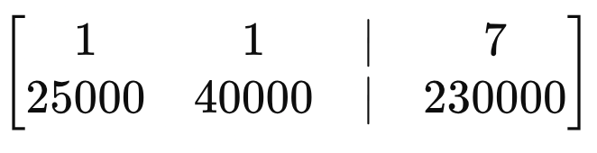

# Linear Algebra

## Linear Equation

```
y=mx+b
m = slope (how fast it's changing)
x = the input (like days, hours, units sold)
b = starting point (called y-intercept)
y = output (like money, distance, result)
```

You run a small coffee shop. Every day, you have fixed costs like rent and utilities totaling $100. Each cup of coffee costs you $2 in supplies. You sell each cup for $5.

**Goal**:\
Find out how many cups of coffee you need to sell to make a profit of $400.\
\
Profit = Revenue - Cost

* Revenue from selling x cups: 5x
* Cost: fixed costs + variable costs = 100+2x
* Profit = 5x−(100+2x)=3x−100

3x−100=400

3x=400+100=500

x= 500/3 ​≈166.67

You need to sell 167 cups (rounding up) to make a $400 profit.

## Multiple linear regression

multiple linear regression is to find best approximate solution fitting noisy data

**Example**: A real estate agent wants to predict house prices based on the size of the house (in square feet) and the number of bedrooms.

**Goals**: Build a model that uses house size and bedrooms to estimate the selling price.

```
y=β0​+β1​x1​+β2​x2​+ϵ
β0=50000→ base price, when size and bedrooms are zero (theoretical)
β1=100→ each extra 1 sq ft adds $100 to price
β2=10000→ each extra bedroom adds $10,000

Predict price for a house with:
Size = 2200 sq ft
Bedrooms = 4

y=50000+100×2200+10000×4=50000+220000+40000=310000
So predicted price = $310,000
```

## Augmented matrix

Find exact solution to system of equations

You’re buying sedans and SUVs for a rental business:

* Sedan price = $25,000
* SUV price = $40,000
* You can buy 7 vehicles total
* You have $230,000 budget

You want to know how many sedans and SUVs you can buy.

x= number of sedans

y= number of SUVs



#### Gaussian elimination

1. Pick the first nonzero element in the leftmost column as the pivot.
2. Use row operations to make all elements below that pivot zero in the same column.
3. Move to the next row and next column, repeat until you get an upper-triangular matrix (all zeros below the pivots).
4. Then solve by back substitution (bottom up).

```
R1​ = [1 1 ∣ 7]
R2 ​← R2​ − 25000 ⋅ R1​
R2​ = [25000  40000  ∣  230000]  −  25000  ⋅  [1 1 ∣ 7]
R2 = [25000  40000  ∣  230000]  −  [25000 25000 ∣ 175000]

25000−25000=0
40000−25000=15000
230000−25000⋅7=230000−175000=55000
```

.png>)

<div align="left"><figure><figcaption></figcaption></figure></div>

x+y=7⟹x=7−y=7−3.67=3.33

Sedans x≈3.33


SUVs y≈3.67


## Vectors equation

vectors describe straight-line movement only. Angle (degrees)

The drone flies 6 meters east, 8 meters north, and 10 meters up.

A=(6,8,10)

<figure><figcaption></figcaption></figure>

Direction vector → The drone is about 14.14 meters from the base, in a straight line (even though it flew in 3 directions).

Unit vector:

.png>)

```
A^≈(0.424,0.566,0.707)

Wind blows,The drone gets pushed 2 meters west and 1 meter down. That’s:
W=(−2,0,−1)
A+W=(6,8,10)+(−2,0,−1)=(4,8,9)
Now the drone is at (4, 8, 9) — it drifted off course.

What vector would return it to the target?
You want it to return to (6, 8, 10):
Correction vector=(6,8,10)−(4,8,9)=(2,0,1)
Correction vector = (6, 8, 10) - (4, 8, 9) = (2, 0, 1)
It must fly 2 meters east, 0 north/south, and 1 meter up to get back on track.
```

## Matrix equation


A⋅X  =  B


.png>)

.png>)

<div align="left"><figure><figcaption></figcaption></figure></div>

<div align="left"><figure><figcaption></figcaption></figure></div>

.png>)

<div align="left"><figure><figcaption></figcaption></figure></div>

## Linear Transformation

Linear transformation is just a rule that moves vectors around, following two simple rules:

1. Adding vectors stays predictable:\
   If you move vector A and vector B separately, then add the results — that’s the same as adding them first and then moving.
2. Scaling stays predictable:\
   If you double a vector before moving it, it's the same as moving it first and then doubling it.

A matrix is a function that transforms vectors.\
E.g., rotating, scaling, reflecting.

<div align="left"><figure><figcaption></figcaption></figure></div>

It's a rule that moves or reshapes all points in space using math that keeps things straight.

It can:

* Stretch
* Rotate
* Flip
* Squish
* Shear

But not bend or curve.

## Identity Matrix

<div align="left"><figure><figcaption></figcaption></figure></div>

## Matrix inverse, Identity, determinant

Determinant is a scalar value computed from a square matrix that tells you important things about the matrix:

* Whether the matrix is invertible (non-zero determinant = invertible)
* The volume scaling factor of the linear transformation the matrix represents
* Whether a system of linear equations has a unique solution (det ≠ 0)

<div align="left"><figure><figcaption></figcaption></figure></div>

<div align="left"><figure><figcaption></figcaption></figure></div>

Since 5 ≠ 0, A is invertible.

<div align="left"><figure><figcaption></figcaption></figure></div>

<figure><figcaption></figcaption></figure>

<figure><figcaption></figcaption></figure>

<figure><figcaption></figcaption></figure>

This is the only test that confirms:

* You didn’t make an arithmetic error.
* The inverse actually works.
* Your system will solve correctly with x=A−1bx = A^{-1}bx=A−1b

If you multiply and don’t get identity, then your "inverse" is garbage.

<figure><figcaption></figcaption></figure>

```
In computer graphics: to undo transformations to objects (like rotating/scaling them back).
In machine learning: to solve systems of equations for parameters.
In physics: to invert forces or fields.
In control systems: to reverse matrix-based dynamics.
In cryptography: some encryption schemes involve matrices and require inverting them to decrypt.
```

❗ What Happens if You Can’t Undo?

If the matrix has no inverse, that means:

* No unique solution exists.
* Either there’s infinite solutions, or no solution at all.
* The system is singular or degenerate — it collapses space (think flattening 3D into 2D).

That’s what a non-invertible matrix is

## Quadratic formula

Factoring if simple

<div align="left"><figure><figcaption></figcaption></figure></div>

<div align="left"><figure><figcaption></figcaption></figure></div>


\=== OR ====\


<div align="left"><figure><figcaption></figcaption></figure></div>

**Solution**:

<div align="left"><figure><figcaption></figcaption></figure></div>

## Rank

Rank = number of linearly independent rows or columns in a matrix.\
Rank tells you how much actual "new information" is in the matrix.

<div align="left"><figure><figcaption></figcaption></figure></div>

Do row operations (subtract 2×R1 from R2, 3×R1 from R3), you'll get:

<div align="left"><figure><figcaption></figcaption></figure></div>

**Only 1 nonzero row → Rank = 1**

If Rank = full (equal to # of rows/columns), then the matrix is invertible.

If Rank < full, it’s not invertible.\


**Rank 2 matrix in 3D → maps stuff to a plane**

Rank 1 → maps everything to a line

Rank 0 → squashes everything to zero

<div align="left"><figure><figcaption></figcaption></figure></div>

## Null space

<div align="left"><figure><figcaption></figcaption></figure></div>

Null space captures all inputs that get squashed to zero by A.

**IF > 0 ax = b** has infinitely many solution

X + 2y + 3z = 0

2z + 4y + 6z = 0

This is the same as A, x = 0 where&#x20;

A= \[1 2 3

&#x20;     4 5 6]

Find values of (x,y,z) to make both equators true

y=z, s=t

x + 2s + 3t = 0

x = -2s -3t

Equation 2 just 2x equation 1

## Eigen vectors & Eigenvalue

Eigenvector: A direction that doesn’t rotate when transformed by the matrix.

Eigenvalue: How much that direction is stretched or squished.

<figure><figcaption></figcaption></figure>

<figure><figcaption></figcaption></figure>

This means:

* When you multiply the matrix A with vector v,
* You get the same vector back, only scaled by λ
* The direction stays the same — just longer or shorter.\


<figure><figcaption></figcaption></figure>


<div align="left"><figure><figcaption></figcaption></figure></div>

<div align="left"><figure><figcaption></figcaption></figure></div>

<div align="left"><figure><figcaption></figcaption></figure></div>

<div align="left"><figure><figcaption></figcaption></figure></div>

<figure><figcaption></figcaption></figure>

<div align="left"><figure><figcaption></figcaption></figure></div>

So in simple terms:

* Eigenvalues come from solving the determinant = 0.
* These eigenvalues tell us when the matrix acts like a scaler for some vector(s).
* Using each eigenvalue, we then find those special vector(s) (eigenvectors) that get scaled exactly by that eigenvalue

## Real-World Example: Simple 2D Population Model (Growth & Movement)

<div align="left"><figure><figcaption></figcaption></figure></div>


<div align="left"><figure><figcaption></figcaption></figure></div>

<div align="left"><figure><figcaption></figcaption></figure></div>

<figure><figcaption></figcaption></figure>

<div align="left"><figure><figcaption></figcaption></figure></div>

<figure><figcaption></figcaption></figure>

<div align="left"><figure><figcaption></figcaption></figure></div>

<div align="left"><figure><figcaption></figcaption></figure></div>

<div align="left"><figure><figcaption></figcaption></figure></div>

\
