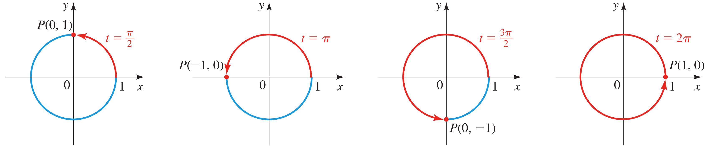
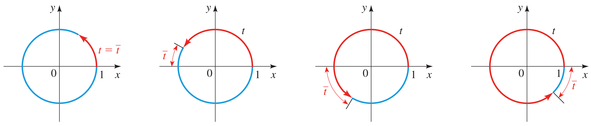
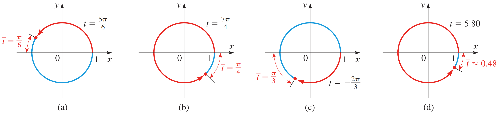
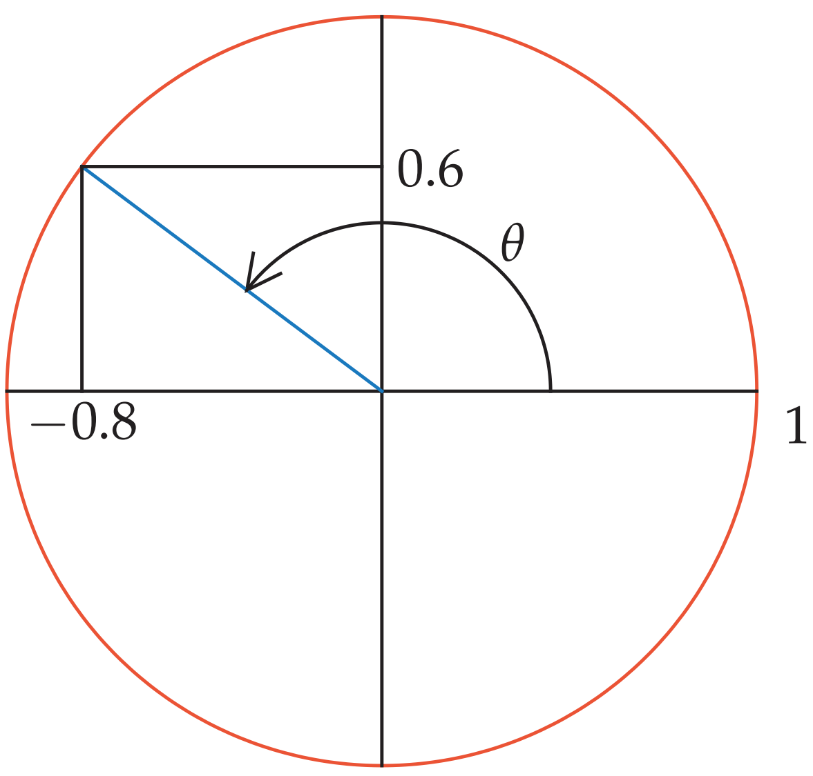
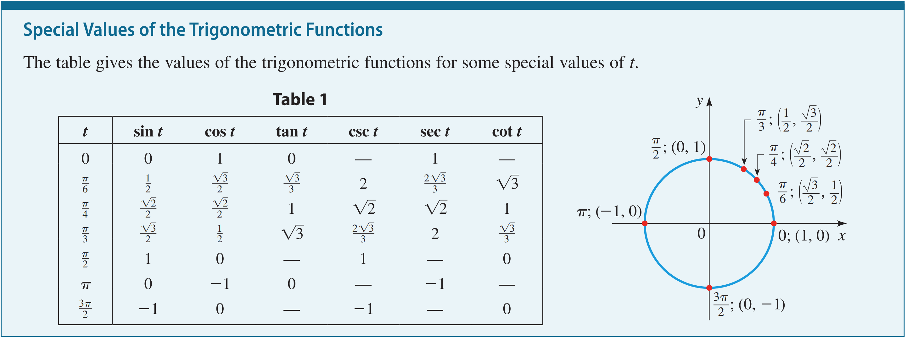

# Trigonometry

<figure><figcaption></figcaption></figure>

Opposite = height\
Hypotenuse = diagonal\
Adjacent = flat line\
$$(\theta)$$ = angle degrees

### Sine & Arcsin

$$\sin(\theta) = \frac{\text{Opposite}}{\text{Hypotenuse}}$$

* What it finds: The Height (Vertical).
* Use this when you know the Diagonal length and the angle.
* Real World Example: A kid is flying a kite. He let out 100 feet of string (Hypotenuse). The string is at a $$30^\circ$$ angle. How high is the kite?
* to find the Height, you move the Diagonal to the other side:
* $$\text{Height} = 100 \times \sin(30^\circ)$$
* $$100 \times 0.5 = \mathbf{50 \text{ feet high}}$$.

If you already have the **hypotenuse** and the **opposite** (vertical) side, you are usually trying to find one of two things: the Angle or the Adjacent (horizontal) side.

**Inverse Sine** (also called $$arcsi$$ or $$\sin^{-1}$$)

$$\theta = \arcsin\left(\frac{\text{Opposite}}{\text{Hypotenuse}}\right)$$

**Finding Adjacent**

$$a^2 + b^2 = c^2 \quad \rightarrow \quad \text{Adjacent} = \sqrt{\text{Hypotenuse}^2 - \text{Opposite}^2}$$

***

### Cosine

$$\cos(\theta) = \frac{\text{Adjacent}}{\text{Hypotenuse}}$$

* What it finds: The Base (Horizontal/Flat line).
* Use this when you know the Diagonal length and want to know how far it travels along the ground.
* Real World Example: A 12-foot ladder is leaning against a wall at a $$60^\circ$$ angle from the ground. How far is the base of the ladder from the wall?
* $$\text{Distance} = 12 \times \cos(60^\circ)$$
* $$12 \times 0.5 = \mathbf{6 \text{ feet from the wall}}$$.

***

### Tangent

$$\tan(\theta) = \frac{\text{Opposite}}{\text{Adjacent}}$$

* What it finds: The Height (if you don't have the diagonal).
* Use this when you are standing on the ground and looking up at something tall.
* Real World Example: You are standing 50 feet away from a tree. You look at the top at a $$45^\circ$$ angle. How tall is the tree?
* $$\text{Height} = 50 \times \tan(45^\circ)$$
* $$50 \times 1 = \mathbf{50 \text{ feet tall}}$$.

***

### Cosecant

$$\csc(\theta) = \frac{\text{Hypotenuse}}{\text{Opposite}}$$ (The flip of Sine)

* What it finds: The Diagonal length.
* Use this when you know how high you need to go and want to find the diagonal path.
* Real World Example: You want to build a zip-line. The platform is 20 feet high. You want the line at a $$30^\circ$$ angle. How much cable do you need to buy?
* $$\text{Cable} = 20 \times \csc(30^\circ)$$ (Note: $$\csc$$ is $$1/0.5 = 2$$)
* $$20 \times 2 = \mathbf{40 \text{ feet of cable}}$$.

***

### Secant

$$\sec(\theta) = \frac{\text{Hypotenuse}}{\text{Adjacent}}$$ (The flip of Cosine)

* What it finds: The Diagonal length.
* Use this when you know the flat distance and need to find the diagonal.
* Real World Example: An architect is designing a bridge. The gap to cross is 100 feet wide. The support beam must be at a $$30^\circ$$ angle. How long is the beam?
* $$\text{Beam} = 100 \times \sec(30^\circ)$$
* $$100 \times 1.15 = \mathbf{115 \text{ feet long}}$$.

***

### Cotangent

$$\cot(\theta) = \frac{\text{Adjacent}}{\text{Opposite}}$$ (The flip of Tangent)

* What it finds: The Flat distance.
* Use this when you know the Height and want to find the ground distance.
* Real World Example: A lighthouse is 100 feet tall. It spots a boat at a $$10^\circ$$ angle from the top. How far away is the boat on the water?
* $$\text{Distance} = 100 \times \cot(10^\circ)$$
* The Answer: $$100 \times 5.67 = \mathbf{567 \text{ feet away}}$$

***

### **Unit circle**

Because it is a circle with radius $$r = 1$$, its equation is derived from the Pythagorean theorem:

$$x^2 + y^2 = 1$$

Any point $$(x, y)$$ that lies on the boundary of this circle must satisfy that equation.

<figure><figcaption></figcaption></figure>

a **terminal point** is the exact $$(x, y)$$ coordinate where an angle "ends" on the unit circle

<figure><figcaption></figcaption></figure>

#### **Reference Number**

<figure><figcaption></figcaption></figure>

Reference Number (often denoted as $$\bar{t}$$ or $$t$$) is a "shortcut" tool. It is the shortest distance along the unit circle between a terminal point and the x-axis

<figure><figcaption></figcaption></figure>

The radius ending at (0, 1) on the positive vertical axis has a **90 degrees** angle with the positive horizontal axis.

**Radian**

radian is a measurement of the angle (the "opening" between two lines

**Arc length**&#x20;

Arc length is the distance along the curved edge (the "crust" of the pizza slice).

<figure><figcaption></figcaption></figure>

The "Height": $$\sin \theta = 0.6$$. This tells us that the point on the unit circle is exactly $$0.6$$ units above the center line.

The "Location": $$\frac{\pi}{2} < \theta < \pi$$. This tells us the angle is between $$90^\circ$$ and $$180^\circ$$. Looking at the circle, this means the point is in the top-left section (Quadrant II).

Since it’s a unit circle, we know the Hypotenuse is 1. As we discussed earlier, every point $$(x, y)$$ must follow the rule $$x^2 + y^2 = 1^2$$.

$$\text{(Horizontal Side)}^2 + \text{(Vertical Side)}^2 = \text{Total}^2$$

$$\cos^2 \theta + \sin^2 \theta = 1$$

Because $$x$$ is $$\cos \theta$$ and $$y$$ is $$\sin \theta$$, the problem uses this formula:

$$(\cos \theta)^2 + (\sin \theta)^2 = 1$$

1. $$(\cos \theta)^2 + (0.6)^2 = 1$$.
2. $$(0.6) \times (0.6) = 0.36$$.
3. $$(\cos \theta)^2 = 1 - 0.36$$, which equals $$0.64$$.
4. To find $$\cos \theta$$, you take the square root of $$0.64$$. This gives you two possible answers: $$0.8$$ or $$-0.8$$.

### **Trigonometric Functions of Real Numbers**

On the unit circle, the primary functions are defined as:

* Sine: $$\sin(\theta) = y$$
* Cosine: $$\cos(\theta) = x$$
* Tangent: $$\tan(\theta) = \frac{y}{x}$$ (where $$x \neq 0$$)

**Reciprocal Trigonometric Formulas**

These functions are the "flipped" versions of the primary ones:

* Cosecant: $$\csc(\theta) = \frac{1}{y}$$ (where $$y \neq 0$$)
* Secant: $$\sec(\theta) = \frac{1}{x}$$ (where $$x \neq 0$$)
* Cotangent: $$\cot(\theta) = \frac{x}{y}$$ (where $$y \neq 0$$)

<figure><figcaption></figcaption></figure>

### **Domain of trigonometric function**

imagine a "laser pointer" rotating from the center of the circle, there are two specific moments where the Tangent or other value simply doesn't exist.

<table><thead><tr><th width="137.39996337890625">Function</th><th>Domain (Input)</th><th>Range (Output)</th></tr></thead><tbody><tr><td>\sin(x)</td><td>All Real Numbers (-\infty, \infty)</td><td>[-1, 1]</td></tr><tr><td>\cos(x)</td><td>All Real Numbers (-\infty, \infty)</td><td>[-1, 1]</td></tr><tr><td>\tan(x)</td><td>All x \neq \frac{\pi}{2} + n\pi (Odd multiples of 90^\circ)</td><td>(-\infty, \infty)</td></tr><tr><td>\csc(x)</td><td>All x \neq n\pi (Multiples of 180^\circ)</td><td>(-\infty, -1] \cup [1, \infty)</td></tr><tr><td>\sec(x)</td><td>All x \neq \frac{\pi}{2} + n\pi (Odd multiples of 90^\circ)</td><td>(-\infty, -1] \cup [1, \infty)</td></tr><tr><td>\cot(x)</td><td>All x \neq n\pi (Multiples of 180^\circ)</td><td>(-\infty, \infty) </td></tr></tbody></table>

Remember that Tangent is the ratio of Vertical ($$y$$) to Horizontal ($$x$$):

$$\tan \theta = \frac{\sin \theta}{\cos \theta}$$

As you rotate the radius, you are building that rectangle we talked about earlier.

* At $$90^\circ$$ (The top edge): Your point is at $$(0, 1)$$. The horizontal width ($$x$$) is zero.
* The Math: $$\tan(90^\circ) = \frac{1}{0}$$.

<figure><figcaption></figcaption></figure>

you cannot divide by zero. At this exact angle, the Tangent "breaks" and becomes undefined.

[https://www.desmos.com/calculator/ajd5qthpcw](https://www.desmos.com/calculator/ajd5qthpcw)

### **Identities**

Use identities for Simplification, Solving trigonometric equation, etc..

**Reciprocal and Quotient Identities**

These define how the six functions relate to one another:

* Quotient: $$\tan(\theta) = \frac{\sin(\theta)}{\cos(\theta)}$$ and $$\cot(\theta) = \frac{\cos(\theta)}{\sin(\theta)}$$
* Reciprocal: $$\csc(\theta) = \frac{1}{\sin(\theta)}$$, $$\sec(\theta) = \frac{1}{\cos(\theta)}$$, and $$\cot(\theta) = \frac{1}{\tan(\theta)}$$

**Pythagorean Identities**

Based on the Pythagorean theorem ($$a^2 + b^2 = c^2$$) applied to the unit circle:

* $$\sin^2(\theta) + \cos^2(\theta) = 1$$
* $$1 + \tan^2(\theta) = \sec^2(\theta)$$
* $$1 + \cot^2(\theta) = \csc^2(\theta)$$

**example**

$$f(x) = (\sin x + \cos x)^2 - 2\sin x \cos x$$

First, we use basic algebra to expand the squared part $$(a + b)^2 = a^2 + 2ab + b^2$$:

$$(\sin x + \cos x)^2 = \sin^2 x + 2\sin x \cos x + \cos^2 x$$

Now, put that back into the full equation:

$$f(x) = (\sin^2 x + 2\sin x \cos x + \cos^2 x) - 2\sin x \cos x$$

1. Notice $$+2\sin x \cos x$$ and a $$-2\sin x \cos x$$. They cancel each other out completely.
2. Pythagorean Identity: You are left with $$\sin^2 x + \cos^2 x$$. As we know from the fundamental identity, this always equals 1.

Result: $$f(x) = 1$$

Beyond the basics, there are several dozen "advanced" identities used in calculus, physics, and complex engineering:

* Even/Odd Identities (6): Based on the symmetry of the circle (e.g., $$\sin(-x) = -\sin x$$).
* Cofunction Identities (6): Relating sines to cosines of complementary angles (e.g., $$\sin(\frac{\pi}{2} - x) = \cos x$$).
* Sum and Difference (6): Formulas for $$\sin(A \pm B)$$, etc.
* Double-Angle (5+): Formulas for $$\sin(2x)$$, $$\cos(2x)$$, and $$\tan(2x)$$.
* Half-Angle (3): Formulas for $$\sin(\frac{x}{2})$$, etc.
* Product-to-Sum & Sum-to-Product (8): Used heavily in audio and signal processing.

### Inverse trigonometric function

Imagine you have a 10-foot long ladder. You lean it against a wall.

1. You want the top of the ladder to touch a window that is exactly 8 feet high.
2. The Question: How much do you need to tilt the ladder? (What is the angle between the ladder and the ground?)

In normal math, you have the angle and find the height. But here, you have the "result" (the height) and you need to find the "cause" (the angle).

* Step 1: You know the ladder length (10) and the height (8).
* Step 2: Height divided by Ladder is called Sine.
* Step 3: $$8 \div 10 = 0.8$$.
* Step 4: You ask your calculator: _"Which angle gives me a Sine of 0.8?"_
* $$\sin^{-1}(0.8)$$ = 53 degrees.

modelling harmonic motion, damped harmonic function
