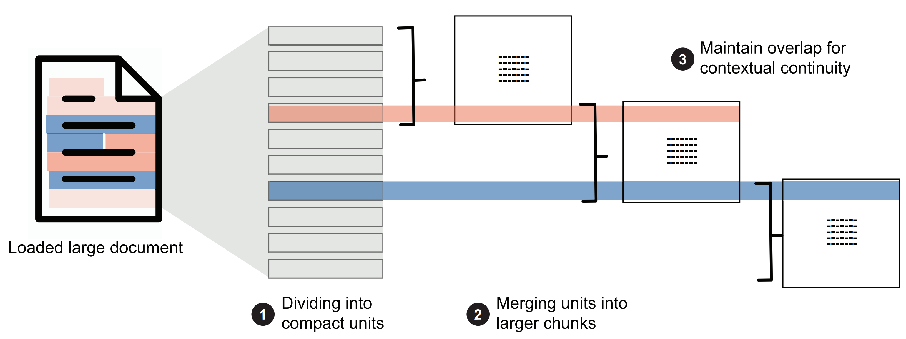

# Chunking & Embedding

### Structure-Aware Chunking

Parse Markdown into an Abstract Syntax Tree (AST) using **markdown-it.**&#x20;

```json
[
  {
    "type": "ElementType.HEADING",
    "content": "this is content abc",
    "level": 2,
    "children": [
      {
        "type": "ElementType.HEADING",
        "content": "on section abc we have ...",
        "level": 2,
        "children": []
      }
    ]
  }
]
```

Then, we build a section hierarchy. It groups content (tables, lists, paragraphs) under their respective headers. For example, Header 1 is the top-level header; all associated content is grouped under it. for example:

```json
[
  {
    "level": 1, 
    "heading": "Header A",
    "content_elements": [], 
    "subsections": [
      {
        "level": 2,
        "heading": "Header A.1",
        "content_elements": [
          "<tables>",
          "<list>"
        ],
        "subsections": []
      }
    ]
  },
  {
    "level": 1,
    "heading": "Header B",
    "content_elements": [
      "<paragraph>"
    ],
    "subsections": []
  }
]
```

Next we do chunking. Each the text, paragraphs, code, tables have their own strategies for chunking

1. paragraphs/text, if its to long split it by sentence/clauses/words, if its to short merged it into one
2. tables, if tables to large split by rows while still keep the table header
3. codes, split by lines
4. list, split by items

If the chunk size is bigger than the `token limits` we should split it into a new chunk. Also adds `context overlap` before and after the current chunk for better retrieval. example:

<figure><figcaption></figcaption></figure>

```md
# Header A
## Header A.1
<tables>
<list>

# Header B
<paragraph>
```

If we want to chunk `## Header A.1 <list>`, the "before" context is `<tables>` and the "after" context is `# Header B`. Since `# Header B` is at the same level as `# Header A` (Level 1), we do not add it as "after" context. The final output will be:

```json
[
  {
    "id": "86881823-686f-48c2-a574-b10d999a9235",
    "chunk_type": "table",
    "section_path": "Table of Contents",
    "parent_section": "Table of Contents",
    "next_chunk_id": "ec782819-99d5-4a61-a663-ec5a78504c6c",
    "prev_chunk_id": "d1faf125-e423-4e9b-bb21-778509df1c61",
    "document_id": "example",
    "content": "| Executive Summary …",
    "token_count": 677,
    "split_sequence": "28/40"
  }
]
```

* `id`: A unique string (UUID v4) assigned to this specific chunk to identify it within the vector store.
* `chunk_type`: Identifies the type of the content, ex: "table"
* `section_path`: A full breadcrumb path representing the document's hierarchical ancestry (e.g., "Introduction > Summary") to preserve global context.
* `parent_section`: The name of the immediate heading under which this chunk is located, used to anchor the data to a specific topic.
* `next_chunk_id`: The unique ID of the following chunk in the document
* `prev_chunk_id`: The unique ID of the preceding chunk in the document
* `document_id`: file name
* `content`: The actual text or markdown representation of the chunk
* `token_count`: The number of tokens in the content
* `split_sequence`: An index (e.g., "28/40") indicating this is the 28th part out of 40 total chunks created from the same original section or element.

## **Embedding**

We need to store **dense vector** from the embed result, and also create **sparse vector** using SPLADE (Sparse Lexical and Expansion Model). Its needed for Hybrid Search retrieval.

```json
{
  "id": 31868393794739972,
  "payload": {
    "is_continuation": false,
    "token_count": 322,
    "extra": null,
    "document_id": "econ_nuclear",
    "split_sequence": null,
    "chunk_type": "text",
    "content": "The policy to promote the development of small-scale coal mines worked...",
    "section_path": "2.  The boom-and-bust road of the coal industry"
  },
  "vector": {
    "sparse": {
      "indices": [
        21447,
        21762
      ],
      "values": [
        0.14956795,
        0.12950781
      ]
    },
    "dense": [
      -0.011004133,
      -0.007966931
    ]
  }
}  
```

#### Dense vector embed config

* model\_name: `BAAI/bge-base-en-v1.5`
* tokenizer\_path: "tokenizer.json" or HuggingFace model ID
* max\_token\_limit: 512 (model's actual limit)
* model\_dim: 768 (embedding dimension)

#### Sparse vector embed config

* model\_name: `prithivida/Splade_PP_en_v1` (The industry standard for high-performance SPLADE embeddings).
* max\_token\_limit: `512` (Matches dense model's limit for consistency during chunking).


the model config flexible, we can change it later

