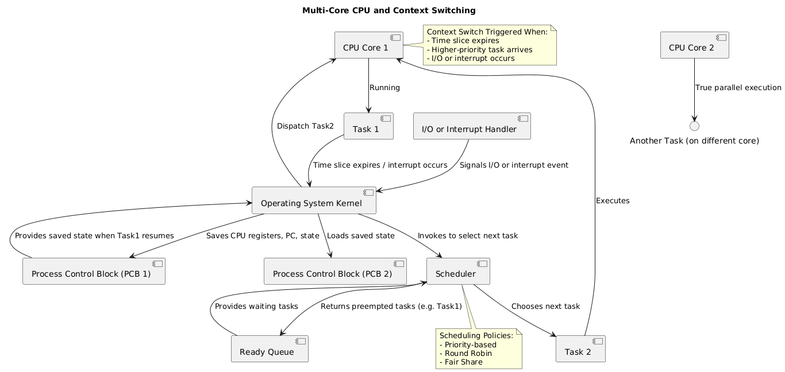

# OS

### Hardware Basics

A computer (PC or laptop) is composed of several main components:

* **CPU (Processor):** Executes instructions.
* **RAM (Memory):** Stores data and code that are actively in use.
* **Disk (Storage):** Persists data long-term (SSD, HDD).

#### Threads and Processes

* The **operating system (OS)** schedules and executes threads on the CPU.
* **Threads within the same process** share the same address space in RAM.
* **I/O operations** (like typing or clicking) interact with devices. Because disk writes are slow, they often use **buffer memory** to temporarily hold data.
* Threads can run **concurrently** (sharing time on one CPU core) or **in parallel** (on multiple cores).

***

### Operating System Fundamentals

* The **kernel** is the core of the OS, mediating between hardware and software.
* A **firewall** filters inbound and outbound network traffic.
* **Programs** can be:
  * **Compiled languages** → translated into machine code binaries (e.g., Go, Java).
  * **Interpreted languages** → executed line by line (e.g., Python, JavaScript).
  * **Java** is compiled into **bytecode** and executed on the **JVM** (Java Virtual Machine).

***

### Virtualization and Containers

* **Virtual Machines (VMs):** Emulate a complete hardware system (CPU, memory, storage, devices).
* **Containers:** Wrap applications with their dependencies, but **share the host OS kernel** instead of emulating full hardware.

***

### Cloud Services

Cloud platforms go beyond hosting VMs:

* Provide on-demand access to compute, storage, databases, and networking.
* Offer **managed services** for scalability, deployment, and monitoring.
* Abstract away the need to manage physical hardware.

***

### Databases

Databases are more than just storage:

* **Storage engine:** Uses algorithms (e.g., B-trees, LSM-trees, hash indexes).
* **Query engine:** Interprets and executes queries.
* **Transaction management:** Ensures consistency and rollback on errors.
* **Indexing, caching, concurrency control, and recovery** are layered above raw disk operations.

***

### Centralized vs Decentralized Systems

#### Centralized Systems

* Applications run on servers, VMs, or cloud instances.
* Easier to manage and deploy from a **single authority**.
* Weakness: if the central server crashes, the system may fail.
* Mitigation: use **load balancers**, **backups**, and **multi-region deployments**.

#### Decentralized Systems

* Composed of independent nodes working together.
* If one node fails, others continue running.
* Nodes sync application state using **consensus algorithms**.
* Static content can be stored on **IPFS**, while nodes connect via **P2P networks**.

**Blockchain Example**

* Business logic runs as **smart contracts** (code executed on every node).
* Every node:
  * Validates transactions.
  * Agrees on new state via consensus.
  * Updates its local copy of the ledger.
* Ensures trust without relying on a central authority.

***

### Process Scheduling and Execution

#### Multitasking

* The OS uses **process scheduling** to choose which thread runs next.
* **Context switching** pauses one thread and resumes another.

#### Single-Core vs Multi-Core

* **Single-core CPU:** Only concurrency (fast switching), no true parallelism.
* **Multi-core CPU:** Each core executes threads independently in parallel.
  * Each core has its own **program counter, registers, and execution unit**.

***

### Memory Management

* Processes require instructions/data in RAM.
* Since RAM is limited, OS uses **virtual memory** with **swap space** on disk.
* **Memory Management Unit (MMU):** Translates virtual addresses into physical ones using page tables.

***

### File Systems and Process Control

* **File system interface:** Provides abstraction for interacting with storage. System calls: `open()`, `read()`, `write()`.
* **Process control & IPC:** Managed through signals (e.g., `SIGKILL`) and commands (e.g., terminate).

***

### Context Switching Walkthrough

**Single-core CPU:**

* Only one task executes at a time.
* Concurrency is simulated by rapidly switching between tasks.

**Multi-core CPU** Multiple tasks can run in true parallel, each on its own core. How a context switch happens:

<figure><figcaption></figcaption></figure>
