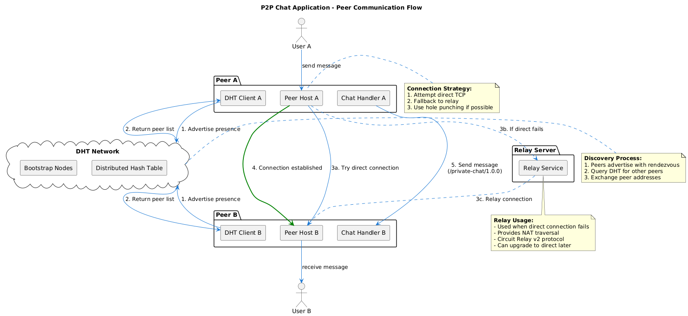

# P2P Chat

<figure><figcaption></figcaption></figure>

### Connection Strategy (NAT Traversal)

The application uses a three-tier fallback strategy to establish peer connections:

```
Direct Connection → Hole Punching → Relay Connection
```

**Connection Flow:**

1. **Open Ports with UPnP** - Automatically configure router port forwarding when possible
2. **Direct Connection (First Attempt)** - Try direct TCP connection if both peers have public IPs or are on the same network
3. **Hole Punching (Second Attempt)** - Use DCUtR (Direct Connection Upgrade through Relay) to punch through NATs
4. **Relay Connection (Final Fallback)** - Route traffic through relay server using Circuit Relay v2

### Peer Discovery

**Method:** Kademlia DHT (Distributed Hash Table)

Peers discover each other through the DHT network:

* Each peer advertises its presence using a rendezvous string (`/private-chat/1.0.0`)
* Peers query the DHT to find others advertising the same rendezvous
* Bootstrap nodes (IPFS public nodes) help new peers join the DHT network
* Discovered peer addresses are cached locally for faster reconnection

### Messaging Protocol

**Protocol ID:** `/private-chat/1.0.0`

Once a connection is established:

* Chat messages are sent over libp2p streams
* Messages are JSON-encoded for simplicity
* Each message opens a new stream, sends data, then closes
* The receiver's protocol handler decodes and displays messages

### Addressing (Multiaddr)

libp2p uses **multiaddr** to encode multi-protocol network addresses:

* Components: IP, transport (tcp/udp), protocol (quic/webtransport), certificate hashes, peer IDs.
* Useful for rendezvous and signaling in decentralized apps.

**TCP Connection:**

```
/ip4/127.0.0.1/tcp/37967/p2p/12D3KooWABC123...
```

**QUIC with WebTransport:**

```
/ip4/127.0.0.1/udp/37260/quic-v1/webtransport/certhash/uEiABC.../p2p/12D3KooWXYZ...
```

**Circuit Relay:**

```
/p2p/12D3KooWRelay.../p2p-circuit/p2p/12D3KooWTarget...
```

