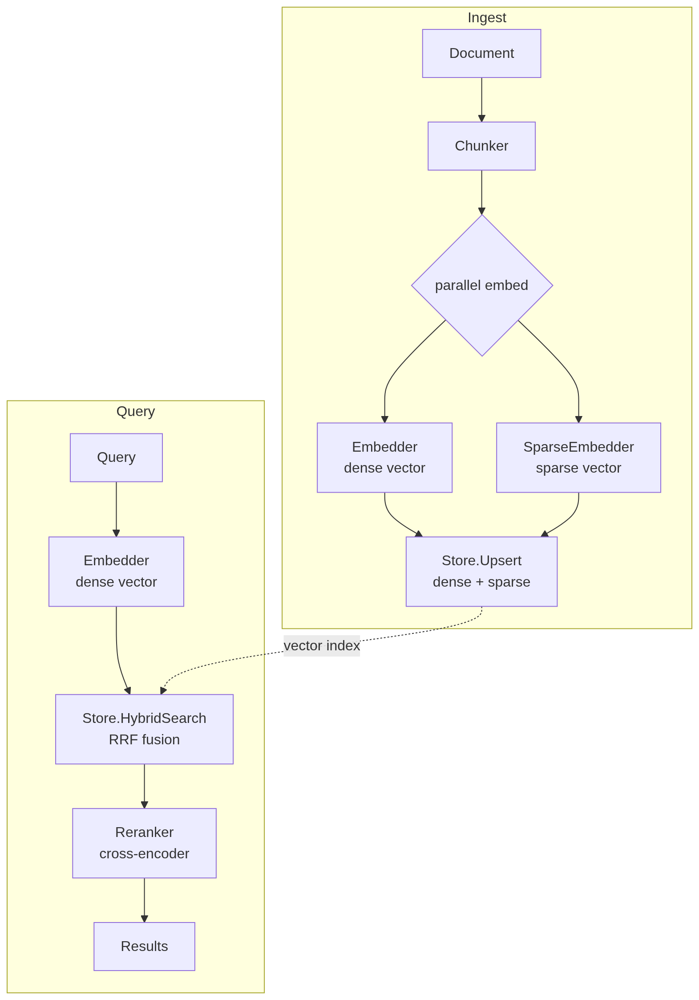

# Personal Knowledge Base

<figure><figcaption></figcaption></figure>

## Ingestion

#### Data Sources

| Source | Final Format | Tool    |
| ------ | ------------ | ------- |
| PDF    | Markdown     | docling |
| Text   | Markdown     | docling |
| Image  | Markdown     | docling |

All inputs normalize to Markdown before chunking.

## Chunking Strategies

| Strategy            | Status | Notes                                               |
| ------------------- | ------ | --------------------------------------------------- |
| Recursive Character | Active | Hierarchical: heading → paragraph → sentence → word |
| Sentence Window     | Active | Index sentences; expand ±N window at retrieval      |
| Semantic Chunking   | TBD    | Split on embedding similarity boundaries            |

**Chunk sizes:** 128, 256, 512 tokens (configurable) **Chunk overlap:** configurable

## Embedding Models

| Modality | Model                         | Notes                |
| -------- | ----------------------------- | -------------------- |
| Sparse   | `prithivida/Splade_PP_en_v1`  | SPLADE neural sparse |
| Dense    | `nomic-embed-text` via Ollama | 768-dim, local       |

***

## Storage & Indexing

#### Vector Configuration

| Type   | Config                                           |
| ------ | ------------------------------------------------ |
| Dense  | 768-dim, Cosine distance                         |
| Sparse | SPLADE/BM25-compatible named vector (`"sparse"`) |

#### Search Optimization

* **Full-text search:** Qdrant text index for lexical matches
* **Keyword indexing:** `file_path` payload field — enables per-file filtering

***

## Retrieval Pipeline

```
Query
  │
  ▼
Semantic Cache ──── hit (score ≥ threshold) ──► return cached result
  │ miss
  ▼
Query Transformation (HyDE)
  └── LLM generates hypothetical doc → embed → avg vector
  │
  ▼
Hybrid Search
  ├── Dense: Qdrant ANN (nomic-embed-text vec)
  └── Sparse: SPLADE or TF fallback
        └── RRF fusion (k=60): score = Σ 1/(60 + rank)
  │
  ▼
Reranker
  └── cross-encoder/ms-marco-MiniLM-L-6-v2
  │
  ▼
Results: []{ file_path, header, line_start, score, text }
```

### Semantic Cache

* Storage: separate Qdrant collection (`pkb_cache`)
* Lookup: cosine search, top-1 score ≥ threshold → return immediately
* Miss: run full pipeline, write result async (fire-and-forget)
* Expiry: lazy TTL check on read (`cached_at + TTL < now` → miss)
* Threshold guidance:
  * `0.85–0.90`: high recall, allows paraphrased queries
  * `0.90–0.95`: balanced (default `0.90`)
  * `>0.95`: near-identical only

### Query Transformation — HyDE

* LLM generates N hypothetical docs for query
* Embed each → average vectors → L2-normalize
* Use averaged vec for dense retrieval
* Falls back to multi-fragment search on generation failure

### Hybrid Search

**Server-side (SPLADE sidecar available):**

* Qdrant `QueryPoints`: prefetch dense (topK×5) + sparse (topK×5)
* Qdrant RRF fusion on server

**Client-side fallback (no sidecar):**

* Dense: `SearchPoints`
* Sparse: scroll + text filter + `TFSparseScorer`
* Client RRF (k=60)

### Reranking

* Model: `cross-encoder/ms-marco-MiniLM-L-6-v2`
* Input: topK × `candidate_mul` candidates (default ×10 oversample)
* Output: top-K by cross-encoder score
* Endpoint: internal Python sidecar (`cmd/reranker/main.py`)

***

## Evaluation & Testing

#### Ground Truth Format (Qrels)

```json
{
  "query": "How does the Go GPM scheduler work with goroutines and OS threads?",
  "chunk_id": "golang/goroutine.md:3",
  "file_path": "golang/goroutine.md",
  "relevant": true
}
```

Qrels stored in `internal/pkb/testdata/qrels.jsonl`.

#### Metrics

| Metric                        | Source                          |
| ----------------------------- | ------------------------------- |
| Latency (p50/p95/p99)         | Prometheus histograms           |
| Cache hit rate                | Prometheus counter              |
| Retrieval quality (MRR, nDCG) | Eval harness (`eval_runner.go`) |

Prometheus endpoint exposed via OpenTelemetry collector.

***

## Configuration Reference

| Key                        | Default     | Effect                                                  |
| -------------------------- | ----------- | ------------------------------------------------------- |
| `chunker.provider`         | `recursive` | `sentence-window` for sentence-level indexing           |
| `sparse_scorer.provider`   | `splade`    | `tf` for zero-dep TF proxy                              |
| `hyde.enabled`             | `true`      | HyDE query expansion                                    |
| `hyde.num_docs`            | `1`         | `8` matches paper accuracy, \~8× latency (parallelized) |
| `reranker.enabled`         | `true`      | Cross-encoder reranking                                 |
| `reranker.candidate_mul`   | `10`        | Oversample factor before reranking                      |
| `semantic_cache.enabled`   | `false`     | Query-result cache                                      |
| `semantic_cache.threshold` | `0.90`      | Cosine similarity cutoff                                |
| `semantic_cache.ttl`       | `24h`       | Cache entry lifetime; `0` = no expiry                   |

## Infrasturcture

<figure><figcaption></figcaption></figure>
