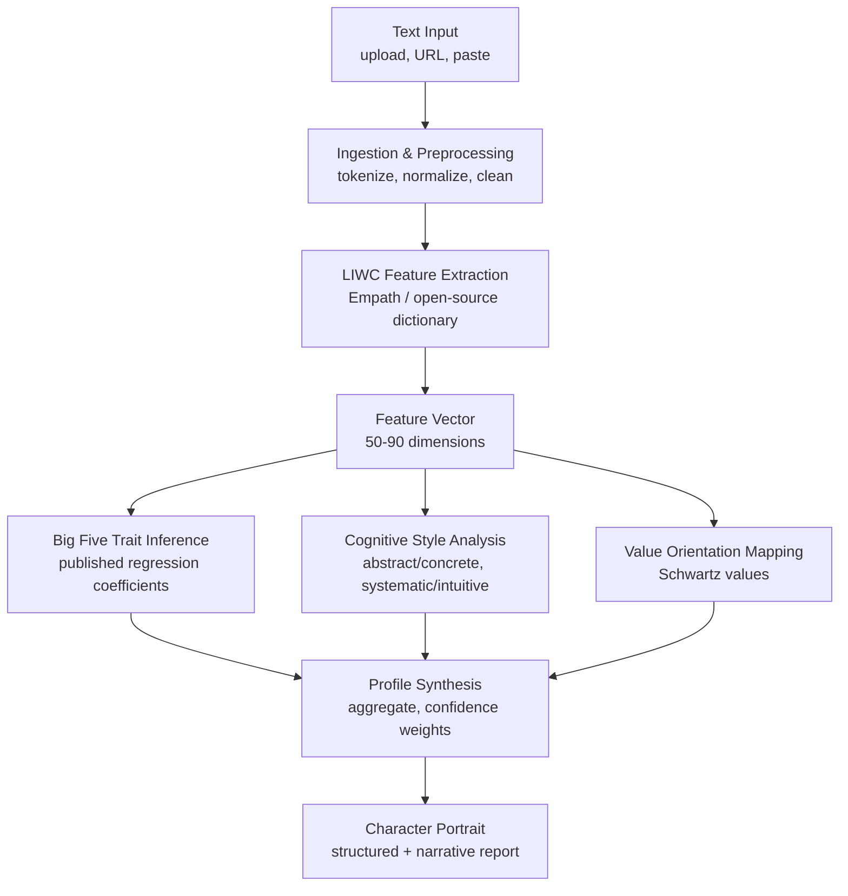

# Psyhco

#### Goal

A system that extracts the hidden psychological structure of a person from their writing — personality traits, cognitive style, values, and communication patterns — using transparent, dictionary-based linguistic analysis.

#### Non-goals

* Clinical diagnosis or mental health assessment
* Real-time surveillance or monitoring
* Predicting future behavior
* Black-box LLM inference (the system is fully explainable)
* Multi-modal input (audio, video); text only in this version

#### Numbers

* QPS: 1–10 analysis requests per minute (single-user or small team)
* Storage: \~10 MB per analyzed subject (raw text + feature vectors + profile)
* Latency target: <5 seconds for full analysis of a 5,000‑word corpus

#### Critical invariant

Every trait score, cognitive label, and value assignment must be directly traceable to specific word‑count percentages. No black‑box inference. A user can point to the exact linguistic evidence behind any output.

#### Failure modes

| What fails                                    | How it manifests                                                                   | How we recover                                                                                                         |
| --------------------------------------------- | ---------------------------------------------------------------------------------- | ---------------------------------------------------------------------------------------------------------------------- |
| Input text too short (<500 words)             | Trait estimates are unreliable, wide confidence intervals                          | Warn user; require minimum 500 words; report low confidence; do not show fine‑grained scores unless word count > 1,000 |
| Domain‑specific jargon dominates              | LIWC dictionary coverage drops; features become unrepresentative                   | Flag low dictionary coverage rate; suggest more natural‑language samples                                               |
| Sarcasm, irony, or highly contextual language | Positive/negative emotion words are inverted; personality estimates may be flipped | Acknowledge limitation in output; future versions may add contextual disambiguation but sacrifice transparency         |
| Single data source (e.g., only work emails)   | Persona captured is context‑specific, not general                                  | Encourage multiple sources; report source‑specific profiles separately before aggregating                              |

### Diagram

#### Core flow

1. **Ingestion:** The user provides text through file upload, URL fetch, or direct paste. The system extracts raw text, normalizes whitespace, and segments into analyzable units (sentences, paragraphs). Source metadata (type, date) is preserved.
2. **Feature extraction:** The normalized text is tokenized and compared against a psycholinguistic dictionary (Empath or LIWC‑compatible open lexicon). For each psychological category (positive emotion, cognitive processes, first‑person singular, etc.), the system computes the percentage of words belonging to that category. Additional statistical features are calculated: type‑token ratio, average sentence length, punctuation patterns, and dictionary coverage rate.
3. **Trait inference:** The resulting feature vector is mapped to Big Five personality dimensions using published regression coefficients from peer‑reviewed psycholinguistics research. Each trait score is accompanied by a confidence interval derived from the word count and feature stability. Cognitive style (abstract vs. concrete, systematic vs. intuitive, need for closure) is computed from additional feature ratios.
4. **Value orientation:** Recurring themes in the text are matched to Schwartz’s ten basic human values using keyword and category co‑occurrence. The system outputs a ranked list of value orientations with percentile estimates.
5. **Profile synthesis:** All trait, style, and value scores are aggregated into a structured profile. The system generates a narrative character portrait by combining the scores with template‑based natural language generation (or optionally an external LLM for prose, while keeping the underlying scores fully explainable). Confidence notes are appended based on corpus size and dictionary coverage.

#### Storage choice & why

**SQLite** — The system is single‑user or small‑team, with modest data volumes. A lightweight embedded database stores raw text corpora, extracted feature vectors, and generated profiles without requiring a separate server process. JSON files on disk would also be sufficient, but SQLite provides queryability for comparing subjects or tracking changes over time.

#### The hard part & how we solve it

* **Bottleneck:** Making accurate, reliable personality inferences from limited or domain‑skewed text without relying on opaque LLMs.
* **Fix:**
  * Use established, validated psycholinguistic dictionaries (LIWC/Empath) whose category‑trait correlations are published in decades of research.
  * Require a minimum of 1,000 words for high‑confidence estimates and display explicit confidence intervals.
  * Combine multiple weak linguistic signals (e.g., pronoun ratios, cognitive word percentages, punctuation patterns) rather than relying on any single feature.
  * Flag low dictionary coverage or single‑source bias rather than silently producing misleading results.

#### What we sacrifice

We sacrifice the semantic depth and contextual understanding that a large language model could provide — sarcasm, irony, metaphor, and highly contextual language will sometimes be misinterpreted or flattened. This hurts most when analyzing informal social media, poetry, or culturally specific communication styles. In return, we gain complete transparency: every trait score can be traced back to a word count, making the system auditable, privacy‑preserving (runs entirely locally), and scientifically defensible. The user pays the cost of potential misinterpretation; the benefit is an analysis they can verify and trust.
