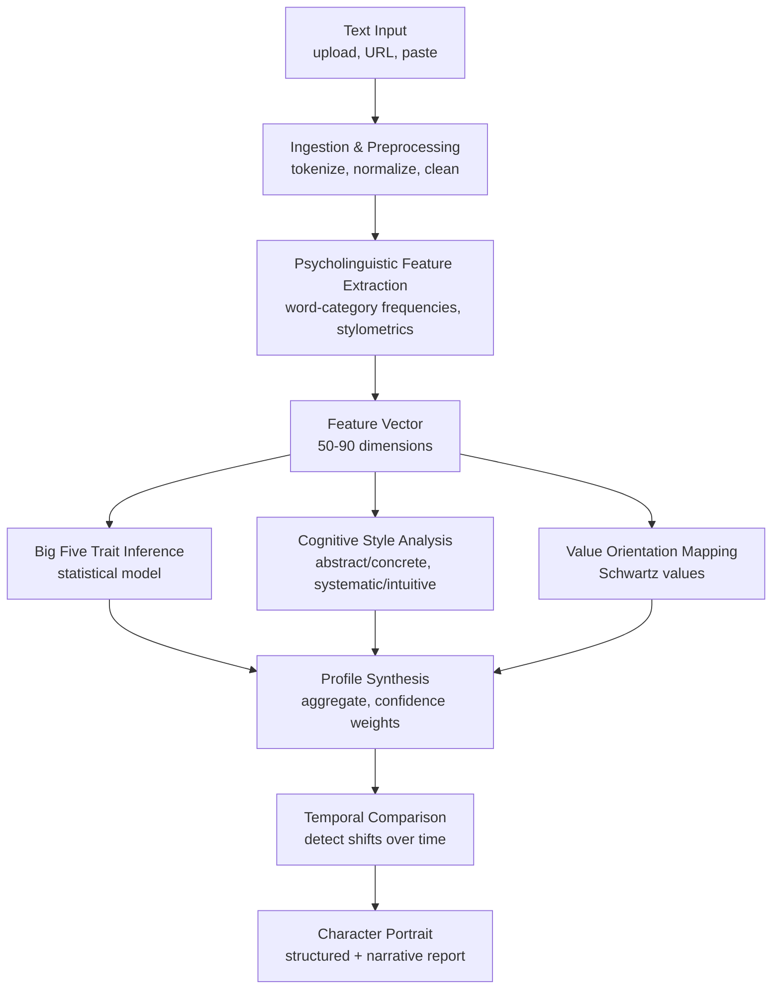

# Psyhco

#### Goal

A system that extracts the psychological structure of a person from their writing and presents it with full auditability—every trait, cognitive label, and value assignment traceable to specific linguistic evidence, with explicit confidence levels, running entirely locally so no data leaves the user’s device.

#### Non-goals

* Clinical diagnosis or mental health assessment
* Real‑time surveillance or monitoring
* Predicting future behavior
* Black‑box LLM inference (all claims are auditable)
* Multi‑modal input (audio, video); text only in this version

#### Numbers

* QPS: 1–10 analysis requests per minute (single‑user or small team)
* Storage: \~10 MB per analyzed subject (raw text + feature vectors + profile)
* Latency target: <5 seconds for full analysis of a 5,000‑word corpus

#### Critical invariant

Every claim in the output must be auditable by a human. The user can trace any trait score, cognitive label, or value assignment back to the specific linguistic evidence, understand the confidence level, and see where the system might be wrong. No inference is delivered without a verifiable trail.

#### Failure modes

| What fails                                                 | How it manifests                                                                   | How we recover                                                                                                         |
| ---------------------------------------------------------- | ---------------------------------------------------------------------------------- | ---------------------------------------------------------------------------------------------------------------------- |
| Input text too short (<500 words)                          | Trait estimates are unreliable, wide confidence intervals                          | Warn user; require minimum 500 words; report low confidence; do not show fine‑grained scores unless word count > 1 000 |
| Domain‑specific jargon dominates                           | Psycholinguistic dictionary coverage drops; features become unrepresentative       | Flag low dictionary coverage rate; suggest more natural‑language samples                                               |
| Sarcasm, irony, or highly contextual language              | Positive/negative emotion words are inverted; personality estimates may be flipped | Acknowledge limitation in output; future versions may add contextual disambiguation but sacrifice transparency         |
| Single data source (e.g., only work emails)                | Persona captured is context‑specific, not general                                  | Encourage multiple sources; report source‑specific profiles separately before aggregating                              |
| Drift in a person’s language over time without re‑analysis | Older profile no longer reflects the person; user makes decisions on stale data    | Encourage periodic re‑analysis; support temporal comparison to detect significant shifts                               |

#### Diagram

#### Core flow

1. **Ingestion:** The user provides text through file upload, URL fetch, or direct paste. The system extracts raw text, normalises whitespace, and segments into analysable units (sentences, paragraphs). Source metadata (type, date) is preserved.
2. **Feature extraction:** The normalised text is analysed with a psycholinguistic dictionary (a curated lexicon mapping words to psychologically meaningful categories) and a set of stylometric measures. The system computes the percentage of words belonging to each category (positive emotion, cognitive processes, first‑person singular, etc.) and additional statistical features: type‑token ratio, average sentence length, punctuation patterns, and dictionary coverage rate.
3. **Trait inference:** The resulting feature vector is mapped to Big Five personality dimensions using a trained inference model (e.g., regression coefficients derived from peer‑reviewed psycholinguistics research). Each trait score is accompanied by a confidence interval derived from the word count and feature stability. Cognitive style (abstract vs. concrete, systematic vs. intuitive, need for closure) is computed from additional feature ratios.
4. **Value orientation:** Recurring themes in the text are matched to a standard value framework (Schwartz’s ten basic human values) using keyword and category co‑occurrence. The system outputs a ranked list of value orientations with percentile estimates.
5. **Profile synthesis:** All trait, style, and value scores are aggregated into a structured profile. A narrative character portrait is generated by combining the scores with template‑based natural language generation (or optionally an external LLM for prose, while keeping the underlying scores fully explainable). Confidence notes are appended based on corpus size and dictionary coverage.
6. **Temporal comparison (if multiple time‑slices exist):** If the user provides writing from distinct time periods, the system computes baseline profiles for each period and detects statistically significant shifts in traits, cognitive style, or emotional tone. Output includes a timeline of psychological change with annotated events.

#### Storage choice & why

**Embedded database (SQLite or similar)** — The system is single‑user or small‑team, with modest data volumes. A lightweight embedded database stores raw text corpora, extracted feature vectors, and generated profiles without requiring a separate server process. JSON files on disk would also be sufficient, but an embedded DB provides queryability for comparing subjects or tracking changes over time.

#### The hard part & how we solve it

* **Bottleneck:** Making accurate, reliable personality inferences from limited or domain‑skewed text without relying on opaque LLMs.
* **Fix:**
  * Use established, validated psycholinguistic dictionaries and well‑researched linguistic markers whose category‑trait correlations are backed by decades of research.
  * Require a minimum of 1 000 words for high‑confidence estimates and display explicit confidence intervals.
  * Combine multiple weak linguistic signals (e.g., pronoun ratios, cognitive word percentages, punctuation patterns) rather than relying on any single feature.
  * Flag low dictionary coverage or single‑source bias rather than silently producing misleading results.

#### Alternatives considered

| Approach                                                            | Why we rejected it                                                                                                                                                                 |
| ------------------------------------------------------------------- | ---------------------------------------------------------------------------------------------------------------------------------------------------------------------------------- |
| Pure LLM analysis (single prompt)                                   | Opaque. Cannot trace traits to evidence. Requires cloud API → privacy risk. No audit trail.                                                                                        |
| Dictionary‑only pipeline, no LLM at all                             | Transparent and auditable, but the final narrative synthesis is stilted without a language model. The core scores remain dictionary‑based; the LLM only polishes the presentation. |
| Fully local LLM (quantised open‑source model)                       | Still a black box for inference; cannot guarantee the same level of traceability. Resource requirements also limit the target hardware.                                            |
| Commercial psychometric API (e.g., IBM Watson Personality Insights) | Dependency on third party; data leaves the device; subscription cost; service may be discontinued.                                                                                 |

**Chosen approach:** Hybrid. Dictionary‑based extraction for auditable trait scores. Optional LLM for narrative synthesis _only_. The scores are always traceable; the prose is a convenience.

#### What we sacrifice

We sacrifice the semantic depth and contextual understanding that a large language model could provide — sarcasm, irony, metaphor, and highly contextual language will sometimes be misinterpreted or flattened. This hurts most when analysing informal social media, poetry, or culturally specific communication styles. We also sacrifice the rapid improvement curve of LLM‑based analysis. As models become more capable, the accuracy gap between dictionary‑based methods and contextual LLMs will widen. Our differentiator is not raw accuracy; it is auditability, privacy, and trust. If the market values accuracy over those properties, we lose. In return, we gain a system whose output can be checked, challenged, and refined by the user — a psychological mirror, not a black‑box oracle.
