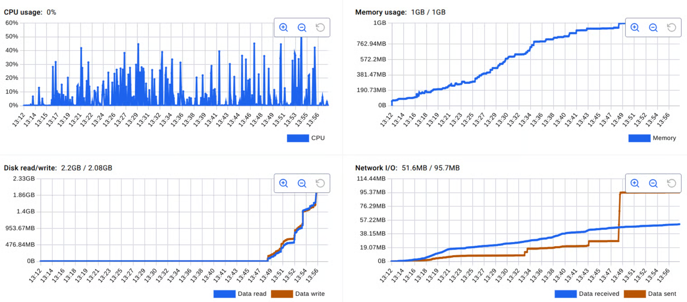

# Golang impl

## Test result

simulating unlimited crawl visits every links found in a page, resulting in growing memory size

<figure><figcaption></figcaption></figure>

### Heap

```
heap profile: 791: 4971120 [30662: 699786264] @ heap/1048576
0: 0 [1: 8192] @ 0xb046e5 0xb04752 0xb04752 0xb04752 0xb04752 0xb04752 0xb04752 0xb04752 0xb04752 0xb04752 0xb04752 0xb04752 0xb04752 0xb04752 0xb04752 0xb04752 0xb045e4 0xe4712b 0xeab5bb 0xea8ea5 0xe96709 0xe96558 0xf8484c 0xf855e5 0xf82a50 0xacbc27 0xac8e8c 0x4b2001
#	0xb046e4	github.com/go-shiori/dom.GetElementsByTagName.func1+0xa4		/app/vendor/github.com/go-shiori/dom/dom.go:131
#	0xb04751	github.com/go-shiori/dom.GetElementsByTagName.func1+0x111		/app/vendor/github.com/go-shiori/dom/dom.go:135
#	0xb04751	github.com/go-shiori/dom.GetElementsByTagName.func1+0x111		/app/vendor/github.com/go-shiori/dom/dom.go:135
#	0xb04751	github.com/go-shiori/dom.GetElementsByTagName.func1+0x111		/app/vendor/github.com/go-shiori/dom/dom.go:135
#	0xb04751	github.com/go-shiori/dom.GetElementsByTagName.func1+0x111		/app/vendor/github.com/go-shiori/dom/dom.go:135
#	0xb04751	github.com/go-shiori/dom.GetElementsByTagName.func1+0x111		/app/vendor/github.com/go-shiori/dom/dom.go:135
#	0xb04751	github.com/go-shiori/dom.GetElementsByTagName.func1+0x111		/app/vendor/github.com/go-shiori/dom/dom.go:135
#	0xb04751	github.com/go-shiori/dom.GetElementsByTagName.func1+0x111		/app/vendor/github.com/go-shiori/dom/dom.go:135
#	0xb04751	github.com/go-shiori/dom.GetElementsByTagName.func1+0x111		/app/vendor/github.com/go-shiori/dom/dom.go:135
#	0xb04751	github.com/go-shiori/dom.GetElementsByTagName.func1+0x111		/app/vendor/github.com/go-shiori/dom/dom.go:135
#	0xb04751	github.com/go-shiori/dom.GetElementsByTagName.func1+0x111		/app/vendor/github.com/go-shiori/dom/dom.go:135
#	0xb04751	github.com/go-shiori/dom.GetElementsByTagName.func1+0x111		/app/vendor/github.com/go-shiori/dom/dom.go:135
#	0xb04751	github.com/go-shiori/dom.GetElementsByTagName.func1+0x111		/app/vendor/github.com/go-shiori/dom/dom.go:135
#	0xb04751	github.com/go-shiori/dom.GetElementsByTagName.func1+0x111		/app/vendor/github.com/go-shiori/dom/dom.go:135
#	0xb04751	github.com/go-shiori/dom.GetElementsByTagName.func1+0x111		/app/vendor/github.com/go-shiori/dom/dom.go:135
#	0xb04751	github.com/go-shiori/dom.GetElementsByTagName.func1+0x111		/app/vendor/github.com/go-shiori/dom/dom.go:135
#	0xb045e3	github.com/go-shiori/dom.GetElementsByTagName+0x83			/app/vendor/github.com/go-shiori/dom/dom.go:140
#	0xe4712a	github.com/markusmobius/go-trafilatura/internal/selector.QueryAll+0x2a	/app/vendor/github.com/markusmobius/go-trafilatura/internal/selector/selector.go:42
#	0xeab5ba	github.com/markusmobius/go-trafilatura.extractDomCategories+0xba	/app/vendor/github.com/markusmobius/go-trafilatura/metadata.go:556
#	0xea8ea4	github.com/markusmobius/go-trafilatura.extractMetadata+0x784		/app/vendor/github.com/markusmobius/go-trafilatura/metadata.go:239
#	0xe96708	github.com/markusmobius/go-trafilatura.ExtractDocument+0x168		/app/vendor/github.com/markusmobius/go-trafilatura/core.go:97
#	0xe96557	github.com/markusmobius/go-trafilatura.Extract+0x77			/app/vendor/github.com/markusmobius/go-trafilatura/core.go:78
#	0xf8484b	axora/crawler.(*Crawler).ExtractWithTrafilatura+0x26b			/app/crawler/text_extraction.go:56
#	0xf855e4	axora/crawler.(*Crawler).ExtractText+0x44				/app/crawler/text_extraction.go:139
#	0xf82a4f	axora/crawler.(*Crawler).Crawl.(*Crawler).OnResponse.func3+0x40f	/app/crawler/dom_handler.go:67
#	0xacbc26	github.com/gocolly/colly/v2.(*Collector).handleOnResponse+0x1c6		/app/vendor/github.com/gocolly/colly/v2/colly.go:1127
#	0xac8e8b	github.com/gocolly/colly/v2.(*Collector).fetch+0x6ab			/app/vendor/github.com/gocolly/colly/v2/colly.go:728
```

| Value          | Meaning                                                                              |
| -------------- | ------------------------------------------------------------------------------------ |
| `791`          | Number of currently allocated heap objects                                           |
| `4971120`      | Bytes allocated by those 791 objects (≈ 4.7 MB currently alive)                      |
| `30662`        | Total allocations over time (objects created at that stack)                          |
| `699786264`    | Total allocated bytes over time (≈ 699 MB allocated overall during program lifetime) |
| `heap/1048576` | pprof bucket grouping (1MB bucket when summarizing heap samples)                     |

notice multiple call on `github.com/go-shiori/dom.GetElementsByTagName.func1+0xa4` which recursively walks nodes to find tags

### Goroutine

```
goroutine profile: total 153399
153384 @ 0x4aa18e 0x43e1ab 0x43ddf7 0xad1d2b 0xad1667 0xac8d09 0x4b2001
#	0xad1d2a	github.com/gocolly/colly/v2.(*httpBackend).Do+0x8a	/app/vendor/github.com/gocolly/colly/v2/http_backend.go:172
#	0xad1666	github.com/gocolly/colly/v2.(*httpBackend).Cache+0x126	/app/vendor/github.com/gocolly/colly/v2/http_backend.go:133
#	0xac8d08	github.com/gocolly/colly/v2.(*Collector).fetch+0x528	/app/vendor/github.com/gocolly/colly/v2/colly.go:711
```

using gocolly async resulting in stuck goroutine, going deeper we could see


```
goroutine 158852 [running]:
runtime/pprof.writeGoroutineStacks({0x1a66760, 0xc015bf04b0})
	/usr/local/go/src/runtime/pprof/pprof.go:756 +0x6b
runtime/pprof.writeGoroutine({0x1a66760?, 0xc015bf04b0?}, 0xd?)
	/usr/local/go/src/runtime/pprof/pprof.go:745 +0x25
runtime/pprof.(*Profile).WriteTo(0x2cb16b0?, {0x1a66760?, 0xc015bf04b0?}, 0xc?)
	/usr/local/go/src/runtime/pprof/pprof.go:371 +0x14b
net/http/pprof.handler.ServeHTTP({0xc03355aca1, 0x9}, {0x1a70a40, 0xc015bf04b0}, 0xc04c42f680)
	/usr/local/go/src/net/http/pprof/pprof.go:272 +0x52a
net/http/pprof.Index({0x1a70a40, 0xc015bf04b0}, 0xc04c42f680?)
	/usr/local/go/src/net/http/pprof/pprof.go:389 +0xda
net/http.HandlerFunc.ServeHTTP(0x2e7bc40?, {0x1a70a40?, 0xc015bf04b0?}, 0x73ec56?)
	/usr/local/go/src/net/http/server.go:2322 +0x29
net/http.(*ServeMux).ServeHTTP(0x4a6b19?, {0x1a70a40, 0xc015bf04b0}, 0xc04c42f680)
	/usr/local/go/src/net/http/server.go:2861 +0x1c7
net/http.serverHandler.ServeHTTP({0xc04c7cf600?}, {0x1a70a40?, 0xc015bf04b0?}, 0x6?)
	/usr/local/go/src/net/http/server.go:3340 +0x8e
net/http.(*conn).serve(0xc05cba8b40, {0x1a729d8, 0xc002980c30})
	/usr/local/go/src/net/http/server.go:2109 +0x665
created by net/http.(*Server).Serve in goroutine 1
	/usr/local/go/src/net/http/server.go:3493 +0x485

goroutine 1 [IO wait]:
internal/poll.runtime_pollWait(0x7f1650440600, 0x72)
	/usr/local/go/src/runtime/netpoll.go:351 +0x85
internal/poll.(*pollDesc).wait(0xc0000a0d00?, 0x900000036?, 0x0)
	/usr/local/go/src/internal/poll/fd_poll_runtime.go:84 +0x27
internal/poll.(*pollDesc).waitRead(...)
	/usr/local/go/src/internal/poll/fd_poll_runtime.go:89
internal/poll.(*FD).Accept(0xc0000a0d00)
	/usr/local/go/src/internal/poll/fd_unix.go:613 +0x28c
net.(*netFD).accept(0xc0000a0d00)
	/usr/local/go/src/net/fd_unix.go:161 +0x29
net.(*TCPListener).accept(0xc00261adc0)
	/usr/local/go/src/net/tcpsock_posix.go:159 +0x1b
net.(*TCPListener).Accept(0xc00261adc0)
	/usr/local/go/src/net/tcpsock.go:380 +0x30
net/http.(*Server).Serve(0xc0027c0600, {0x1a70bf0, 0xc00261adc0})
	/usr/local/go/src/net/http/server.go:3463 +0x30c
net/http.(*Server).ListenAndServe(0xc0027c0600)
	/usr/local/go/src/net/http/server.go:3389 +0x72
net/http.ListenAndServe(...)
	/usr/local/go/src/net/http/server.go:3704
main.main()
	/app/cmd/main.go:189 +0x9c5

goroutine 22 [IO wait, 54 minutes]:
internal/poll.runtime_pollWait(0x7f1650440c00, 0x72)
	/usr/local/go/src/runtime/netpoll.go:351 +0x85
internal/poll.(*pollDesc).wait(0xc0000a0180?, 0x380016?, 0x0)
	/usr/local/go/src/internal/poll/fd_poll_runtime.go:84 +0x27
internal/poll.(*pollDesc).waitRead(...)
	/usr/local/go/src/internal/poll/fd_poll_runtime.go:89
internal/poll.(*FD).Accept(0xc0000a0180)
	/usr/local/go/src/internal/poll/fd_unix.go:613 +0x28c
net.(*netFD).accept(0xc0000a0180)
	/usr/local/go/src/net/fd_unix.go:161 +0x29
net.(*TCPListener).accept(0xc00261a0c0)
	/usr/local/go/src/net/tcpsock_posix.go:159 +0x1b
net.(*TCPListener).Accept(0xc00261a0c0)
	/usr/local/go/src/net/tcpsock.go:380 +0x30
net/http.(*Server).Serve(0xc0027c0000, {0x1a70bf0, 0xc00261a0c0})
	/usr/local/go/src/net/http/server.go:3463 +0x30c
net/http.(*Server).ListenAndServe(0xc0027c0000)
	/usr/local/go/src/net/http/server.go:3389 +0x72
net/http.ListenAndServe(...)
	/usr/local/go/src/net/http/server.go:3704
main.main.func1()
	/app/cmd/main.go:36 +0x3a
created by main.main in goroutine 1
	/app/cmd/main.go:35 +0x38

goroutine 109686 [chan send, 15 minutes]:
github.com/gocolly/colly/v2.(*httpBackend).Do(0xc002980210, 0xc03727ba40, 0xa00000, 0xc03b205f28)
	/app/vendor/github.com/gocolly/colly/v2/http_backend.go:172 +0x8b
github.com/gocolly/colly/v2.(*httpBackend).Cache(0xc034065400?, 0xc03727b900?, 0x1815079?, 0x6?, {0x0?, 0x70532f696b69772f?})
	/app/vendor/github.com/gocolly/colly/v2/http_backend.go:133 +0x127
github.com/gocolly/colly/v2.(*Collector).fetch(0xc00305cb40, {0x67657461433d656c?, 0x6e69614d3a79726f?}, {0x1805016, 0x3}, 0x4, {0x0, 0x0}, 0x7469743f7068702e?, 0xc022742600, ...)
	/app/vendor/github.com/gocolly/colly/v2/colly.go:711 +0x529
created by github.com/gocolly/colly/v2.(*Collector).scrape in goroutine 531
	/app/vendor/github.com/gocolly/colly/v2/colly.go:660 +0x5f9

goroutine 23 [select, 54 minutes]:
google.golang.org/grpc/internal/grpcsync.(*CallbackSerializer).run(0xc001bf0b90, {0x1a72a10, 0xc002392b40})
	/app/vendor/google.golang.org/grpc/internal/grpcsync/callback_serializer.go:88 +0x10c
created by google.golang.org/grpc/internal/grpcsync.NewCallbackSerializer in goroutine 1
	/app/vendor/google.golang.org/grpc/internal/grpcsync/callback_serializer.go:52 +0x11a

goroutine 24 [select, 54 minutes]:
google.golang.org/grpc/internal/grpcsync.(*CallbackSerializer).run(0xc001bf0bc0, {0x1a72a10, 0xc002392b90})
	/app/vendor/google.golang.org/grpc/internal/grpcsync/callback_serializer.go:88 +0x10c
created by google.golang.org/grpc/internal/grpcsync.NewCallbackSerializer in goroutine 1
	/app/vendor/google.golang.org/grpc/internal/grpcsync/callback_serializer.go:52 +0x11a

goroutine 25 [select, 54 minutes]:
google.golang.org/grpc/internal/grpcsync.(*CallbackSerializer).run(0xc001bf0bf0, {0x1a72a10, 0xc002392be0})
	/app/vendor/google.golang.org/grpc/internal/grpcsync/callback_serializer.go:88 +0x10c
created by google.golang.org/grpc/internal/grpcsync.NewCallbackSerializer in goroutine 1
	/app/vendor/google.golang.org/grpc/internal/grpcsync/callback_serializer.go:52 +0x11a

goroutine 26 [select, 54 minutes]:
google.golang.org/grpc/internal/resolver/dns.(*dnsResolver).watcher(0xc0001fdf00)
	/app/vendor/google.golang.org/grpc/internal/resolver/dns/dns_resolver.go:221 +0x24b
created by google.golang.org/grpc/internal/resolver/dns.(*dnsBuilder).Build in goroutine 24
	/app/vendor/google.golang.org/grpc/internal/resolver/dns/dns_resolver.go:150 +0x2b9

goroutine 74471 [chan send, 31 minutes]:
github.com/gocolly/colly/v2.(*httpBackend).Do(0xc002980210, 0xc0221e92c0, 0xa00000, 0xc024be6f28)
	/app/vendor/github.com/gocolly/colly/v2/http_backend.go:172 +0x8b
github.com/gocolly/colly/v2.(*httpBackend).Cache(0xc01de319c0?, 0xc02230a500?, 0x1815079?, 0x6?, {0x0?, 0xc024f25dc0?})
	/app/vendor/github.com/gocolly/colly/v2/http_backend.go:133 +0x127
github.com/gocolly/colly/v2.(*Collector).fetch(0xc00305cb40, {0x0?, 0x0?}, {0x1805016, 0x3}, 0x3, {0x0, 0x0}, 0x0?, 0xc00733f2f0, ...)
	/app/vendor/github.com/gocolly/colly/v2/colly.go:711 +0x529
created by github.com/gocolly/colly/v2.(*Collector).scrape in goroutine 364
	/app/vendor/github.com/gocolly/colly/v2/colly.go:660 +0x5f9

goroutine 74516 [chan send, 31 minutes]:
github.com/gocolly/colly/v2.(*httpBackend).Do(0xc002980210, 0xc022f00c80, 0xa00000, 0xc024cf5f28)
	/app/vendor/github.com/gocolly/colly/v2/http_backend.go:172 +0x8b
github.com/gocolly/colly/v2.(*httpBackend).Cache(0xc01fad7980?, 0xc025433a40?, 0x1815079?, 0x6?, {0x0?, 0x3a7370747468?})
	/app/vendor/github.com/gocolly/colly/v2/http_backend.go:133 +0x127
github.com/gocolly/colly/v2.(*Collector).fetch(0xc00305cb40, {0x79614d5f6e686f4a?, 0x79654b5f6472616e?}, {0x1805016, 0x3}, 0x3, {0x0, 0x0}, 0x697461646e756f66?, 0xc014d29b90, ...)
	/app/vendor/github.com/gocolly/colly/v2/colly.go:711 +0x529
created by github.com/gocolly/colly/v2.(*Collector).scrape in goroutine 365
	/app/vendor/github.com/gocolly/colly/v2/colly.go:660 +0x5f9

goroutine 17876 [chan send, 44 minutes]:
github.com/gocolly/colly/v2.(*httpBackend).Do(0xc002980210, 0xc00bdbb7c0, 0xa00000, 0xc00b92ef28)
	/app/vendor/github.com/gocolly/colly/v2/http_backend.go:172 +0x8b
github.com/gocolly/colly/v2.(*httpBackend).Cache(0xc009067e40?, 0xc00b924140?, 0x1815079?, 0x6?, {0x0?, 0x1?})
	/app/vendor/github.com/gocolly/colly/v2/http_backend.go:133 +0x127
github.com/gocolly/colly/v2.(*Collector).fetch(0xc00305cb40, {0x0?, 0x7f160354abdc?}, {0x1805016, 0x3}, 0x3, {0x0, 0x0}, 0x0?, 0xc008ef9aa0, ...)
	/app/vendor/github.com/gocolly/colly/v2/colly.go:711 +0x529
created by github.com/gocolly/colly/v2.(*Collector).scrape in goroutine 203
	/app/vendor/github.com/gocolly/colly/v2/colly.go:660 +0x5f9

goroutine 10 [IO wait, 15 minutes]:
internal/poll.runtime_pollWait(0x7f1650440a00, 0x72)
	/usr/local/go/src/runtime/netpoll.go:351 +0x85
internal/poll.(*pollDesc).wait(0xc0000a0480?, 0xc001424000?, 0x0)
	/usr/local/go/src/internal/poll/fd_poll_runtime.go:84 +0x27
internal/poll.(*pollDesc).waitRead(...)
	/usr/local/go/src/internal/poll/fd_poll_runtime.go:89
internal/poll.(*FD).Read(0xc0000a0480, {0xc001424000, 0x8000, 0x8000})
	/usr/local/go/src/internal/poll/fd_unix.go:165 +0x279
net.(*netFD).Read(0xc0000a0480, {0xc001424000?, 0xc00303bcd0?, 0x0?})
	/usr/local/go/src/net/fd_posix.go:68 +0x25
net.(*conn).Read(0xc002a54108, {0xc001424000?, 0x30?, 0x100017814a0?})
	/usr/local/go/src/net/net.go:196 +0x45
bufio.(*Reader).Read(0xc0000943c0, {0xc002df0200, 0x9, 0x4a79c5?})
	/usr/local/go/src/bufio/bufio.go:245 +0x197
io.ReadAtLeast({0x1a66300, 0xc0000943c0}, {0xc002df0200, 0x9, 0x9}, 0x9)
	/usr/local/go/src/io/io.go:335 +0x8e
io.ReadFull(...)
	/usr/local/go/src/io/io.go:354
golang.org/x/net/http2.readFrameHeader({0xc002df0200, 0x9, 0x231bd0d315f?}, {0x1a66300?, 0xc0000943c0?})
	/app/vendor/golang.org/x/net/http2/frame.go:242 +0x65
golang.org/x/net/http2.(*Framer).ReadFrame(0xc002df01c0)
	/app/vendor/golang.org/x/net/http2/frame.go:506 +0x7d
google.golang.org/grpc/internal/transport.(*http2Client).reader(0xc001766488, 0xc002538380)
	/app/vendor/google.golang.org/grpc/internal/transport/http2_client.go:1639 +0x1c9
created by google.golang.org/grpc/internal/transport.NewHTTP2Client in goroutine 7
	/app/vendor/google.golang.org/grpc/internal/transport/http2_client.go:413 +0x1df3

goroutine 11 [select, 15 minutes]:
google.golang.org/grpc/internal/transport.(*controlBuffer).get(0xc00261a440, 0x1)
	/app/vendor/google.golang.org/grpc/internal/transport/controlbuf.go:412 +0x108
google.golang.org/grpc/internal/transport.(*loopyWriter).run(0xc002a58280)
	/app/vendor/google.golang.org/grpc/internal/transport/controlbuf.go:575 +0x78
google.golang.org/grpc/internal/transport.NewHTTP2Client.func6()
	/app/vendor/google.golang.org/grpc/internal/transport/http2_client.go:471 +0xd2
created by google.golang.org/grpc/internal/transport.NewHTTP2Client in goroutine 7
	/app/vendor/google.golang.org/grpc/internal/transport/http2_client.go:469 +0x23eb
```


**goroutines like 109686, 74471, 74516, 17876, 16719 \[chan send]**

* These are **Colly’s HTTP backend goroutines**.
* They are blocked **sending to a channel** or **waiting for HTTP request to finish**.
* They have been running for 15–44 minutes → clearly **stuck / piled up**.

## Improvement

* decouple heavy cpu operation at OnResponse, use non-blocking channel to send task operation to other goroutine
* use context timeout

## Dependency

* For rotation IP free use [https://github.com/zhaow-de/rotating-tor-http-proxy](https://github.com/zhaow-de/rotating-tor-http-proxy)
* For browser automation use [https://github.com/chromedp/chromedp](https://github.com/chromedp/chromedp)
* For crawling/scraping use [https://github.com/gocolly/colly](https://github.com/gocolly/colly)
* For extraction use [http://github.com/markusmobius/go-trafilatura](http://github.com/markusmobius/go-trafilatura)

## Improvement

* consider using [https://github.com/unclecode/crawl4ai](https://github.com/unclecode/crawl4ai) for crawling and LLM ready data or [https://www.firecrawl.dev/](https://www.firecrawl.dev/)
* or maybe using [https://github.com/docling-project/docling](https://github.com/docling-project/docling) if we still want to use golang as crawling and content extraction using python
* and [https://github.com/infiniflow/ragflow](https://github.com/infiniflow/ragflow) for RAG
