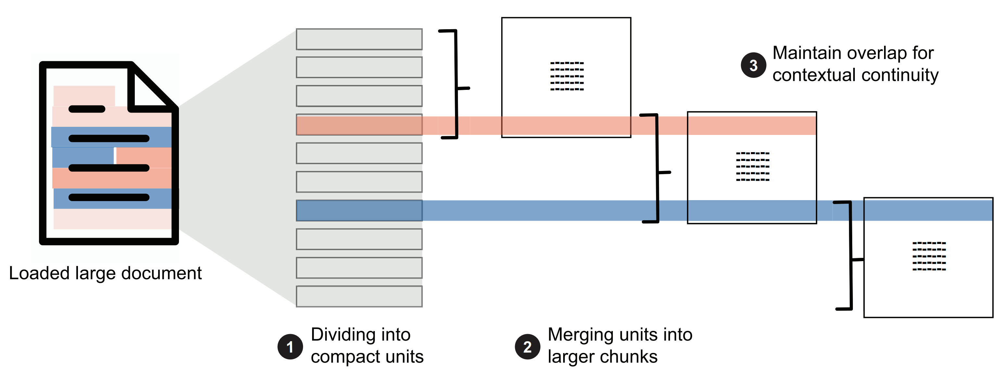

# Deep Research

This document outlines the end-to-end pipeline for a deep research agent, from initial document extraction to recursive discovery and final synthesis.

## Initiation & Dynamic Templating

To ensure specific and actionable results, the agent requires a Goal and a Template.

* Goal & Depth: The user provides a query and a recursion limit (e.g., 3 levels).
* Template Selection: A router node selects a template from the `research_templates` table.
* JIT Pydantic Generation: The system pulls the `schema_json` and uses a factory function to create a Pydantic class.

Templates are stored in PostgreSQL to allow for hot-swapping research logic without code changes.

```sql
CREATE TABLE research_templates (
    id UUID PRIMARY KEY DEFAULT gen_random_uuid(),
    name TEXT UNIQUE NOT NULL,
    description TEXT, -- Used by the Router LLM to select the template
    schema_json JSONB NOT NULL,
    system_prompt TEXT NOT NULL,
    seed_questions JSONB -- 3–5 base questions to kickstart the research
);
```

Different research goals require completely different data shapes. The `schema_json` uses a meta-definition to allow for type validation, descriptions for the LLM, and constraints.

```json
{
  "fields": {
    "sample_size": {
      "type": "integer",
      "description": "Total number of participants in the study"
    },
    "p_value": {
      "type": "float",
      "description": "The statistical significance value reported"
    },
    "study_type": {
      "type": "string",
      "enum": ["Randomized Controlled Trial", "Observational", "Meta-Analysis"]
    }
  }
}
```

Each field within the schema is an object that provides "guardrails" and "instructions" to the LLM. It is flexible; while `type` and `description` are standard, we can add custom keys to control agent behavior.

* `type`: Tells the system how to cast the data in Python (e.g., `str`, `int`, `float`, `list`). This prevents "TypeErrors" during data synthesis.
* `description`: It tells the LLM exactly what to look for and how to interpret the text.
* `enum`: Creates a closed list of allowed values. This forces the agent to categorize data (e.g., "Low" vs "High") rather than using synonyms that might break later analysis.

## Data Acquisition

Once the Goal is set and the Template is selected, the agent enters the Discovery Phase. This layer focuses on identifying, fetching, and normalizing raw data before it hits the processing pipeline.

#### Multi-Source Search & Aggregation

Find relevant documents and URLs using SearXNG to gather a list of candidate URLs based on the `seed_questions` from researh\_templates

#### Web Crawling & Scraping

Use Crawl4ai

## Data Processing

Once we collect the data (html, pdf, etc..) to markdown we process the content

### Content Extraction

Use Docling to extract content from PDFs into Markdown format, ensuring all elements (including images and tables) are preserved.

### Structure-Aware Chunking

To do Structure aware chunking we need to build a Markdown tree using an **Abstract Syntax Tree (AST)** first to detect the opening and closing of elements in markdown&#x20;

for example: table is opened when is tagged as `table_open` and close as `table_close`

* `table_open` (The container)
  * `thead_open` (The header section)
    * `tr_open` (The header row)
      * `th_open` / `inline` / `th_close` (Each header cell)
    * `tr_close`
  * `thead_close`
  * `tbody_open` (The body section)
    * `tr_open` (A data row)
      * `td_open` / `inline` / `td_close` (Each data cell)
    * `tr_close`
  * `tbody_close`
* `table_close`

then using markdown-it python to build AST into JSON object like this:

```json
[
  {
    "type": "ElementType.HEADING",
    "content": "this is content abc",
    "level": 2,
    "children": [
      {
        "type": "ElementType.HEADING",
        "content": "on section abc we have ...",
        "level": 2,
        "children": []
      }
    ]
  }
]
```

Then, we build a section hierarchy. It groups content (tables, lists, paragraphs) under their respective headers. For example, Header 1 is the top-level header; all associated content is grouped under it. for example:

```json
[
  {
    "level": 1, 
    "heading": "Header A",
    "content_elements": [], 
    "subsections": [
      {
        "level": 2,
        "heading": "Header A.1",
        "content_elements": [
          "<tables>",
          "<list>"
        ],
        "subsections": []
      }
    ]
  },
  {
    "level": 1,
    "heading": "Header B",
    "content_elements": [
      "<paragraph>"
    ],
    "subsections": []
  }
]
```

Next we do chunking. Each the text, paragraphs, code, tables have their own strategies for chunking

1. paragraphs/text, if its to long split it by sentence/clauses/words, if its to short merged it into one
2. tables, if tables to large split by rows while still keep the table header
3. codes, split by lines
4. list, split by items

If the chunk size is bigger than the `token limits` we should split it into a new chunk. Also adds `context overlap` before and after the current chunk for better retrieval. example:

<figure><figcaption></figcaption></figure>

```md
# Header A
## Header A.1
<tables>
<list>

# Header B
<paragraph>
```

If we want to chunk `## Header A.1 <list>`, the "before" context is `<tables>` and the "after" context is `# Header B`. Since `# Header B` is at the same level as `# Header A` (Level 1), we do not add it as "after" context. The final output will be:

```json
[
  {
    "id": "86881823-686f-48c2-a574-b10d999a9235",
    "chunk_type": "table",
    "section_path": "Table of Contents",
    "parent_section": "Table of Contents",
    "next_chunk_id": "ec782819-99d5-4a61-a663-ec5a78504c6c",
    "prev_chunk_id": "d1faf125-e423-4e9b-bb21-778509df1c61",
    "document_id": "example",
    "content": "| Executive Summary …",
    "token_count": 677,
    "split_sequence": "28/40"
  }
]
```

* `id`: A unique string (UUID v4) assigned to this specific chunk to identify it within the vector store.
* `chunk_type`: Identifies the type of the content, ex: "table"
* `section_path`: A full breadcrumb path representing the document's hierarchical ancestry (e.g., "Introduction > Summary") to preserve global context.
* `parent_section`: The name of the immediate heading under which this chunk is located, used to anchor the data to a specific topic.
* `next_chunk_id`: The unique ID of the following chunk in the document
* `prev_chunk_id`: The unique ID of the preceding chunk in the document
* `document_id`: file name
* `content`: The actual text or markdown representation of the chunk
* `token_count`: The number of tokens in the content
* `split_sequence`: An index (e.g., "28/40") indicating this is the 28th part out of 40 total chunks created from the same original section or element.

### **Embedding**

We need to store **dense vector** from the embed result, and also create **sparse vector** using SPLADE (Sparse Lexical and Expansion Model). Its needed for Hybrid Search retrieval.

```json
{
  "id": 31868393794739972,
  "payload": {
    "is_continuation": false,
    "token_count": 322,
    "extra": null,
    "document_id": "econ_nuclear",
    "split_sequence": null,
    "chunk_type": "text",
    "content": "The policy to promote the development of small-scale coal mines worked...",
    "section_path": "2.  The boom-and-bust road of the coal industry"
  },
  "vector": {
    "sparse": {
      "indices": [
        21447,
        21762
      ],
      "values": [
        0.14956795,
        0.12950781
      ]
    },
    "dense": [
      -0.011004133,
      -0.007966931
    ]
  }
}  
```

#### Dense vector embed config

* model\_name: `BAAI/bge-base-en-v1.5`
* tokenizer\_path: "tokenizer.json" or HuggingFace model ID
* max\_token\_limit: 512 (model's actual limit)
* model\_dim: 768 (embedding dimension)

#### Sparse vector embed config

* model\_name: `prithivida/Splade_PP_en_v1` (The industry standard for high-performance SPLADE embeddings).
* max\_token\_limit: `512` (Matches dense model's limit for consistency during chunking).


the model config flexible, we can change it later


## **Retrieval** Pipeline

The agent queries the vector store (using the dense and sparse embeddings defined in Data Processing) to find chunks relevant to the current research goal.

**Structured Fact Extraction (The LLM Loop)**

Once a relevant chunk is retrieved, the LLM uses the JIT Pydantic Model (generated during Initiation) to extract information. This transforms the `content` of a chunk into a structured object.

* Schema Enforcement: We use the `Instructor` library to ensure the LLM's output matches the `type`, `enum`, and `description` defined in the template.
* Context Injection: The LLM is provided with the `section_path` and `parent_section` of the chunk to ensure it understands the global context of the text it is reading.

**Data Storage: `research_facts` table**

Validated facts are saved into a table. This creates a "Structured Knowledge Base" that the agent uses to write the final report without hallucinations.

```sql
CREATE TABLE research_facts (
    id UUID PRIMARY KEY DEFAULT gen_random_uuid(),
    session_id UUID NOT NULL,          -- Links facts to the specific Research Goal
    source_chunk_id UUID,              -- Citation: FK to the Chunk used as evidence
    fact_data JSONB NOT NULL,          -- The validated key-values (e.g., {"risk": "High"})
    confidence_score FLOAT,            -- LLM's self-assessment
    created_at TIMESTAMP DEFAULT NOW()
);
```

* `session_id`: Essential for multi-tenant or multi-session support; ensures facts from "Project A" don't leak into "Project B."
* `source_chunk_id`: Provides a Source of Truth. Every fact in your database can be traced back to a specific UUID in the vector store, allowing for 100% verifiable citations.
* `fact_data`: The `JSONB` payload containing the specific attributes defined by the template's `fields`.

## Recursive Discovery & Lead Identification

The agent uses a "Discovery Node" to dig deeper without losing focus. Lead Identification: The agent analyzes `extracted_facts` to find gaps:

* Citations: Extracts links or source mentions.
* Conceptual Leads: If a concept (e.g., "The Edict of Diocletian") is mentioned without detail, a new Sub-Question Task is created.

## Presentation & Synthesis

Upon completion (depth limit reached or queue empty), the Synthesis Node compiles the report into Text, it uses an LLM to write a cohesive narrative using the `extracted_facts` as the only source of truth (reducing hallucinations).

## Technical Stack

* Search: SearXNG (for free, privacy-focused multi-engine search).
* Scraping: Crawl4AI (fast, AI-ready Markdown output).
* Logic: Instructor + Pydantic (for strictly structured data).
* Storage: PostgreSQL + `pgvector` (for the "everything" database).
* Queue: Redis (for managing prioritized research tasks).

## Reference

[https://www.oreilly.com/library/view/a-simple-guide/9781633435858/](https://www.oreilly.com/library/view/a-simple-guide/9781633435858/)
