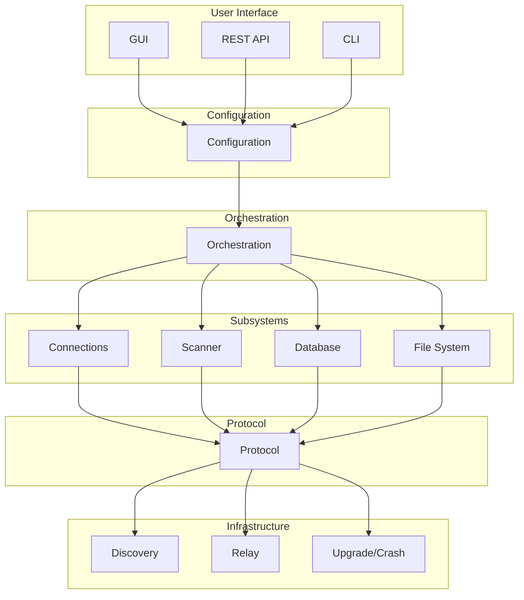
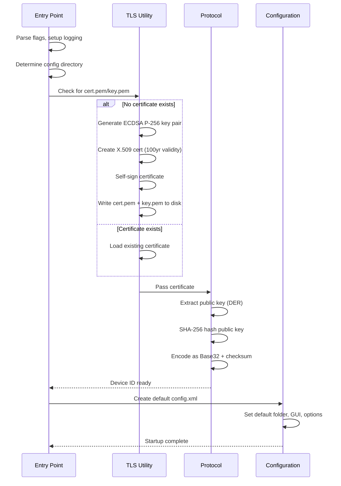
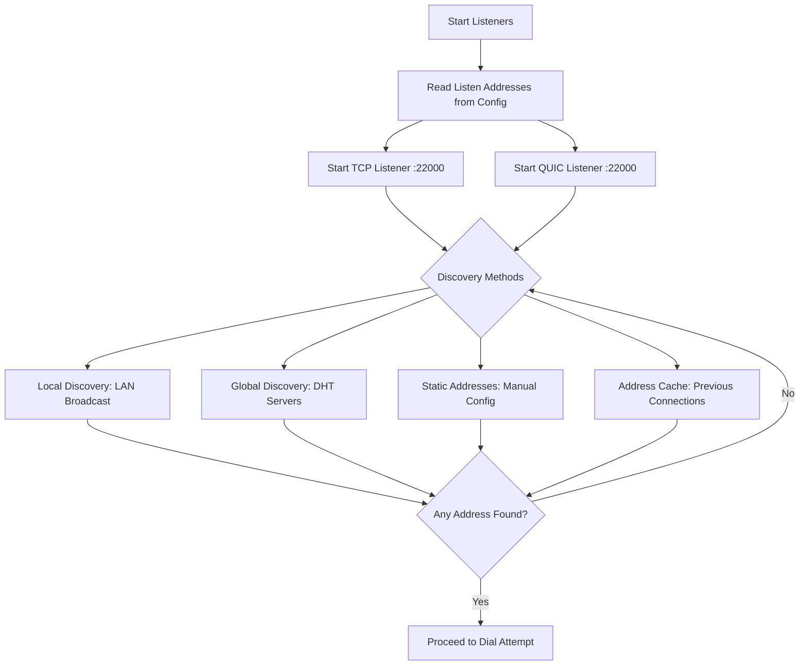
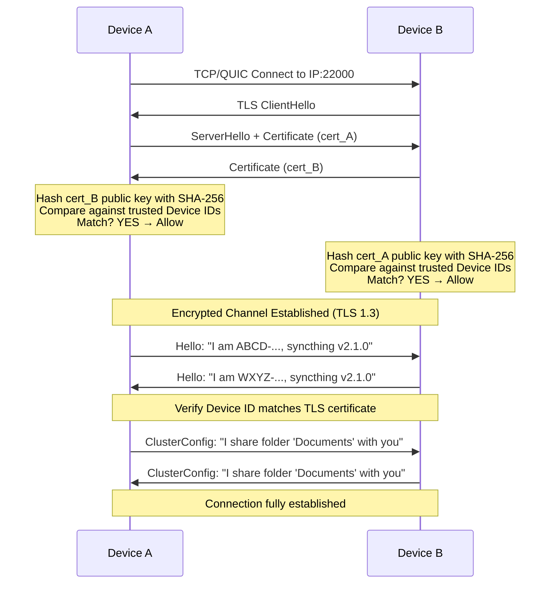
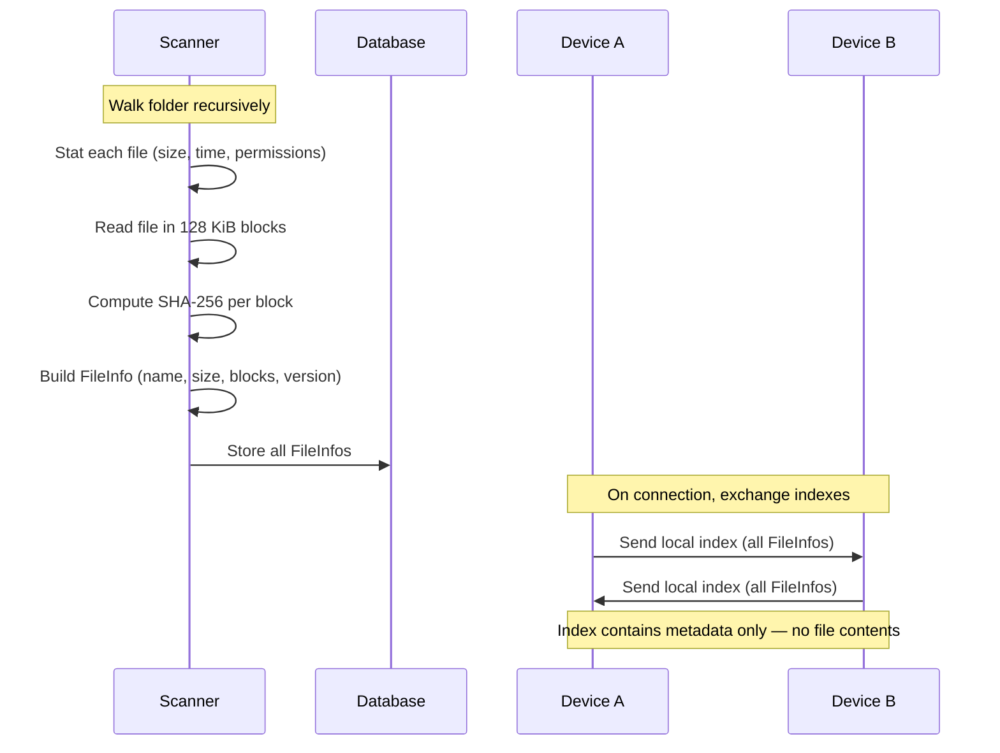
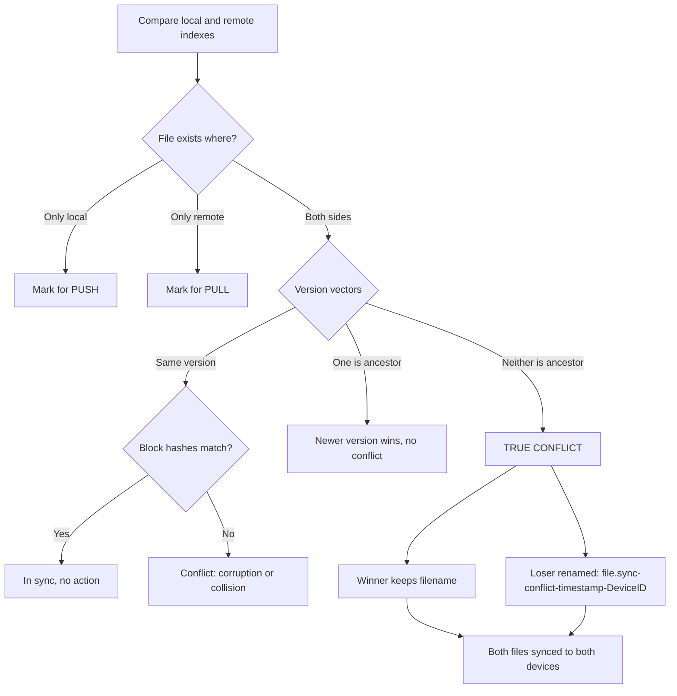
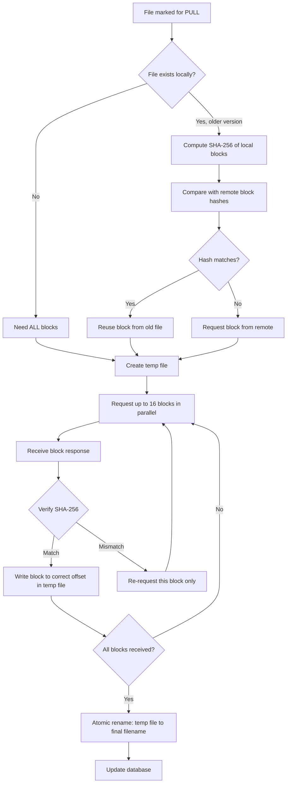
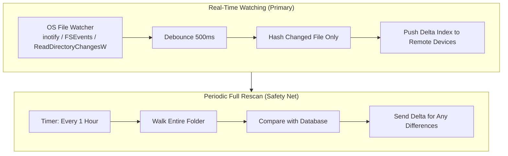

# Syncthing

## Architecture



**User Interface**

for user to add trusted devices, choose folders to sync, and monitor what's happening.

**Configuration**

Store the source of truth for who to trust (Device IDs), what to sync (folders), and how to behave (settings). Everything persists to disk so it survives restarts.

**Orchestration**

Make all high-level decisions. Compare local and remote file indexes to figure out what needs syncing. Detect conflicts. Trigger versioning. Coordinate all the subsystems beneath it.

**Connections**

Establish and maintain secure, encrypted channels between devices. Find peers on the network. Keep connections alive or reconnect when they drop.

**Scanner**

Turn files on disk into a compact, hash-based index that can be compared efficiently with remote devices without sending the actual file contents.

**Database**

Persist everything needed to survive crashes and restarts. Remember which files exist, their block hashes, and the state of in-progress transfers so nothing is lost or re-downloaded unnecessarily.

**File System**

Interact safely with the operating system's file system. Detect changes instantly. Write files atomically so interrupted transfers never corrupt data.

**Protocol**

Define the language that **Syncthing** devices speak to each other, how to encode messages, how to exchange file metadata, how to request and send blocks, and how to verify each other's identity without a central authority.

**Discovery Server**

Help devices find each other's IP addresses on the internet without revealing anything about what files are being synced.

**Relay Server**

Forward encrypted traffic between devices that can't connect directly, without ever being able to read the data. Usually because devices is behind NAT

**Upgrade/Crash Reporting**

Keep **Syncthing** up to date automatically and help developers fix bugs by collecting crash reports (opt-in).

***

## Identity Creation

Create a permanent, self-sovereign cryptographic identity for this device. No central authority, no registration, no cloud dependency.



* Entry point: cmd/syncthing/main.go
* Certificate generation: lib/tlsutil/tlsutil.go (ECDSA P-256, self-signed, 100yr validity)
* Device ID: lib/protocol/deviceid.go (SHA-256 of DER-encoded public key, Base32 + Luhn checksum)
* Config: lib/config/config.go (creates config.xml with default folder, GUI on 127.0.0.1:8384, discovery/relay enabled)
* Security: key.pem never leaves the device; Device ID is cryptographically bound, human-verifiable, QR-code friendly

***

## Adding a Remote Device (Trust Bootstrapping)

Establish a trusted relationship with another User device. This is the ONLY manual step in the entire system and the foundation of all security.

```
ADDING A REMOTE DEVICE
======================

PREREQUISITE: OUT-OF-BAND DEVICE ID EXCHANGE (Manual, Human-Verified)
---------------------------------------------------------------------

YOU (Device A)                    FRIEND (Device B)
┌──────────────┐                 ┌──────────────┐
│ Device ID:   │                 │ Device ID:   │
│ ABCD-EFGH... │                 │ WXYZ-1234... │
│              │                 │              │
│ [QR Code]    │                 │ [QR Code]    │
└──────────────┘                 └──────────────┘

Exchange methods (trusted channel):
• Scan QR code in person
• Send via Signal/WhatsApp (encrypted messenger)
• Read over phone call
• Email (less secure, but still requires MITM to exploit)

⚠️  NEVER trust a Device ID received through an untrusted channel!


STEP 2.1: ENTER DEVICE ID IN WEB GUI
------------------------------------
File: gui/default/index.html (Web GUI)
The user opens the Syncthing Web GUI and adds the remote device

1. User clicks "Add Remote Device"
2. Enters/pastes friend's Device ID: "WXYZ-1234-..."
3. Optionally sets:
   - Device name (friendly label)
   - Compression (metadata only / always / never)
   - Introducer flag (can this device introduce others?)
   - Addresses (tcp://ip:port for static IPs)
4. GUI validates checksum client-side before submission


STEP 2.2: REST API CALL
-----------------------
File: cmd/syncthing/gui.go: handle POST /rest/config/devices
The GUI sends the new device information to the Syncthing backend

1. Receive JSON: { "deviceID": "WXYZ-...", "name": "Friend's PC" }
2. Validate Device ID format and checksum (lib/protocol/)
3. It passes the validated device configuration to the configuration layer for storage


STEP 2.3: PERSIST TO CONFIGURATION
----------------------------------
File: lib/config/config.go: SetDevice()
The configuration layer stores the new device permanently

1. The device is added to the in-memory configuration with its Device ID, name, and settings:
   <device id="WXYZ-1234-..." name="Friend's PC">
     <address>dynamic</address>
     <compression>metadata</compression>
   </device>

2. Write updated config.xml to disk, so it survive restart
3. Notify all subscribers (via callback/observer pattern) that device list has changed


STEP 2.4: MODEL REACTS TO CONFIG CHANGE
---------------------------------------
File: lib/model/model.go: deviceAdded(deviceID)
The orchestration layer (the brain) responds to the configuration change

1. Model receives configuration change notification
2. Creates internal device connection handle
3. Signals connection service: "Try to connect to this Device ID"
4. Connection service begins discovery (see Section 3)


STEP 2.5: FOLDER SHARING (Optional but Typical)
-----------------------------------------------
User selects a folder in GUI and adds the remote device to it.

Config update:
<folder id="folder-abc123..." ...>
  <device id="MY-DEVICE-ID"/>  <!-- me -->
  <device id="WXYZ-1234..."/>  <!-- friend (NEW) -->
</folder>

This triggers:
1. Local device now expects to sync this folder with friend
2. On next connection to friend, a "folder suggestion" is sent
   (protocol ClusterConfig message)
3. Friend's Syncthing shows: "Device ABCD-... wants to share
   folder 'Documents' with you. Accept?"
4. If friend accepts, folder is added to THEIR config too
```

***

## Connection Establishment (Discovery + TLS + Multiplexing)

Find the remote device on the network and establish a secure, authenticated, multiplexed connection.

### Listeners + Discovery



#### **Start Lisiteners**

Syncthing reads the listen addresses from its configuration — by default `tcp://0.0.0.0:22000` and `quic://0.0.0.0:22000` — and binds to all network interfaces on port 22000. It starts a TCP listener that accepts incoming connections, wraps each one in TLS, and passes it to the connection handler. It also starts a QUIC listener over UDP on the same port, handling incoming sessions the same way. Both protocols run side by side, sharing the single port number.

Key things:

* Listens on all interfaces, port 22000
* TCP and QUIC simultaneously
* Every connection is TLS-wrapped before any data flows

***

#### Device Discovery

Syncthing finds the remote device's IP address by trying four methods in parallel and using whichever responds first.

**Local Discovery (LAN):** Each device broadcasts its presence on the local network every 30 seconds — "I am Device ABCD-..., at 192.168.1.5" — using IPv4 broadcast to `255.255.255.255:21027` and IPv6 multicast to `[ff12::8384]:21027`. Other devices listen on port 21027. When a device hears a broadcast from a Device ID it recognizes from its configuration, it replies directly with its own address. Both devices learn each other's LAN IPs within seconds without any internet access.

**Global Discovery (Internet):** Devices connect to community-run discovery servers over HTTPS. Each device announces its current IP address and which Device ID it wants to reach. When the server sees two devices announcing that they're looking for each other, it shares their IP addresses. The discovery server only sees opaque Device IDs and IP addresses — never file names, folder contents, or anything that could identify the user. Announcements are encrypted with each device's key. Users can also run their own discovery server for complete privacy.

**Static Addresses:** If a user has manually configured a fixed address like `tcp://1.2.3.4:22000` for a device, Syncthing dials it directly without any discovery step.

**Address Cache:** Previously successful addresses are saved to disk. On restart, Syncthing tries these cached addresses immediately for a fast reconnect before waiting for discovery.

> All four methods run simultaneously. The first one to produce a working address wins.



### Dial Attempt

Once discovery produces an IP address, Syncthing dials it on port 22000 and wraps the raw connection in TLS. Certificate authority verification is disabled, and instead a custom callback verifies the peer by hashing its certificate and checking whether the resulting Device ID exists in the local trusted device list. No CA, no server name, just the raw certificate check.

Key things:

* Dials the discovered IP on port 22000
* TLS configured with CA verification turned off
* Custom callback handles verification by hashing the peer certificate into a Device ID

***

#### Mutual TLS Handshake

This is the critical security step where both devices prove their identities without any central authority.

Device A and Device B each hold a self-signed certificate and a secret private key. The handshake proceeds in four steps: Device A connects, Device B sends a ClientHello, Device A replies with its certificate, and Device B sends its own certificate.

Then both sides perform the same verification. They extract the received certificate's public key, compute its SHA-256 hash, encode it as a Device ID, and check whether that Device ID appears in their local configuration's trusted device list. If the hash matches a known Device ID, the connection is allowed. If it does not match, the connection is rejected immediately.

No certificate authority is involved. Trust comes entirely from the out-of-band Device ID exchange done earlier: "This certificate hashes to a Device ID I was explicitly told to trust." Once both sides accept, the TLS handshake completes and an encrypted channel is established.

Key things:

* Both devices present self-signed certificates
* Each side hashes the other's certificate and compares to trusted Device IDs
* No CA — trust is purely certificate pinning
* Mismatched hash means immediate rejection

***

#### Protocol Negotiation

After TLS encryption is active, the devices confirm their identities at the application level. Each sends a Hello message containing its Device ID, client name, and version. Both sides verify that the Device ID in the Hello matches the identity from the TLS certificate. They then exchange ClusterConfig messages listing which folders are shared with whom. At this point, the connection is fully established.

Key things:

* Hello messages confirm Device ID, client name, and version
* Device ID is cross-checked against the TLS certificate
* ClusterConfig declares shared folders

***

#### Connection Multiplexing

A single physical TLS connection carries multiple independent logical streams. Each message carries a header with a stream ID, message type, and length, so messages from different streams can be interleaved freely — a block request for file A, then a block request for file B, then a response for file A, and so on.

* Stream 0: Index data (file metadata exchange)
* Stream 1-N: Block requests and responses for different files
* Dedicated stream: Ping/pong keepalive messages to detect dead connections
* Dedicated stream: ClusterConfig updates when folder sharing changes

This multiplexing enables parallel transfers: multiple files can sync simultaneously, and within a single file up to 16 block requests can be in flight at once. Blocks can arrive out of order and are written directly to the correct offset in the temporary file. Go goroutines handle each stream concurrently, making efficient use of a single encrypted channel.

Key things:

* One physical connection, many logical streams
* Each message tagged with stream ID for interleaving
* Separate streams for index data, block transfers, keepalive, and config
* Up to 4 concurrent files, 16 in-flight blocks per file
* Blocks written to correct offset regardless of arrival order

***

## File Synchronization

Detect which files need to be transferred, transfer only the changed blocks, verify integrity, handle conflicts.

### Indexing



#### Initial Local Indexing

When a folder is first added or rescanned, Syncthing walks it recursively and builds a local index. For each file, it reads the file's size, modification time, and permissions. Then it opens the file and reads it in 128 KiB blocks, computing a SHA-256 hash for each block. These hashes are stored in a list of block metadata, each entry recording the block's byte offset, size, and hash.

From this, Syncthing builds a FileInfo structure containing the file name, total size, modification timestamp, permissions, an initial version vector, and the list of block hashes. A 2 MB file produces 16 blocks of 128 KiB each.

All FileInfo entries are stored in a local key-value database, keyed by folder ID and filename, with the FileInfo serialized using Protocol Buffers. This database is what gets compared with remote devices to determine what needs syncing.

Key things:

* Walks folder recursively
* Splits each file into 128 KiB blocks
* Computes SHA-256 hash per block
* Builds FileInfo: name, size, time, permissions, version, block list
* Stores everything in local database

***

#### Index Exchange

When two devices connect and share a folder, they exchange their local indexes. Each device sends its complete list of FileInfo entries to the other, then receives the remote device's list in return.

The index contains only metadata: file names and paths, sizes, modification times, permissions, SHA-256 hashes of every block, and version vectors. It does not contain any actual file data. The block hashes are what allow devices to determine which specific blocks have changed without ever sending the file contents themselves.

Key things:

* Both devices send their full index on connection
* Contains metadata only — no file contents
* Block hashes enable efficient comparison later

### Comparison & Conflict



#### Comparison

Once both indexes are received, Syncthing compares them to decide what action to take for each file.

If a file only exists locally, it's marked for push to the remote device. If a file only exists remotely, it's marked for pull from the remote device. If a file exists on both sides with the same version vector, Syncthing compares the block hashes if they match, the file is in sync and no action is needed; if they don't match, it's treated as a conflict, which is rare and usually indicates corruption or a hash collision.

If one side has a strictly newer version, the newer one wins and gets pushed to the other device. If both sides changed the same file independently and neither version is a direct ancestor of the other, a true conflict is detected and handed off to conflict resolution.

Key things:

* File only local → push
* File only remote → pull
* Same version, matching hashes → in sync
* One version is ancestor → newer wins
* Neither is ancestor → conflict

***

#### Conflict Resolution

When both devices modified the same file since their last sync, Syncthing resolves the conflict by comparing version vectors. The comparison isn't "highest counter wins" — it checks whether one version is a direct ancestor of the other. If Remote's state is an ancestor of Local's state, Local wins cleanly with no conflict. If neither side is an ancestor of the other, it's a true conflict.

In a true conflict, the side with the larger version vector keeps the original filename. The losing side gets renamed with the pattern `filename.sync-conflict-timestamp-DeviceID.ext`. Both files are synced to both devices, so no data is ever lost.

Key things:

* Conflict only when neither version is an ancestor of the other
* Winner keeps original filename
* Loser renamed with timestamp and device ID
* Both files synced everywhere, no data lost

### Block Transfer



#### Block Level Transfer

For each file marked for pull, Syncthing determines which blocks it actually needs. If the file doesn't exist locally at all, every block must be requested. If an older version exists locally, Syncthing computes the SHA-256 hash of each local block and compares them against the remote index. Blocks with matching hashes are reused from the old file — only blocks with different hashes are requested from the remote device.

A temporary file is created in the sync folder. Any reusable blocks are copied from the old file into the temp file at their correct offsets. Then Syncthing requests the missing blocks from the remote device, keeping up to 16 requests in flight at once. As each response arrives, the block's SHA-256 hash is verified immediately. If the hash matches, the block is written to the correct offset in the temp file — blocks can arrive in any order and are placed correctly regardless. If the hash doesn't match, only that specific block is re-requested; nothing else is affected.

Once all blocks are received and verified, Syncthing optionally verifies the full file hash, sets the correct modification time and permissions, atomically renames the temp file to the final filename, updates the local database with the new FileInfo, and emits a "file synced" event to the GUI.

Key things:

* Reuses blocks from old local file when hashes match
* Requests only changed blocks, not the whole file
* Up to 16 block requests in flight at once
* Each block verified by SHA-256 on arrival
* Hash mismatch → re-request only that block
* Blocks written to correct offset regardless of arrival order
* Atomic rename from temp file to final filename when complete

### Continous Monitoring



After the initial sync completes, Syncthing enters a steady state using two complementary methods to detect changes.

**Method A: Real-Time File Watching (Primary)**

Syncthing subscribes to OS-level file system notifications

* notify on Linux
* FSEvents on macOS
* ReadDirectoryChangesW on Windows.&#x20;

When a user saves a file, the operating system emits an event. Syncthing receives it, waits 500 milliseconds to debounce rapid successive saves like IDE auto-saves, then hashes only the changed file, updates the local index, and pushes a delta index to connected remote devices. The remote device receives the updated index and pulls only the changed blocks. Total latency from save to sync is typically one to three seconds.

**Method B: Periodic Full Rescan (Safety Net)**

A timer triggers a full folder walk at a configurable interval, defaulting to once per hour. It rescans every file, compares against the database, and sends delta indexes for any differences. This catches changes the file watcher might have missed: watcher errors, modifications made while Syncthing was stopped, or changes by tools that bypass filesystem events.

Key things:

* Primary: OS-level file watcher with 500ms debounce, 1-3 second latency
* Safety net: full rescan every hour catches anything the watcher missed
* Both produce delta indexes so remotes only pull what changed

***

### SECTION 5: RESILIENCE & ERROR HANDLING

#### Purpose

Handle connection failures, network issues, restarts, and partial transfers without data loss.

#### Files Involved

| File                         | Role                                 |
| ---------------------------- | ------------------------------------ |
| `lib/connections/service.go` | Reconnection logic, keepalive        |
| `lib/model/model.go`         | Transfer retry, state persistence    |
| `lib/db/set.go`              | Persistent state (survives restarts) |
| `lib/db/transactions.go`     | Atomic DB operations                 |
| `lib/protocol/protocol.go`   | Ping/pong protocol messages          |
| `lib/relay/client/`          | Relay fallback connections           |

#### Step-by-Step Flow

```
RESILIENCE & ERROR HANDLING
===========================

STEP 5.1: CONNECTION MONITORING (Keepalive)
-------------------------------------------
Files: lib/connections/service.go + lib/protocol/protocol.go

Two layers of connection health checking:

Layer 1: TCP Keepalives (OS-level)
- Enabled on all TCP sockets
- Default: idle 30s, probe every 10s, 3 probes before dead
- Detects: network cable unplugged, router crash, etc.

Layer 2: Protocol Ping/Pong (Application-level)
- Every 90 seconds, send Ping message
- Expect Pong response within 30 seconds
- If no response: connection is considered DEAD

Protocol messages (lib/protocol/protocol.go):
  type Ping struct{}  // empty message
  type Pong struct{}  // empty response


STEP 5.2: CONNECTION LOSS DETECTION
-----------------------------------
File: lib/connections/service.go: connectionLoop()

Connection can be lost due to:
- Network failure (WiFi disconnect, ISP outage)
- Remote device shutdown/sleep
- Firewall rule change
- IP address change (mobile network, DHCP renewal)

Detection:
1. TCP connection: Read() returns error or connection reset
2. QUIC session: idle timeout or stream error
3. Ping timeout: no Pong within 30 seconds

On detection:
1. Mark connection as "disconnected"
2. Cancel all in-flight requests on this connection
3. Clean up pending blocks (temp files preserved!)
4. Notify Model: "device WXYZ-... disconnected"
5. Begin reconnection process (Step 5.3)


STEP 5.3: AUTOMATIC RECONNECTION
--------------------------------
File: lib/connections/service.go: reconnectLoop()

RECONNECTION ALGORITHM:

1. Immediate retry (attempt 1): wait 1 second
2. If fails, exponential backoff:
   Attempt 1:  wait   1 second
   Attempt 2:  wait   2 seconds
   Attempt 3:  wait   4 seconds
   Attempt 4:  wait   8 seconds
   Attempt 5:  wait  16 seconds
   Attempt 6:  wait  32 seconds
   Attempt 7:  wait  64 seconds
   ...
   Maximum:    wait 3600 seconds (1 hour)

3. On each retry attempt, REDISCOVER the remote device:
   a. Check address cache first (fast)
   b. Try local discovery (LAN broadcast)
   c. Try global discovery (internet)
   d. Try relay connections if enabled

4. All methods tried in PARALLEL per attempt
5. First successful connection → stop retrying


STEP 5.4: STATE PRESERVATION (Surviving Restarts)
-------------------------------------------------
Files: lib/db/set.go + lib/model/model.go

Syncthing is designed to be KILLED AT ANY TIME without data loss.

WHAT PERSISTS TO DISK:

1. config.xml: All device and folder configuration
2. cert.pem + key.pem: Device identity
3. Index database (LevelDB/Badger):
   - Complete file index for all folders
   - Block hashes for every synced file
   - Version vectors for conflict detection
4. Temporary files (.syncthing.tmp.*):
   - Partially transferred files with blocks written to disk

WHAT HAPPENS ON RESTART:

1. Load config.xml
2. Open index database
3. Check for temp files from previous session:
   - For each .syncthing.tmp.* file:
     • Check database: was this transfer completed?
     • YES → complete the rename to final filename
     • NO  → keep as temp, resume transfer on reconnect
4. Connect to known devices
5. Exchange DELTA indexes:
   Instead of re-sending entire index:
   - "Here's what I have NOW"
   - Remote compares with what it knew before
   - Only differences trigger transfer
6. Resume interrupted transfers from temp files:
   - Check which blocks are already written to temp file
   - Only request the MISSING blocks


STEP 5.5: RELAY FALLBACK (When Direct Connection Impossible)
-----------------------------------------------------------
Files: lib/relay/client/ + lib/connections/service.go

When direct connection fails (both behind restrictive NAT):

   Device A                        Device B
   (NAT)                           (NAT)
     │                                │
     │  1. Can't connect directly     │
     │                                │
     │  2. Connect to relay           │  3. Connect to relay
     ├──────────────────────────────► ├───────────────────────►
     │                                │
     │               RELAY SERVER (public or private)
     │               ┌──────────────────────┐
     │               │  Listens on :22067   │
     │               │  cmd/strelaysrv/     │
     │               └──────────────────────┘
     │                         │
     │  4. Relay matches       │
     │     "A wants WXYZ..."   │
     │     "B wants ABCD..."   │
     │                         │
     │  5. A <──── TLS (END-TO-END) ────> B
     │     Relay forwards bytes, CANNOT DECRYPT
     │

WHAT THE RELAY CAN SEE:
- Source IP and destination IP
- Encrypted TLS traffic (unreadable)
- Amount of data transferred

WHAT THE RELAY CANNOT SEE:
- File names, folder names
- File contents
- Device IDs (inside encrypted tunnel)

Connection preference: Direct > Relay
- Direct connections always preferred
- Relay is only used as fallback
- If direct connection becomes available, switch automatically
```

***

### SECTION 6: FILE VERSIONING & RECOVERY

#### Purpose

Protect against accidental deletion, unwanted modification, and provide a safety net for user errors.

#### Files Involved

| File                         | Role                                        |
| ---------------------------- | ------------------------------------------- |
| `lib/versioner/simple.go`    | Simple versioning (keep N versions)         |
| `lib/versioner/staggered.go` | Staggered versioning (time-based retention) |
| `lib/versioner/trashcan.go`  | Trash can versioning (move to .stversions)  |
| `lib/versioner/external.go`  | External script versioning                  |
| `lib/model/model.go`         | Integrates versioning into sync flow        |

#### Step-by-Step Flow

```
FILE VERSIONING & RECOVERY
==========================

STEP 6.1: VERSIONING TRIGGERS
-----------------------------
Versioning activates when:

1. A remote device sends a file that OVERWRITES a local file
2. A remote device sends a DELETION for a file
3. (When "sync ownership" is enabled) permissions/metadata change

Versioning does NOT activate for:
- Local changes you make yourself
- Initial sync (first time receiving a file)


STEP 6.2: VERSIONING STRATEGIES
-------------------------------

STRATEGY 1: TRASH CAN (Simple)
File: lib/versioner/trashcan.go

When a file is replaced/deleted:
- Move old file to: .stversions/filename~timestamp.ext
- Keep forever (unless manually cleaned)
- Example:
  Original: documents/report.pdf
  Replaced → documents/.stversions/report~20260519-143052.pdf


STRATEGY 2: SIMPLE VERSIONING
File: lib/versioner/simple.go

Configuration: "Keep last N versions"

When a file is replaced/deleted:
1. Move old file to .stversions/filename~timestamp.ext
2. If total versions > N, delete the OLDEST one

Example with N=3:
.stversions/
  report~20260517-090000.pdf  ← version 1
  report~20260518-150000.pdf  ← version 2
  report~20260519-120000.pdf  ← version 3 (newest)
Next change: version 1 is DELETED, new version 4 is kept


STRATEGY 3: STAGGERED VERSIONING
File: lib/versioner/staggered.go

Configuration: "Keep versions at increasing intervals"

Retention schedule:
  For the first HOUR:     Keep ALL versions
  For the first DAY:      Keep one version per HOUR
  For the first 30 DAYS:  Keep one version per DAY
  Up to 1 YEAR:           Keep one version per WEEK
  Beyond 1 year:          Keep one version per MONTH
  Maximum age:            Delete versions older than 365 days

Result: Fine-grained recent history, efficient long-term storage


STRATEGY 4: EXTERNAL VERSIONING
File: lib/versioner/external.go

- Calls a user-specified script/program on each version event
- Script receives: action, filepath, version path
- Allows integration with: Git, Borg Backup, Restic, etc.


STEP 6.3: VERSIONING INTEGRATION WITH SYNC
------------------------------------------
File: lib/model/model.go: versioner.Archive(filePath)

When a remote change would overwrite a local file:

1. Remote sends: "I have report.pdf v5"
2. Local has:   "report.pdf v3"
3. Before overwriting:
   a. Versioner.Archive("report.pdf")
   b. Old file moved to .stversions/
   c. New file pulled and written
4. If user realizes v5 is wrong:
   - Go to .stversions/
   - Copy report~20260518-143000.pdf back to report.pdf
```

***

### SECTION 7: SHUTDOWN & RESTART

#### Purpose

Gracefully stop all subsystems, flush data to disk, and prepare for clean restart.

#### Files Involved

| File                         | Role                                    |
| ---------------------------- | --------------------------------------- |
| `cmd/syncthing/main.go`      | Signal handling, shutdown orchestration |
| `lib/model/model.go`         | Stop sync, flush state                  |
| `lib/connections/service.go` | Close all connections gracefully        |
| `lib/db/set.go`              | Flush database to disk                  |
| `lib/config/config.go`       | Save final configuration                |

#### Step-by-Step Flow

```
SHUTDOWN & RESTART
==================

STEP 7.1: SHUTDOWN TRIGGERS
---------------------------
File: cmd/syncthing/main.go: signal handling

Shutdown initiated by:
1. SIGINT (Ctrl+C) or SIGTERM (systemd stop)
2. GUI "Shutdown" button (REST API call)
3. Fatal error (auto-restart via service manager)


STEP 7.2: GRACEFUL SHUTDOWN SEQUENCE
------------------------------------

1. STOP ACCEPTING NEW CONNECTIONS
   Close TCP listener (lib/connections/tcp_listener.go)
   Close QUIC listener (lib/connections/quic_listener.go)
   New connection attempts will be rejected

2. NOTIFY REMOTE DEVICES
   Send "Close" message on each active connection:
   type Close struct {
     Reason string  // "shutting down"
   }
   Remote devices know: this is intentional, not a crash

3. CANCEL IN-FLIGHT TRANSFERS
   - Cancel all pending block requests
   - Mark temp files with current progress
   - Temp files survive shutdown (intact on disk)

4. FLUSH DATABASE
   lib/db/set.go: db.Close()
   - Complete any in-progress transactions
   - Flush all writes to disk
   - Close LevelDB/Badger database handle

5. SAVE CONFIGURATION
   lib/config/config.go: config.Save()
   - Write config.xml to disk (if changes pending)
   - All device and folder settings preserved

6. CLOSE ALL CONNECTIONS
   - Close TLS connections gracefully
   - Close relay connections
   - Close discovery announcements

7. EXIT
   - Log "Syncthing exiting"
   - os.Exit(0)


STEP 7.3: RESTART SEQUENCE
--------------------------
On restart, Syncthing resumes cleanly:

1. Load existing certificate (identity preserved!)
2. Load config.xml (all devices and folders remembered)
3. Open index database (all file metadata intact)
4. Scan for temp files:
   For each .syncthing.tmp.* file:
     if isComplete(tempFile):
         rename tempFile → finalFile  // Complete the transfer
     else:
         keep tempFile  // Will resume on reconnect
5. Start listeners (begin accepting connections)
6. Begin discovery and connection to known devices
7. On connection: exchange delta indexes (only what changed)
8. Resume interrupted transfers from temp files

RESULT: No data loss, minimal re-transfer, fast resume.
```

***

### Complete System Data Flow Diagram

```
┌─────────────────────────────────────────────────────────────────────────────┐
│                         END-TO-END DATA FLOW                                   
│                                                                               │
│  YOUR DEVICE                                          FRIEND'S DEVICE         │
│  ┌───────────────────────┐                           ┌──────────────────────┐ │
│  │                       │                           │                      │ │
│  │  1. FIRST LAUNCH      │                           │  (same process)      │ │
│  │     cert.pem + key.pem│                           │                      │ │
│  │     Device ID: ABCD.. │                           │  Device ID: WXYZ..   │ │
│  │                       │                           │                      │ │
│  │  2. ADD DEVICE        │                           │                      │ │
│  │     Enter WXYZ-...    │─── out-of-band exchange ──│ Enter ABCD-...       │ │
│  │     (manual)          │      (QR code/msg)        │ (manual)             │ │
│  │                       │                           │                      │ │
│  │  3. SHARE FOLDER      │                           │                      │ │
│  │     "Documents" →     │                           │ Accept folder share  │ │
│  │     shared with WXYZ  │                           │                      │ │
│  │                       │                           │                      │ │
│  │  4. DISCOVERY         │                           │                      │ │
│  │     ├─ LAN broadcast  │◄─────── broadcast ───────►│ ├─ LAN broadcast     │ │
│  │     ├─ Global server  │◄──── discovery.syncthing ─│ ├─ Global server     │ │
│  │     └─ Cached addrs   │                           │ └─ Cached addrs      │ │
│  │                       │                           │                      │ │
│  │  5. CONNECTION        │                           │                      │ │
│  │     Dial WXYZ:22000   │─────── TCP/QUIC ────────► │ Accept from ABCD     │ │
│  │                       │                           │                      │ │
│  │  6. MUTUAL TLS        │                           │                      │ │
│  │     Present cert_A    │─────── TLS 1.3 mTLS ───── │ Present cert_B       │ │
│  │     Verify cert_B     │◄──── no CA involved ────► │ Verify cert_A        │ │
│  │     hash = WXYZ-... ✓ │                           │ hash = ABCD-... ✓    │ │
│  │                       │                           │                      │ │
│  │  7. PROTOCOL HELLO    │                           │                      │ │
│  │     "I am ABCD-..."   │◄────────────────────────► │ "I am WXYZ-..."      │ │
│  │     "Folders I share  │                           │ "Folders I share     │ │
│  │      with you: Docs"  │                           │  with you: Docs"     │ │
│  │                       │                           │                      │ │
│  │  8. INDEX EXCHANGE     │                          │                      │ │
│  │     Send local index   │─────── FileInfos ───────►│ Receive remote index │ │
│  │     Receive remote idx │◄────── FileInfos ─────── │ Send local index     │ │
│  │                        │                          │                      │ │
│  │  9. COMPARE            │                          │                      │ │
│  │     Need: report.pdf   │                          │ Need: photo.jpg      │ │
│  │     Have: photo.jpg    │                          │ Have: report.pdf     │ │
│  │                        │                          │                      │ │
│  │  10. BLOCK TRANSFER    │                          │                      │ │
│  │     Request blocks     │──── request(blk 0,1) ──► │ Read blocks from disk│ │
│  │     Verify SHA-256     │◄─── response(data) ───── │ Send blocks          │ │
│  │     Write to temp file │                          │                      │ │
│  │     Request blocks     │◄─── request(blk 5,7) ─── │ Verify SHA-256       │ │
│  │     Read from disk     │──── response(data) ────► │ Write to temp file   │ │
│  │                        │                           │                     │ │
│  │  11. FINALIZE          │                           │                     │ │
│  │     All blocks verified│                           │ All blocks verified │ │
│  │     Rename temp→final  │                           │ Rename temp→final   │ │
│  │     Update DB          │                           │ Update DB           │ │
│  │                        │                           │                     │ │
│  │  12. CONTINUOUS SYNC   │                           │                     │ │
│  │     ┌─ File watcher    │                           │ ┌─ File watcher     │ │
│  │     ├─ Detect changes  │◄──── delta index ────────►│ ├─ Detect changes   │ │
│  │     └─ Push index      │                           │ └─ Push index       │ │
│  │                        │                           │                     │ │
│  │  13. CONNECTION LOSS   │                           │                     │ │
│  │     Detect disconnect  │                           │ Detect disconnect   │ │
│  │     Exponential backoff│                           │ Exponential backoff │ │
│  │     Rediscover + retry │◄────── reconnect ────────►│ Rediscover + retry  │ │
│  │     Resume from temp   │                           │ Resume from temp    │ │
│  │                        │                           │                     │ │
│  │  14. SHUTDOWN          │                           │                     │ │
│  │     Cancel transfers   │                           │ (same process)      │ │
│  │     Flush DB           │                           │                     │ │
│  │     Save config        │                           │                     │ │
│  │     Close connections  │─────── "Close" msg ─────► │ Mark as disconnected│ │
│  │                        │                           │                     │ │
│  └────────────────────────┘                           └─────────────────────┘ │
│                                                                               │
└───────────────────────────────────────────────────────────────────────────────┘
```

***

### Key Architectural Principles Summary

| #  | Principle                          | Implementation                                             |
| -- | ---------------------------------- | ---------------------------------------------------------- |
| 1  | **No central server**              | Peer-to-peer with mutual TLS                               |
| 2  | **No trusted third party**         | Certificate pinning via out-of-band Device ID exchange     |
| 3  | **No cloud dependency**            | Identity, config, and index stored locally only            |
| 4  | **End-to-end encryption**          | TLS 1.3 between peers, even through relays                 |
| 5  | **Data integrity**                 | SHA-256 of every block, verified on receipt                |
| 6  | **Block-level delta sync**         | 128 KiB blocks, only changed blocks transferred            |
| 7  | **Out-of-order parallel transfer** | Blocks requested in parallel, written at correct offsets   |
| 8  | **Conflict safety**                | Version vectors + automatic conflict file renaming         |
| 9  | **Offline resilience**             | Persistent index DB, temp file checkpointing               |
| 10 | **Automatic reconnection**         | Exponential backoff, rediscovery, relay fallback           |
| 11 | **Privacy-preserving discovery**   | Opaque Device IDs, encrypted announcements                 |
| 12 | **File versioning**                | Configurable retention strategies                          |
| 13 | **Cross-platform**                 | Pure Go, OS-specific file watchers                         |
| 14 | **Graceful shutdown**              | Flush state, notify peers, resume on restart               |
| 15 | **Single binary**                  | All infrastructure (discovery, relay) in separate commands |
