  # Syncthing



## Architecture

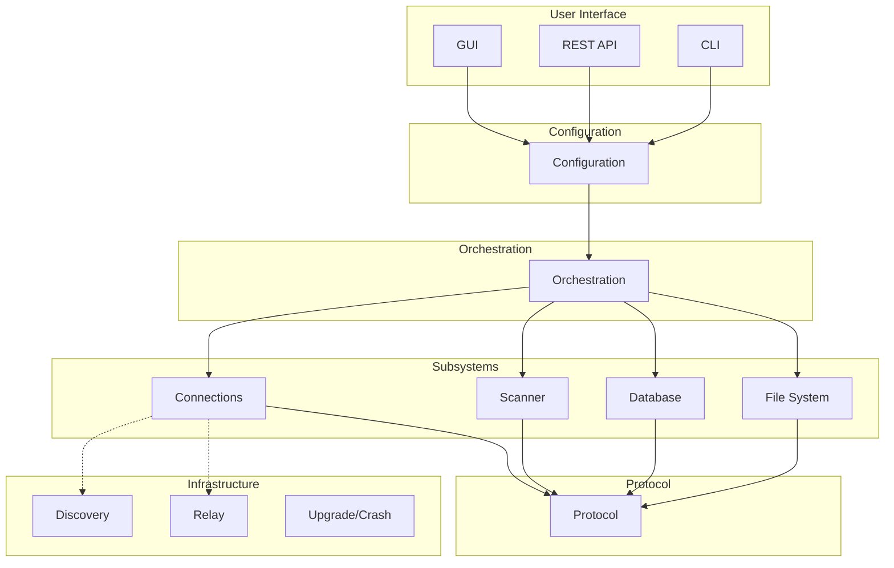

**User Interface**

for user to add trusted devices, choose folders to sync, and monitor what's happening.

**Configuration**

Store the source of truth for who to trust (Device IDs), what to sync (folders), and how to behave (settings). Everything persists to disk so it survives restarts.

**Orchestration**

Make all high-level decisions. Compare local and remote file indexes to figure out what needs syncing. Detect conflicts. Trigger versioning. Coordinate all the subsystems beneath it.

**Connections**

Establish and maintain secure, encrypted channels between devices. Find peers on the network. Keep connections alive or reconnect when they drop.

**Scanner**

Turn files on disk into a compact, hash-based index that can be compared efficiently with remote devices without sending the actual file contents.

**Database**

Persist everything needed to survive crashes and restarts. Remember which files exist, their block hashes, and the state of in-progress transfers so nothing is lost or re-downloaded unnecessarily.

**File System**

Interact safely with the operating system's file system. Detect changes instantly. Write files atomically so interrupted transfers never corrupt data.

**Protocol**

Define the language that **Syncthing** devices speak to each other, how to encode messages, how to exchange file metadata, how to request and send blocks, and how to verify each other's identity without a central authority.

**Discovery Server**

Help devices find each other's IP addresses on the internet without revealing anything about what files are being synced.

**Relay Server**

Forward encrypted traffic between devices that can't connect directly, without ever being able to read the data. Usually because devices is behind NAT

**Upgrade/Crash Reporting**

Keep **Syncthing** up to date automatically and help developers fix bugs by collecting crash reports (opt-in).

***

## Identity Creation

Create a permanent, self-sovereign cryptographic identity for this device. No central authority, no registration, no cloud dependency.

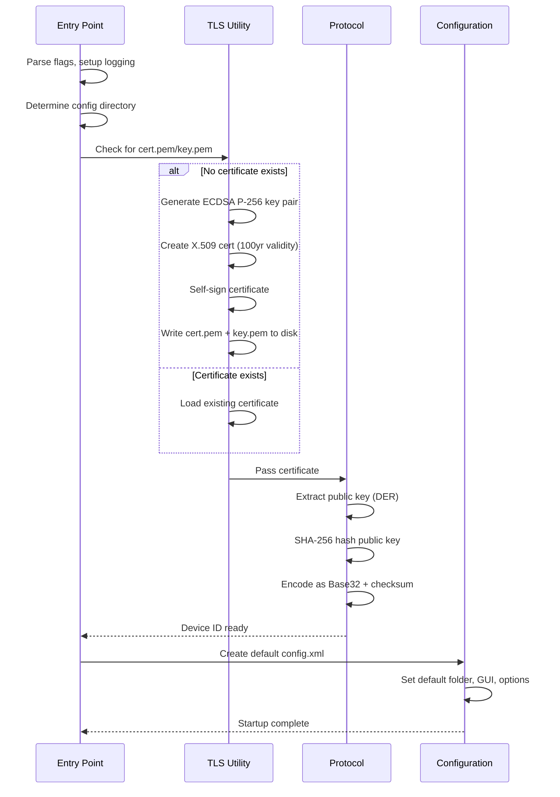

* Entry point: cmd/syncthing/main.go
* Certificate generation: lib/tlsutil/tlsutil.go (ECDSA P-256, self-signed, 100yr validity)
* Device ID: lib/protocol/deviceid.go (SHA-256 of DER-encoded public key, Base32 + Luhn checksum)
* Config: lib/config/config.go (creates config.xml with default folder, GUI on 127.0.0.1:8384, discovery/relay enabled)
* Security: key.pem never leaves the device; Device ID is cryptographically bound, human-verifiable, QR-code friendly

***

## Adding a Remote Device (Trust Bootstrapping)

Establish a trusted relationship with another User device. This is the ONLY manual step in the entire system and the foundation of all security.

### Adding a Device

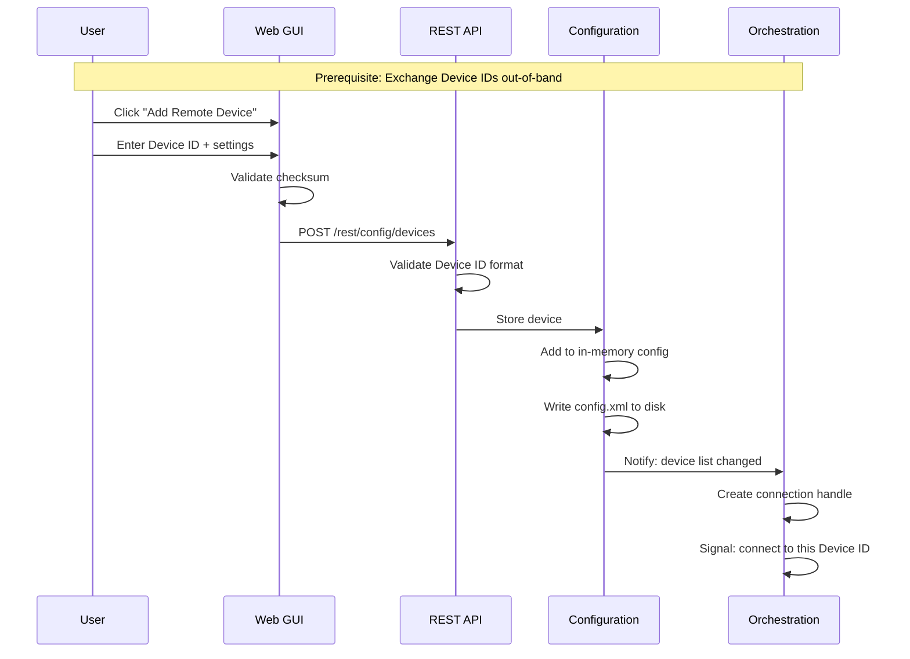

#### PREREQUISITE: Out-of-Band Device ID Exchange

Before any connection can happen, both users must exchange Device IDs through a trusted channel — scanning a QR code in person, sending via an encrypted messenger like Signal or WhatsApp, or reading it over a phone call. Email works but is less secure since it still requires a man-in-the-middle attack to exploit. A Device ID received through an untrusted channel should never be accepted.

#### Enter Device ID in Web GUI

The user opens the Syncthing Web GUI, clicks "Add Remote Device," and enters the friend's Device ID. Optional settings include a friendly name, compression preference, whether the device can act as an introducer, and static addresses for fixed IPs. The GUI validates the checksum before sending anything to the backend.

#### REST API Call

The GUI sends the new device information as JSON to the backend. The backend validates the Device ID format and checksum again, then passes the validated configuration to the configuration layer for storage.

#### Persist to Configuration

The configuration layer adds the device to its in-memory store with the Device ID, name, and settings. The updated configuration is written to `config.xml` on disk so it survives restarts. All interested parts of Syncthing are notified that the device list has changed.

#### Orchestration Reacts

The orchestration layer receives the notification, creates an internal handle for the new device, and signals the connection service to begin discovery — searching for the device on the local network, via global discovery servers, and through cached addresses.

***

### Sharing a Folder

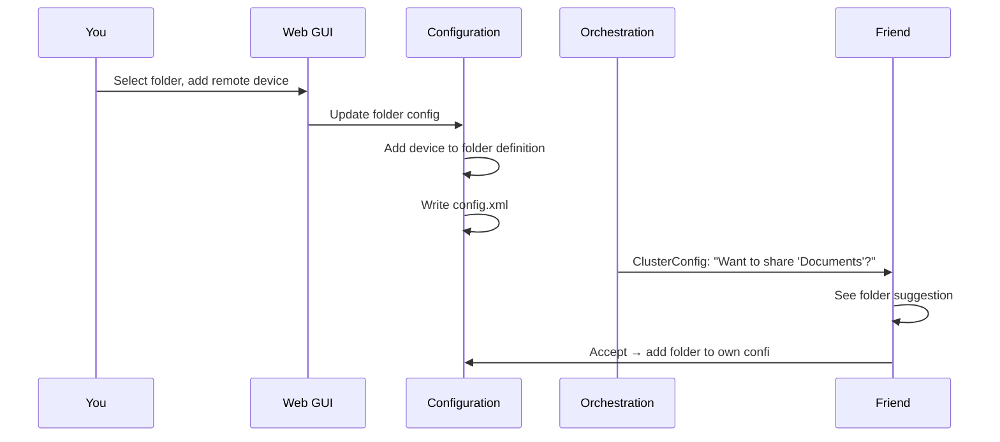

#### Folder Sharing (Optional but Typical)

After adding a device, the user typically shares a folder with it. In the Web GUI, the user selects a folder and adds the remote device to it. The configuration is updated so the folder now lists both devices as participants — the local device and the newly added remote device.

On the next connection to the remote device, the orchestration layer sends a folder suggestion via a ClusterConfig message. The friend sees a notification: "Device ABCD-... wants to share folder 'Documents' with you. Accept?" If the friend accepts, the folder is added to their configuration too, and both devices now expect to keep that folder in sync.

Key things:

* User picks a folder and adds the remote device to it
* ClusterConfig message sent on next connection
* Friend must accept before syncing begins
* Acceptance adds the folder to both configurations

***

## Connection Establishment (Discovery + TLS + Multiplexing)

Find the remote device on the network and establish a secure, authenticated, multiplexed connection.

### Listeners + Discovery

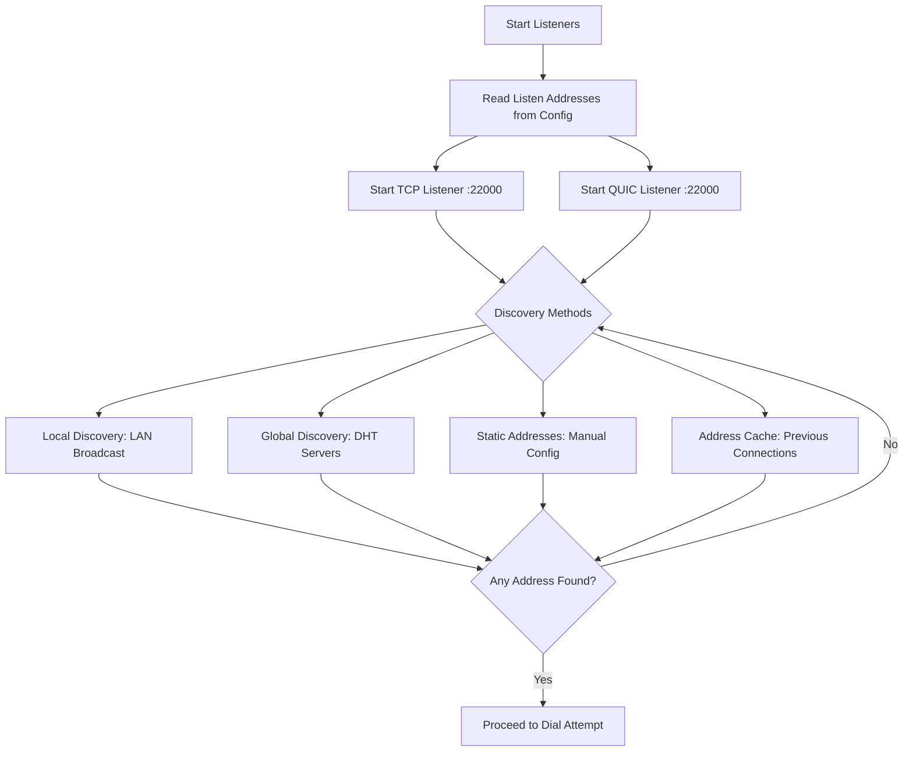

#### **Start Lisiteners**

Syncthing reads the listen addresses from its configuration — by default `tcp://0.0.0.0:22000` and `quic://0.0.0.0:22000` — and binds to all network interfaces on port 22000. It starts a TCP listener that accepts incoming connections, wraps each one in TLS, and passes it to the connection handler. It also starts a QUIC listener over UDP on the same port, handling incoming sessions the same way. Both protocols run side by side, sharing the single port number.

Key things:

* Listens on all interfaces, port 22000
* TCP and QUIC simultaneously
* Every connection is TLS-wrapped before any data flows

***

#### Device Discovery

Syncthing finds the remote device's IP address by trying four methods in parallel and using whichever responds first.

**Local Discovery (LAN):** Each device broadcasts its presence on the local network every 30 seconds — "I am Device ABCD-..., at 192.168.1.5" — using IPv4 broadcast to `255.255.255.255:21027` and IPv6 multicast to `[ff12::8384]:21027`. Other devices listen on port 21027. When a device hears a broadcast from a Device ID it recognizes from its configuration, it replies directly with its own address. Both devices learn each other's LAN IPs within seconds without any internet access.

**Global Discovery (Internet):** Devices connect to community-run discovery servers over HTTPS. Each device announces its current IP address and which Device ID it wants to reach. When the server sees two devices announcing that they're looking for each other, it shares their IP addresses. The discovery server only sees opaque Device IDs and IP addresses — never file names, folder contents, or anything that could identify the user. Announcements are encrypted with each device's key. Users can also run their own discovery server for complete privacy.

**Static Addresses:** If a user has manually configured a fixed address like `tcp://1.2.3.4:22000` for a device, Syncthing dials it directly without any discovery step.

**Address Cache:** Previously successful addresses are saved to disk. On restart, Syncthing tries these cached addresses immediately for a fast reconnect before waiting for discovery.

> All four methods run simultaneously. The first one to produce a working address wins.

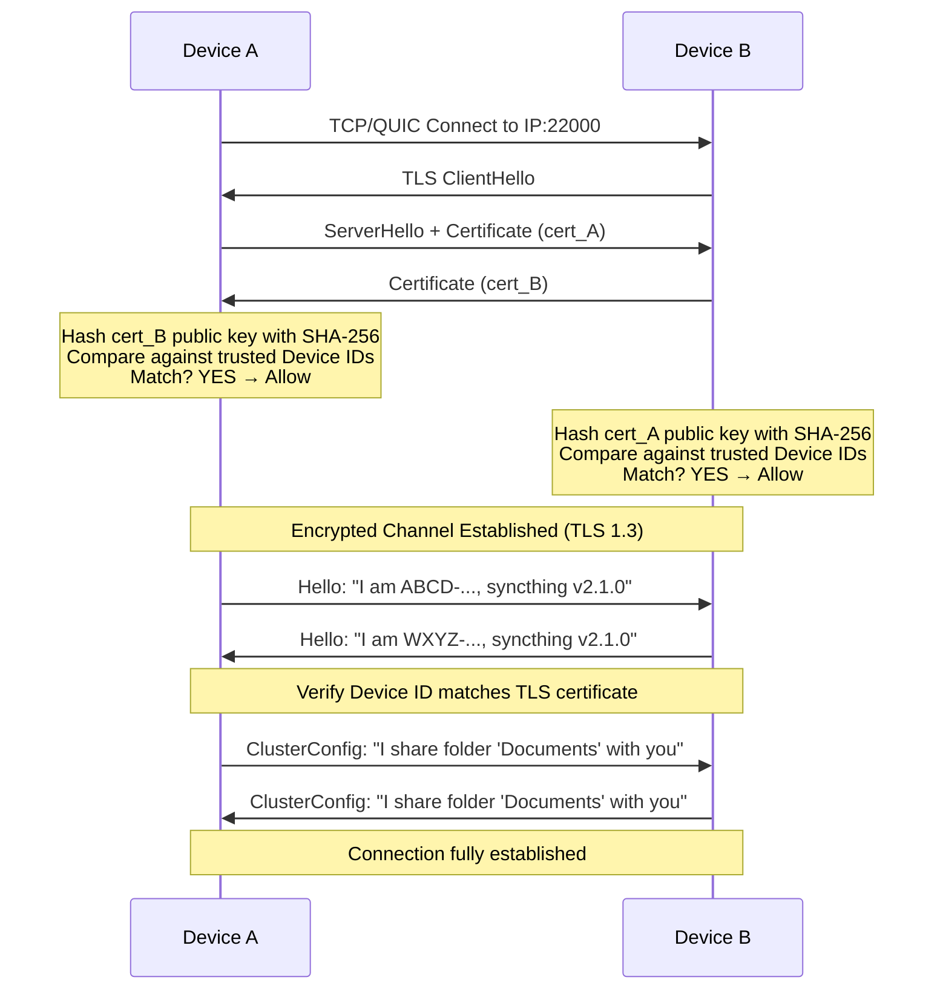

### Dial Attempt

Once discovery produces an IP address, Syncthing dials it on port 22000 and wraps the raw connection in TLS. Certificate authority verification is disabled, and instead a custom callback verifies the peer by hashing its certificate and checking whether the resulting Device ID exists in the local trusted device list. No CA, no server name, just the raw certificate check.

Key things:

* Dials the discovered IP on port 22000
* TLS configured with CA verification turned off
* Custom callback handles verification by hashing the peer certificate into a Device ID

***

#### Mutual TLS Handshake

This is the critical security step where both devices prove their identities without any central authority.

Device A and Device B each hold a self-signed certificate and a secret private key. The handshake proceeds in four steps: Device A connects, Device B sends a ClientHello, Device A replies with its certificate, and Device B sends its own certificate.

Then both sides perform the same verification. They extract the received certificate's public key, compute its SHA-256 hash, encode it as a Device ID, and check whether that Device ID appears in their local configuration's trusted device list. If the hash matches a known Device ID, the connection is allowed. If it does not match, the connection is rejected immediately.

No certificate authority is involved. Trust comes entirely from the out-of-band Device ID exchange done earlier: "This certificate hashes to a Device ID I was explicitly told to trust." Once both sides accept, the TLS handshake completes and an encrypted channel is established.

Key things:

* Both devices present self-signed certificates
* Each side hashes the other's certificate and compares to trusted Device IDs
* No CA — trust is purely certificate pinning
* Mismatched hash means immediate rejection

***

#### Protocol Negotiation

After TLS encryption is active, the devices confirm their identities at the application level. Each sends a Hello message containing its Device ID, client name, and version. Both sides verify that the Device ID in the Hello matches the identity from the TLS certificate. They then exchange ClusterConfig messages listing which folders are shared with whom. At this point, the connection is fully established.

Key things:

* Hello messages confirm Device ID, client name, and version
* Device ID is cross-checked against the TLS certificate
* ClusterConfig declares shared folders

***

#### Connection Multiplexing

A single physical TLS connection carries multiple independent logical streams. Each message carries a header with a stream ID, message type, and length, so messages from different streams can be interleaved freely — a block request for file A, then a block request for file B, then a response for file A, and so on.

* Stream 0: Index data (file metadata exchange)
* Stream 1-N: Block requests and responses for different files
* Dedicated stream: Ping/pong keepalive messages to detect dead connections
* Dedicated stream: ClusterConfig updates when folder sharing changes

This multiplexing enables parallel transfers: multiple files can sync simultaneously, and within a single file up to 16 block requests can be in flight at once. Blocks can arrive out of order and are written directly to the correct offset in the temporary file. Go goroutines handle each stream concurrently, making efficient use of a single encrypted channel.

Key things:

* One physical connection, many logical streams
* Each message tagged with stream ID for interleaving
* Separate streams for index data, block transfers, keepalive, and config
* Up to 4 concurrent files, 16 in-flight blocks per file
* Blocks written to correct offset regardless of arrival order

***

## File Synchronization

Detect which files need to be transferred, transfer only the changed blocks, verify integrity, handle conflicts.

### Indexing

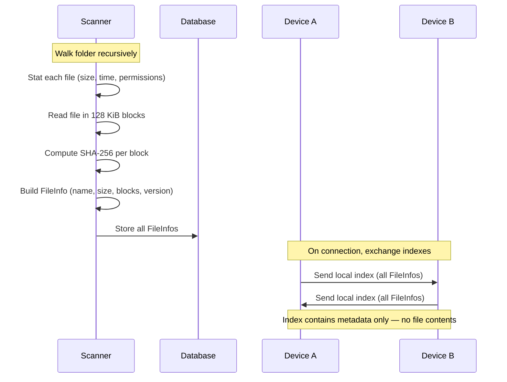

#### Initial Local Indexing

When a folder is first added or rescanned, Syncthing walks it recursively and builds a local index. For each file, it reads the file's size, modification time, and permissions. Then it opens the file and reads it in 128 KiB blocks, computing a SHA-256 hash for each block. These hashes are stored in a list of block metadata, each entry recording the block's byte offset, size, and hash.

From this, Syncthing builds a FileInfo structure containing the file name, total size, modification timestamp, permissions, an initial version vector, and the list of block hashes. A 2 MB file produces 16 blocks of 128 KiB each.

All FileInfo entries are stored in a local key-value database, keyed by folder ID and filename, with the FileInfo serialized using Protocol Buffers. This database is what gets compared with remote devices to determine what needs syncing.

Key things:

* Walks folder recursively
* Splits each file into 128 KiB blocks
* Computes SHA-256 hash per block
* Builds FileInfo: name, size, time, permissions, version, block list
* Stores everything in local database

***

#### Index Exchange

When two devices connect and share a folder, they exchange their local indexes. Each device sends its complete list of FileInfo entries to the other, then receives the remote device's list in return.

The index contains only metadata: file names and paths, sizes, modification times, permissions, SHA-256 hashes of every block, and version vectors. It does not contain any actual file data. The block hashes are what allow devices to determine which specific blocks have changed without ever sending the file contents themselves.

Key things:

* Both devices send their full index on connection
* Contains metadata only — no file contents
* Block hashes enable efficient comparison later

### Comparison & Conflict

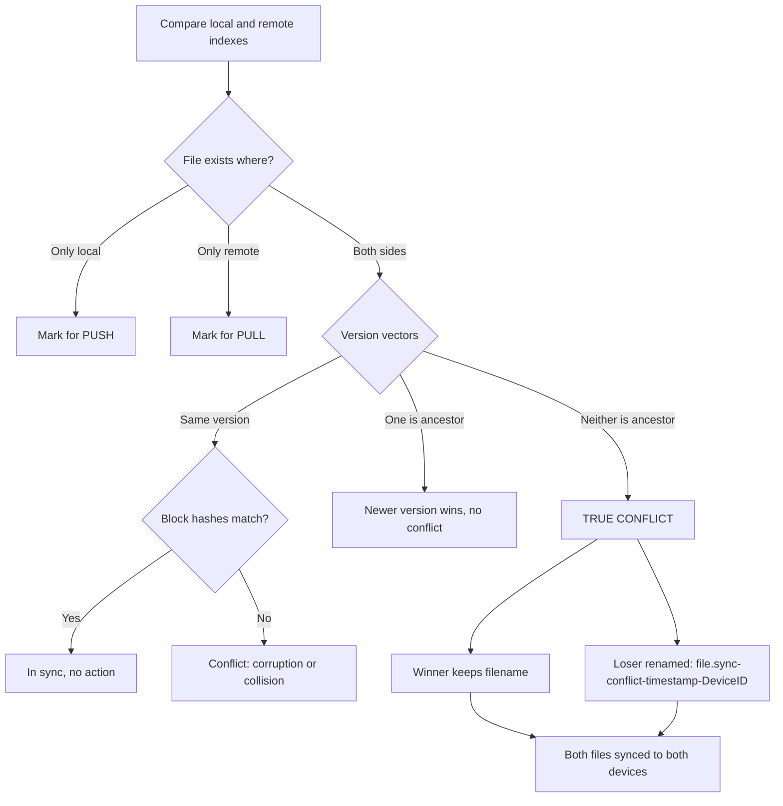

#### Comparison

Once both indexes are received, Syncthing compares them to decide what action to take for each file.

If a file only exists locally, it's marked for push to the remote device. If a file only exists remotely, it's marked for pull from the remote device. If a file exists on both sides with the same version vector, Syncthing compares the block hashes if they match, the file is in sync and no action is needed; if they don't match, it's treated as a conflict, which is rare and usually indicates corruption or a hash collision.

If one side has a strictly newer version, the newer one wins and gets pushed to the other device. If both sides changed the same file independently and neither version is a direct ancestor of the other, a true conflict is detected and handed off to conflict resolution.

Key things:

* File only local → push
* File only remote → pull
* Same version, matching hashes → in sync
* One version is ancestor → newer wins
* Neither is ancestor → conflict

***

#### Conflict Resolution

When both devices modified the same file since their last sync, Syncthing resolves the conflict by comparing version vectors. The comparison isn't "highest counter wins" — it checks whether one version is a direct ancestor of the other. If Remote's state is an ancestor of Local's state, Local wins cleanly with no conflict. If neither side is an ancestor of the other, it's a true conflict.

In a true conflict, the side with the larger version vector keeps the original filename. The losing side gets renamed with the pattern `filename.sync-conflict-timestamp-DeviceID.ext`. Both files are synced to both devices, so no data is ever lost.

Key things:

* Conflict only when neither version is an ancestor of the other
* Winner keeps original filename
* Loser renamed with timestamp and device ID
* Both files synced everywhere, no data lost

### Block Transfer

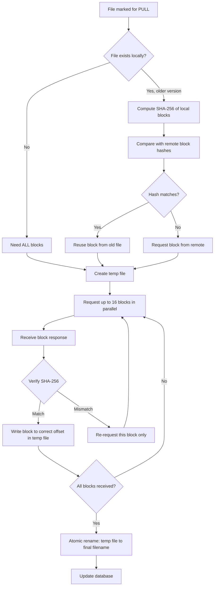

#### Block Level Transfer

For each file marked for pull, Syncthing determines which blocks it actually needs. If the file doesn't exist locally at all, every block must be requested. If an older version exists locally, Syncthing computes the SHA-256 hash of each local block and compares them against the remote index. Blocks with matching hashes are reused from the old file — only blocks with different hashes are requested from the remote device.

A temporary file is created in the sync folder. Any reusable blocks are copied from the old file into the temp file at their correct offsets. Then Syncthing requests the missing blocks from the remote device, keeping up to 16 requests in flight at once. As each response arrives, the block's SHA-256 hash is verified immediately. If the hash matches, the block is written to the correct offset in the temp file — blocks can arrive in any order and are placed correctly regardless. If the hash doesn't match, only that specific block is re-requested; nothing else is affected.

Once all blocks are received and verified, Syncthing optionally verifies the full file hash, sets the correct modification time and permissions, atomically renames the temp file to the final filename, updates the local database with the new FileInfo, and emits a "file synced" event to the GUI.

Key things:

* Reuses blocks from old local file when hashes match
* Requests only changed blocks, not the whole file
* Up to 16 block requests in flight at once
* Each block verified by SHA-256 on arrival
* Hash mismatch → re-request only that block
* Blocks written to correct offset regardless of arrival order
* Atomic rename from temp file to final filename when complete

### Continous Monitoring

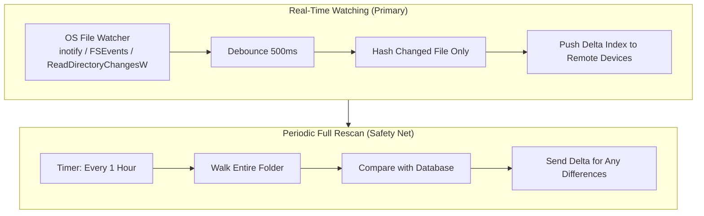

After the initial sync completes, Syncthing enters a steady state using two complementary methods to detect changes.

**Method A: Real-Time File Watching (Primary)**

Syncthing subscribes to OS-level file system notifications

* notify on Linux
* FSEvents on macOS
* ReadDirectoryChangesW on Windows.&#x20;

When a user saves a file, the operating system emits an event. Syncthing receives it, waits 500 milliseconds to debounce rapid successive saves like IDE auto-saves, then hashes only the changed file, updates the local index, and pushes a delta index to connected remote devices. The remote device receives the updated index and pulls only the changed blocks. Total latency from save to sync is typically one to three seconds.

**Method B: Periodic Full Rescan (Safety Net)**

A timer triggers a full folder walk at a configurable interval, defaulting to once per hour. It rescans every file, compares against the database, and sends delta indexes for any differences. This catches changes the file watcher might have missed: watcher errors, modifications made while Syncthing was stopped, or changes by tools that bypass filesystem events.

Key things:

* Primary: OS-level file watcher with 500ms debounce, 1-3 second latency
* Safety net: full rescan every hour catches anything the watcher missed
* Both produce delta indexes so remotes only pull what changed

***

## Resilience & Error Handling

Handle connection failures, network issues, restarts, and partial transfers without data loss.

### Detection & Immediate reaction

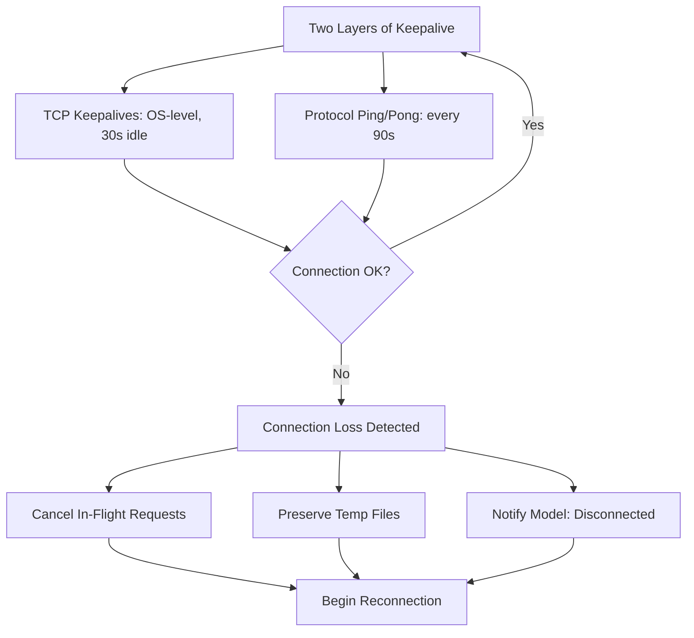

#### Connection Monitoring

Syncthing monitors connection health using two layers of keepalive checks. At the OS level, TCP keepalives are enabled on all sockets — after 30 seconds of idle time, the kernel sends a probe every 10 seconds, and after 3 failed probes the connection is declared dead. This catches hardware-level failures like unplugged cables or router crashes.

At the application level, Syncthing sends an empty Ping message every 90 seconds and expects a Pong response within 30 seconds. If no Pong arrives, the connection is considered dead. This catches cases where the TCP connection appears open but the remote application is unresponsive.

Key things:

* OS-level: TCP keepalives, 30s idle, 3 probes
* App-level: Ping every 90s, expect Pong within 30s
* Two independent layers for reliability

***

#### Connection Loss Detection

Connections can be lost for many reasons: WiFi disconnects, ISP outages, the remote device going to sleep, firewall changes, or IP address changes from mobile networks or DHCP renewal. Syncthing detects loss through three signals: a TCP read returning an error or connection reset, a QUIC session timing out, or a Ping message receiving no Pong within 30 seconds.

When loss is detected, Syncthing marks the connection as disconnected, cancels all in-flight block requests on that connection, and cleans up pending state. Critically, temporary files with partially transferred data are preserved on disk — they are not deleted. The Model is notified that the device disconnected, and the reconnection process begins.

Key things:

* Detected via TCP error, QUIC timeout, or missed Pong
* In-flight requests cancelled, temp files preserved
* Model notified, reconnection starts immediately

### Recovery

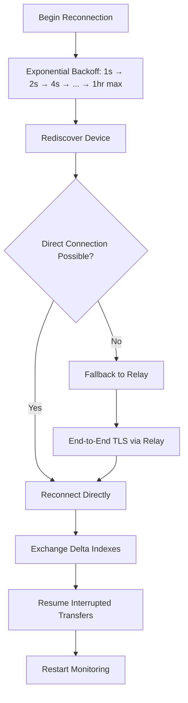

#### Automatic Reconnection

When a connection is lost, Syncthing begins reconnecting immediately. The first retry happens after 1 second. If it fails, the wait time doubles with each attempt — 2 seconds, 4, 8, 16, 32, 64 — up to a maximum of one hour between attempts.

On each retry, Syncthing rediscovers the remote device using all available methods in parallel: cached addresses from previous connections, LAN broadcasts, global discovery servers, and relay connections if enabled. The first method to produce a working connection wins, and retrying stops.

Key things:

* Exponential backoff from 1 second to 1 hour max
* Rediscovery on every attempt using all methods in parallel
* First successful connection wins

***

#### State Preservation

Syncthing is designed to survive being killed at any moment without data loss. Four things persist to disk:&#x20;

* the configuration file with all device and folder settings
* the device certificate and key
* the index database containing every file's metadata and block hashes
* any temporary files from interrupted transfers with their already-written blocks intact.

On restart, Syncthing loads the configuration and opens the index database. It scans for leftover temporary files — if the database confirms a transfer was fully completed before the shutdown, the temp file is atomically renamed to its final filename. If the transfer was incomplete, the temp file is kept so the transfer can resume where it left off.

After reconnecting to known devices, Syncthing exchanges delta indexes instead of full indexes — it tells the remote what it has now, the remote compares against what it knew before, and only the differences trigger new transfers. Interrupted transfers resume by checking which blocks already exist in the temp file and requesting only the missing ones.

Key things:

* Config, certificate, database, and temp files all persist to disk
* Completed transfers are finalized on restart
* Incomplete transfers resume with only missing blocks requested
* Delta indexes avoid re-sending all metadata

***

#### Relay Fallback

When a direct connection is impossible — typically because both devices are behind restrictive NATs — Syncthing falls back to a relay server. Both devices connect to the same relay, which runs on port 22067. The relay matches them by their Device IDs and forwards traffic between them.

The critical security property is that the TLS encryption is end-to-end between the two devices. The relay forwards encrypted bytes but cannot decrypt them. It sees only source and destination IP addresses, the amount of data transferred, and the encrypted TLS stream. It cannot see file names, folder names, file contents, or even the Device IDs, which are inside the encrypted tunnel.

Direct connections are always preferred. The relay is only a fallback, and if a direct connection becomes available later, Syncthing switches automatically.

Key things:

* Relay used only when direct connection fails
* End-to-end TLS — relay cannot decrypt traffic
* Relay sees IPs and data volume, nothing more
* Automatically switches back to direct when possible 

***

### File Versioning & Recovery

Protect against accidental deletion, unwanted modification, and provide a safety net for user errors.

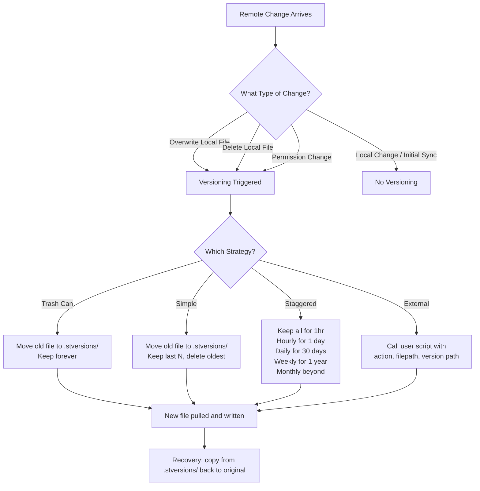

#### Versioning Triggers

Versioning activates when a remote change would overwrite or delete a local file — a remote device sends a newer version, a deletion, or a permission change when sync ownership is enabled. It does not activate for local changes made by the user or for files received for the first time during initial sync. The purpose is to protect against unwanted remote changes, not to version every edit.

Key things:

* Triggers on remote overwrite, remote deletion, or permission changes
* Does not trigger on local changes or initial sync

***

#### Versioning Strategies

Syncthing offers four st rategies, all working by moving the old file into a `.stversions` folder before the new version is written.

* **Trash Can** simply moves the old file with a timestamp appended and keeps it forever until the user manually cleans it up.&#x20;
* **Simple Versioning** does the same but only retains the last N versions, deleting the oldest when the limit is exceeded.&#x20;
* **Staggered Versioning** keeps a fine-grained history for recent changes and progressively thins it out over time — all versions for the first hour, hourly for a day, daily for 30 days, weekly for up to a year, and monthly beyond that, with a maximum age of 365 days.&#x20;
* **External Versioning** calls a user-provided script with the action, file path, and version path, allowing integration with tools like Git, Borg Backup, or Restic.

Key things:

* All strategies save old files to `.stversions/` with timestamps
* Trash Can: keep forever
* Simple: keep last N, delete oldest
* Staggered: keep all → hourly → daily → weekly → monthly
* External: delegate to a user script

***

#### Versioning Integration With Sync

Versioning is integrated directly into the sync flow. When a remote device announces a new version of a file, Syncthing checks whether the local copy would be overwritten. If so, it archives the local file by moving it into `.stversions/` with a timestamp before pulling and writing the new version.

If the user later realizes the new version is wrong, recovery is straightforward: open the `.stversions/` folder, find the timestamped copy, and copy it back to the original location.

Key things:

* Archive happens before overwrite, not after
* Old file moved to `.stversions/` with timestamp
* Recovery: copy timestamped file back to original location

***

## Shutdown & Restart

Gracefully stop all subsystems, flush data to disk, and prepare for clean restart

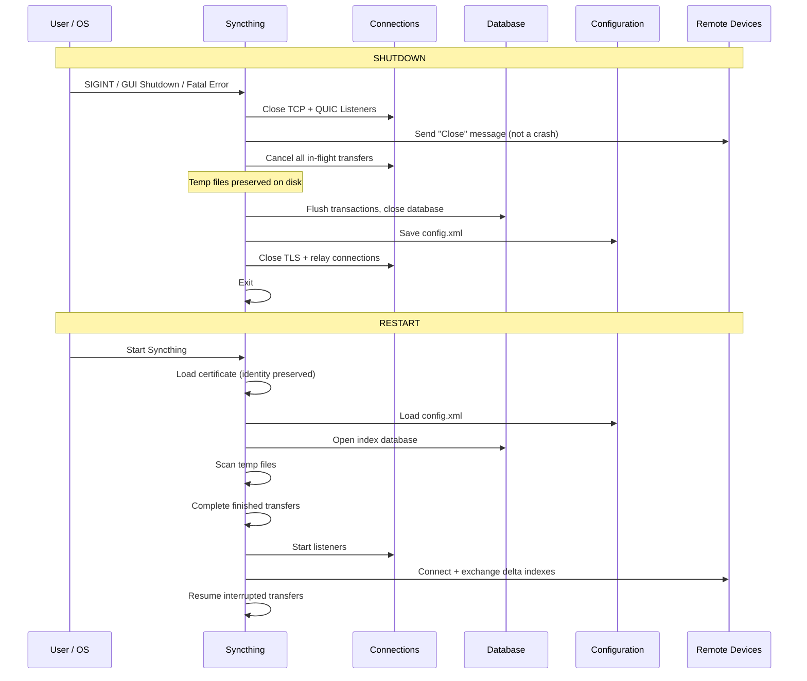

#### Shutdown Triggers

Shutdown can be initiated three ways: the user sends SIGINT or SIGTERM via Ctrl+C or systemd, the user clicks the Shutdown button in the Web GUI, or a fatal error triggers an automatic restart through a service manager.

Key things:

* Triggered by signal, GUI button, or fatal error

***

#### Graceful Shutdown Sequence

Syncthing shuts down in a careful sequence designed to leave everything in a clean, recoverable state. First, it stops accepting new connections by closing both the TCP and QUIC listeners — any new connection attempts will be rejected. Then it notifies every connected remote device with a Close message so they know this is an intentional shutdown, not a crash.

All in-flight block requests are cancelled, and temp files are marked with their current progress and left intact on disk. The database completes any in-progress transactions, flushes all writes, and closes cleanly. The configuration file is saved if there are pending changes. All TLS connections, relay connections, and discovery announcements are closed gracefully. Finally, Syncthing logs its exit and terminates.

Key things:

* Listeners closed first so no new connections arrive
* Remotes notified: intentional shutdown, not a crash
* Temp files preserved, database flushed, config saved
* All connections closed gracefully before exit

***

#### Restart Sequence

On restart, Syncthing picks up exactly where it left off. It loads its existing certificate so its Device ID is preserved, loads the configuration with all devices and folders remembered, and opens the index database with all file metadata intact.

It scans for leftover temporary files from the previous session. If a transfer was fully completed before shutdown, the temp file is atomically renamed to its final filename. If it was incomplete, the temp file is kept so the transfer can resume on reconnect.

Listeners are started so the device becomes reachable again. Discovery begins and connections to known devices are established. On reconnection, Syncthing exchanges delta indexes — only what changed while it was offline — and resumes any interrupted transfers by checking which blocks are already written and requesting only the missing ones.

Key things:

* Identity, config, and database all restored on restart
* Completed transfers finalized; incomplete ones resume
* Delta indexes avoid re-sending all metadata
* Only missing blocks re-requested on interrupted transfers
* Result: no data loss, minimal re-transfer, fast resume

***

### E2E Data Flow Diagram

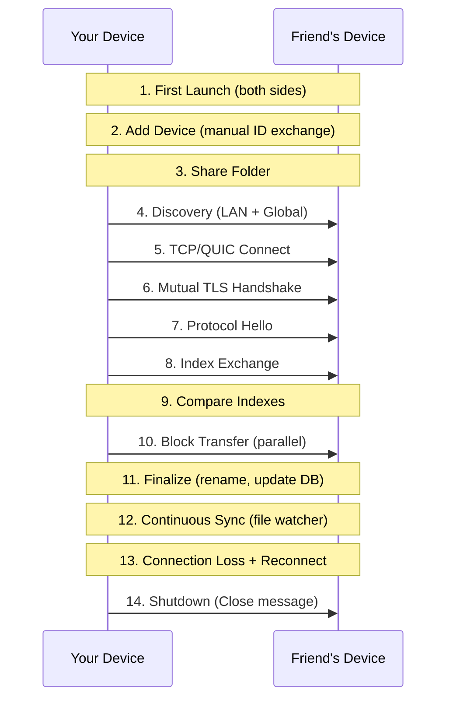

***

### Key Architectural Principles Summary

| #  | Principle                          | Implementation                                             |
| -- | ---------------------------------- | ---------------------------------------------------------- |
| 1  | **No central server**              | Peer-to-peer with mutual TLS                               |
| 2  | **No trusted third party**         | Certificate pinning via out-of-band Device ID exchange     |
| 3  | **No cloud dependency**            | Identity, config, and index stored locally only            |
| 4  | **End-to-end encryption**          | TLS 1.3 between peers, even through relays                 |
| 5  | **Data integrity**                 | SHA-256 of every block, verified on receipt                |
| 6  | **Block-level delta sync**         | 128 KiB blocks, only changed blocks transferred            |
| 7  | **Out-of-order parallel transfer** | Blocks requested in parallel, written at correct offsets   |
| 8  | **Conflict safety**                | Version vectors + automatic conflict file renaming         |
| 9  | **Offline resilience**             | Persistent index DB, temp file checkpointing               |
| 10 | **Automatic reconnection**         | Exponential backoff, rediscovery, relay fallback           |
| 11 | **Privacy-preserving discovery**   | Opaque Device IDs, encrypted announcements                 |
| 12 | **File versioning**                | Configurable retention strategies                          |
| 13 | **Cross-platform**                 | Pure Go, OS-specific file watchers                         |
| 14 | **Graceful shutdown**              | Flush state, notify peers, resume on restart               |
| 15 | **Single binary**                  | All infrastructure (discovery, relay) in separate commands |
