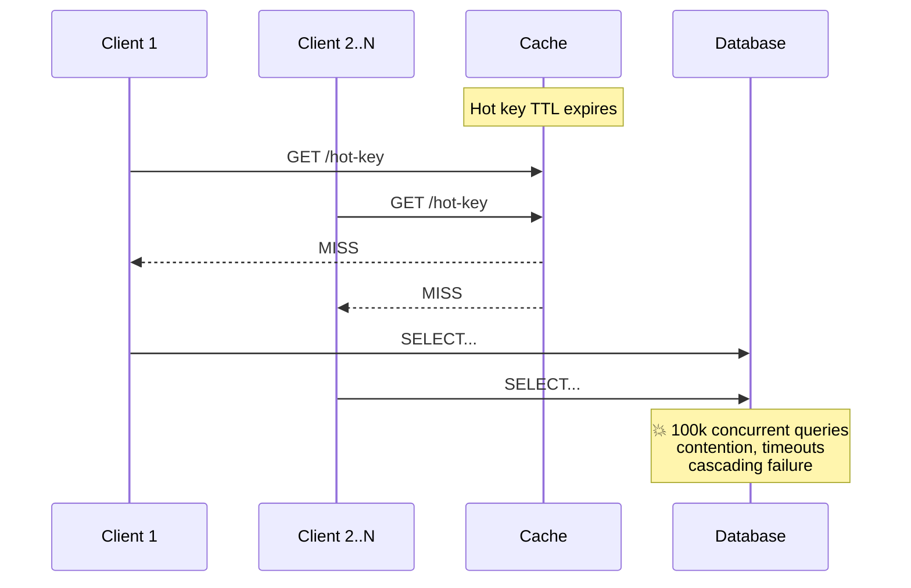
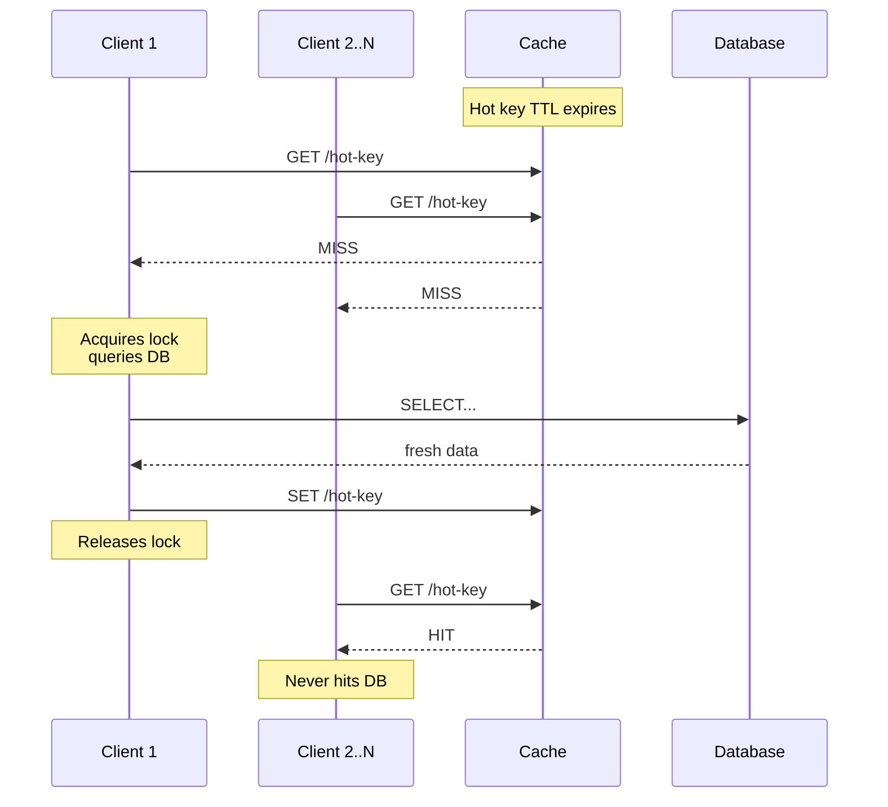
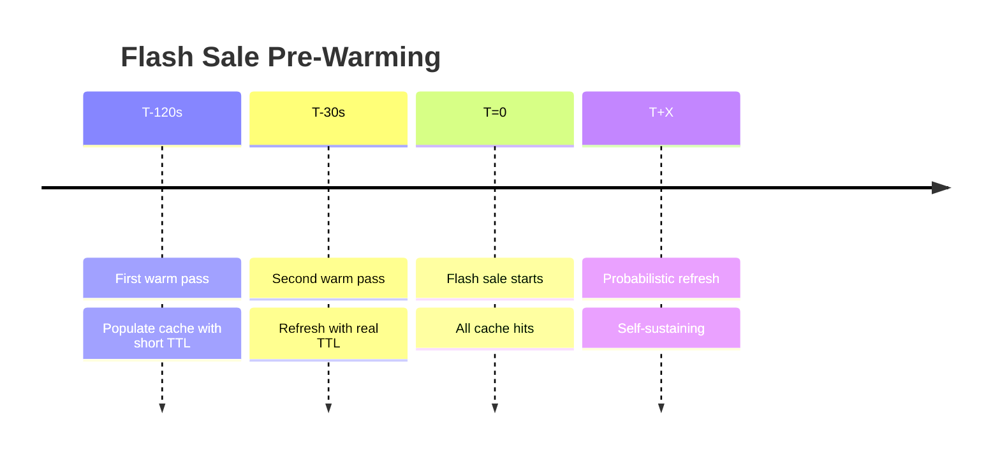

# Cache Stampede: Flash Sale Use Case

Also known as: **thundering herd problem**, **dog-piling**, **cache miss storm**.

## Problem

When a hot cache key expires, all concurrent requests miss the cache simultaneously and flood the database. With 100k requests hitting at once, the DB experiences a sudden spike in load — causing contention, timeouts, and potentially cascading failure.

## Solution



Request coalescing solves this by serializing recomputation:



### Multi-Tier Cache

Place a fast in-process L1 cache (e.g., `sync.Map` with TTL) in front of the shared L2 cache (Redis). L1 absorbs the micro-burst of concurrent misses before they reach L2, reducing 100k concurrent L2 misses to a handful per process. Each process still deduplicates at the goroutine level with request coalescing, making the system resilient to both L1 evictions and L2 failures.

### Request Coalescing (Locking)

Only one request is allowed to recompute the cache value. All others wait on the result.

- A mutex (in-memory lock) guards cache recomputation for each key.
- The first request acquires the lock, queries the DB, and writes the fresh value to cache.
- Concurrent requests that fail to acquire the lock block until the lock is released, then read the freshly cached value — never hitting the DB.

```go
import "golang.org/x/sync/singleflight"

var sf singleflight.Group

func fetch(key string) (Value, error) {
    v, err, _ := sf.Do(key, func() (any, error) {
        val, err := queryDB(key)
        if err != nil {
            return nil, err
        }
        cache.Set(key, val, 5*time.Minute)
        return val, nil
    })
    return v.(Value), err
}
```

### Probabilistic Early Expiration (Stay-Ahead)

Instead of reacting to expiry, refresh the cache *before* the TTL runs out.

- As the TTL nears expiry, each request performs a random roll proportional to how stale the cached value is: `rand() < (TTL - remaining_ttl) / TTL`. Probability starts at 0 (just after refresh) and grows linearly to 1 (at expiry).
- The "winner" refreshes the value early while the cache is still serving stale-but-valid data to everyone else.
- This eliminates cache miss storms entirely and keeps latency flat.

```go
func shouldRefresh(ttl, remaining time.Duration) bool {
    return rand.Float64() < float64(ttl-remaining)/float64(ttl)
}
```

> **Reference**: [Vattani et al., *Techniques to Reduce Cache Stampedes*](https://couchbase.com/blog/cache-stampede-paper)

### Pre-Warming

For scheduled high-traffic events (flash sales, live streams), populate the cache *before* the expected rush.



- A background job warms the key 30–120 seconds early with a short TTL.
- A second warm pass just before the event refreshes with the real TTL.
- This turns the initial burst of cache misses into cache hits, buying time for the coalescing layer to stabilize.
- Works especially well combined with probabilistic early expiry — even if the warm window is missed, the first real request refreshes early before expiry.

### Resilience & Fail-Safe

- **Lock timeouts**: If the lock holder crashes or the DB is slow, release the lock after a deadline so others can retry.
- **Key-level capacity limit**: Limit waiters per key (e.g., 64). When the queue is full, return the stale cached value with an `Age` header rather than blocking. This prevents OOM and gives the consumer visibility into freshness.
