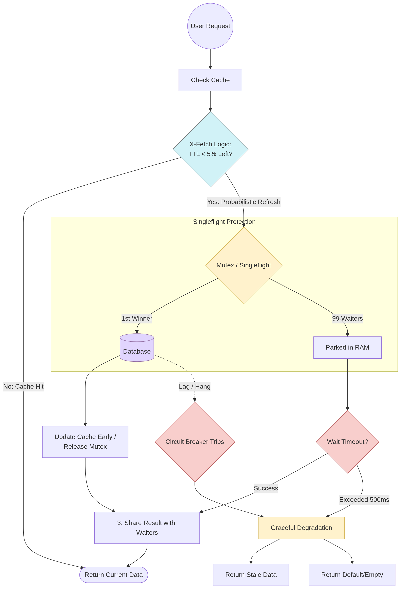

# Cache  Stampede

## Problem

What happens if we have a cache where 100k requests hit simultaneously just as the cache expires? All 100k requests would hit the database (DB) at the exact same time, causing contention, errors, and potential DB failure. How do we prevent it?

## Solution

<figure><figcaption></figcaption></figure>

* **Request Coalescing**: When the Redis cache expires, instead of allowing all requests to hit the DB, we use in-memory lock (like mutex) so only one request proceeds. The first request acquires the mutex, fetches the data from the DB, and updates the cache.
  * What happens to the other requests? Requests that attempted to acquire the lock while it was held are "parked." Once the "winner" finishes and updates the cache, the "waiters" are woken up to consume the new result from memory without ever touching the DB.
* **Stay-Ahead Strategy**: Instead of waiting for the TTL to expire reactively, we use a proactive approach. As the TTL nears its end, the system performs a "random roll" to decide if a request should "volunteer" to refresh the data early. This ensures the cache is refreshed before it hits zero, eliminating cache misses and maintaining constant latency.
* **Resilience & Fail-Safe**: We must account for failures during lock acquisition or network issues. If many requests wait in a queue in RAM, it can lead to Out of Memory (OOM) errors. To prevent this, we implement timeouts and graceful degradation.
