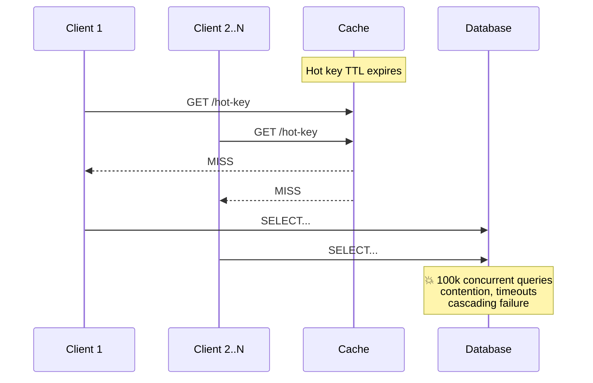

# Cache Stampede

Also known as: **thundering herd problem**, **dog-piling**, **cache miss storm**.

## Problem

When a hot cache key expires, all concurrent requests miss the cache simultaneously and flood the database. With 100k requests hitting at once, the DB experiences a sudden spike in load — causing contention, timeouts, and potentially cascading failure.

## Solution

### Request Coalescing (Locking)

Only one request is allowed to recompute the cache value. All others wait on the result.

- A mutex (in-memory lock) guards cache recomputation for each key.
- The first request acquires the lock, queries the DB, and writes the fresh value to cache.
- Concurrent requests that fail to acquire the lock block until the lock is released, then read the freshly cached value — never hitting the DB.

### Probabilistic Early Expiration (Stay-Ahead)

Instead of reacting to expiry, refresh the cache *before* the TTL runs out.

- As the TTL nears expiry, each request performs a random roll proportional to how stale the cached value is: `rand() < (TTL - remaining_ttl) / TTL`. Probability starts at 0 (just after refresh) and grows linearly to 1 (at expiry).
- The "winner" refreshes the value early while the cache is still serving stale-but-valid data to everyone else.
- This eliminates cache miss storms entirely and keeps latency flat.

> **Reference**: [Vattani et al., *Techniques to Reduce Cache Stampedes*](https://couchbase.com/blog/cache-stampede-paper)

### Resilience & Fail-Safe

- **Lock timeouts**: If the lock holder crashes or the DB is slow, release the lock after a deadline so others can retry.
- **Request caps**: Limit how many waiters can queue per key to prevent Out-of-Memory (OOM) from parked goroutines/threads.
- **Graceful degradation**: Serve stale cached data if the DB is unreachable, rather than failing hard.
