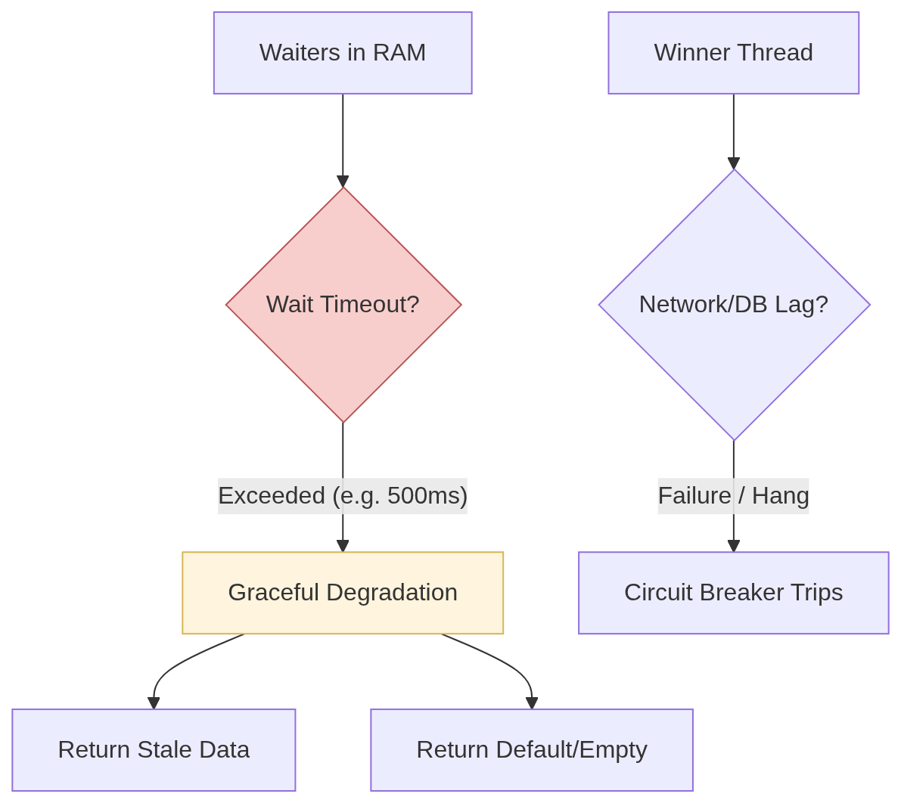

# Caching Problem

## Problem

* **Context:** A specific flight route is discounted by 90%.
* **Traffic:** 50x normal peak (e.g., 100k concurrent users).
* **Bottleneck:** Every request targets the same `Flight_ID` (Read Hot Key) and attempts to update the same `Inventory_ID` (Write Hot Key).

## Solution

1. redis cache expires -> hit db (db contention) -> then the solution use in memory cache like hashmap and mutex so only 1 request proceed and others are waiting -> mutex acquired from db -> return result and update the cache -> what happen to others that try to acauired the mutex before? we dont want it to hit db again right
2. tier 2 solution instead of waiting cache expires bcs of ttl we use stay-ahead" probability we act as if the data already expired so we refresh thecache so we never see miss cache
3. tier 3 solution we expect the failure from acquiring lock, network failure happens the request that want to acquired lock will wait in queue in ram resulting in OOM so we need to set ttl/expired and graceful shutdown

### Coalescing

<figure><figcaption></figcaption></figure>

* You use a local lock to ensure only one thread per server hits the DB.
* What happens to others that are try to acquired lock? They stay "parked." Once the Winner finishes, it populates the shared memory, and the Waiters are "woken up" to consume that exact same result without ever touching the DB.

## Stay Ahead Strategy

<figure><figcaption></figcaption></figure>

* Moving from "Reactive" (fixing a miss) to "Proactive" (preventing a miss)
* You don't wait for the cache to hit $$0$$. As the TTL nears its end, you use a random roll to see if this request should "volunteer" to refresh the data early.
* The cache never expires. The latency remains a constant because the DB hit happens in the background.

## Fail Safe

<figure><figcaption></figcaption></figure>

* Protecting the system resources (RAM/CPU) when the "Winner" or the DB fails.
* You accept that things _will_ break. You add a `context.WithTimeout` to the Waiters. If the Winner doesn't return in, say, $$ $500ms$ $$, the Waiters stop waiting to prevent OOM (Out of Memory).
* Instead of crashing, the system returns "Stale" data from a few minutes ago. It's better to show an old price than a "Crash" screen.

## Terms

cascading failure, resource exhaustion, coalescing
