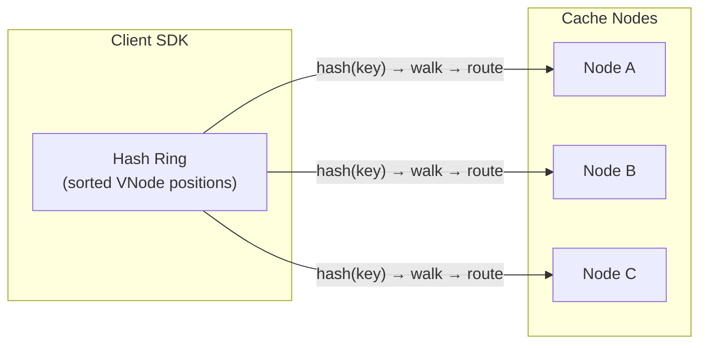
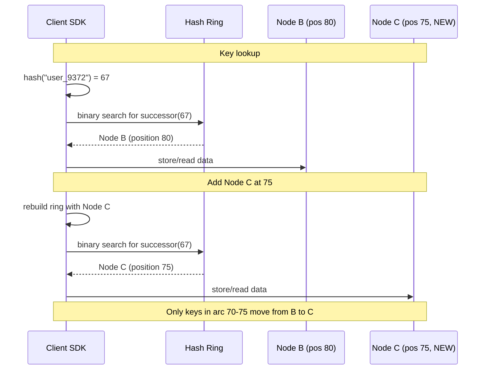

# Consistent Hashing: Distributed Cache Use Case

### Goal

Distribute keys across N cache nodes so that adding or removing a node causes only K/N keys to remap — not all of them. Enable the client SDK to route directly to the right node without a proxy hop.

### Non-goals

* Data replication or durability (handled at the cache layer, not by the hash function)
* Load balancing across hot keys (requires separate monitoring and rebalancing)
* Cryptographic security (hash function chosen for distribution speed, not secrecy)

### Numbers

| Metric | Value | Justification |
|---|---|---|
| Hash ring size | 0 to 2³²−1 (32-bit) | 4 billion positions; sufficient for most clusters |
| Virtual nodes per physical node | 150–256 | Cassandra default is 256; fewer VNodes = worse distribution |
| Cluster size | 3–100 nodes | Typical distributed cache range |
| Keys remapped on add/remove | ≈ K/N (e.g., 1% for 100 nodes) | Only keys in the affected arc move; the rest stay |
| Lookup complexity | O(log V) where V = total virtual nodes | Binary search on sorted array of VNode positions |
| Ring memory | ~200 KB for 100 nodes × 256 VNodes | Fits in L2 cache on any modern CPU |

### How It Works

#### The problem with simple modulo

```
server = hash(key) % N
```

When N changes (node added or removed), almost ALL keys remap to different servers. For a cache, this means a near-100% miss rate and a flood of requests to the database.

#### The hash ring

Consistent hashing places both servers and keys on a circular number line — a **ring** — typically ranging from 0 to 2³²−1.

Both **servers** and **data keys** get positions on the ring via a hash function:

```
Input: "Server-A" → Hash: 23
Input: "Server-B" → Hash: 80
Input: "user_9372" → Hash: 67
```

```
0 ---- 10 ---- 20 ---- 30 ---- 40 ---- 50 ---- 60 ---- 70 ---- 80 ---- 90 ---- back to 0

Server-A at 23  
user_9372 at 67  
Server-B at 80
```

A key is stored on the first server encountered when moving **clockwise** from the key's position. So `user_9372` (position 67) maps to Server-B (position 80).

If no server is ahead, the lookup wraps around to 0 and continues — this is why it's a ring.

#### Adding a server — minimal remapping

If we add Server-C at position 75, only keys between positions 70 and 75 move from Server-B to Server-C. All other keys stay where they were:

```
Before: user_9372 (67) → Server-B (80)
After:  user_9372 (67) → Server-C (75)   ← only this arc moved
```

* Minimal data movement
* No global reshuffle
* Stable system under growth

#### Virtual nodes (VNodes)

With one position per server, random placement can leave large gaps:

```
Server-A at 5  
Server-B at 8  
Server-C at 92

Gap between 8 and 92 is huge → Server-C handles most keys
```

To fix this, each physical server appears multiple times on the ring using slightly modified names:

```
Server-A#1 → 12  
Server-A#2 → 28  
Server-A#3 → 63  
Server-A#4 → 88  
```

```
12  → Server A  
18  → Server B  
28  → Server A  
35  → Server C  
63  → Server A  
70  → Server B  
88  → Server A  
92  → Server C
```

This distributes data evenly without any central coordination. Typical deployments use 150–256 virtual nodes per physical node.

#### Handling server failure

When a server fails, consistent hashing reassigns its key range to the next clockwise neighbor. This shifts **responsibility** — but without replication, the data on the dead server is lost. Consistent hashing handles placement, not durability.

**Replication (a separate layer)** stores each key on the first N clockwise servers (replication factor). If Server-A is the primary, Servers-B and -C hold replicas. When Server-B fails, traffic shifts to Server-C, where the data is already available.

### Key Design Decisions

<table data-header-hidden><thead><tr><th width="67"></th><th width="164"></th><th></th><th></th></tr></thead><tbody>
<tr><td></td><td>Decision</td><td>Chosen Approach</td><td>Rejected Alternatives & Why</td></tr>
<tr><td>1</td><td>Hash function</td><td><strong>SHA-1 (truncated to 32-bit)</strong></td><td>CRC32: higher collision rate skews distribution. MD5: same distribution quality, no advantage. Simple modulo: 100% remap on resizing.</td></tr>
<tr><td>2</td><td>Ring data structure</td><td><strong>Sorted array of (hash, node) tuples</strong></td><td>Binary tree: more memory, same O(log N). HashMap: can't do clockwise walk. Linked list: O(N) lookup.</td></tr>
<tr><td>3</td><td>Virtual nodes</td><td><strong>150–256 per physical node</strong></td><td>Single position per node: one large gap dominates and creates hot spots.</td></tr>
<tr><td>4</td><td>Key placement rule</td><td><strong>First clockwise successor</strong></td><td>Counterclockwise: convention only, no functional difference. Nearest node: inconsistent under wrap-around.</td></tr>
<tr><td>5</td><td>Replica placement</td><td><strong>Next N clockwise successors</strong></td><td>Random: complicates failover logic — successor must be deterministic.</td></tr>
<tr><td>6</td><td>Rebalancing strategy</td><td><strong>Only K/N keys move on add/remove</strong></td><td>Full rehash (mod N): 100% of keys move, causing cache miss storms.</td></tr>
</tbody></table>

### Diagrams

#### Architecture



#### Data flow



### Core Flow

#### Key routing
1. Client hashes the key: `hash("user_9372") → 67`.
2. Client performs binary search on the sorted VNode array to find the first position ≥ 67.
3. If found, route to the VNode's owner. If no position ≥ 67 (key past the last VNode), wrap to the first VNode at position 0.

#### Scaling up
1. A new physical node joins the cluster.
2. The node is hashed into the ring 150–256 times (VNodes).
3. Only keys in the arcs immediately clockwise of each new VNode move — on average, K/N of all keys.
4. The ring config is pushed to all clients, who rebuild their sorted array.

#### Failure handling
1. A node stops responding. The config service marks it as dead.
2. The ring is rebuilt without that node's VNodes.
3. Keys that mapped to the dead node's VNodes now map to the next clockwise VNode.
4. If replication is enabled (store on N successors), the new owner already holds a replica.

### The Hard Part & How We Solve It

| Problem | Fix |
|---|---|
| Random ring placement causes imbalance | 150–256 VNodes per physical node smooths distribution |
| 100% key remapping on resize | Clockwise ring with successor-based placement → only K/N move |
| Data loss on node failure | Replication on N clockwise successors |
| Slow lookup with many VNodes | Binary search on sorted array → O(log V) |
| Hash collisions skew distribution | Use SHA-1 (or similar well-distributed hash) |

### Where It's Used

- **Redis Cluster** — distributes keys across 16,384 hash slots. When nodes are added or removed, only 1/N of keys are remapped.
- **CDNs** — route requests to edge servers by hashing the URL or client IP. Adding a cache node reshuffles minimal traffic.
- **Cassandra / DynamoDB** — use consistent hashing with virtual nodes for partition placement, with a replication factor for durability.
- **Rate-limit counters** — pin a user's state to a specific node so all rate-limit increments hit the same server.

### Tradeoffs

#### Consistent hashing vs modulo N
Modulo N is simpler and faster — a single modulo operation vs O(log V) binary search + hashing. For static clusters where scaling is rare, modulo N may be sufficient. For dynamic clusters, consistent hashing's lower remapping cost wins.

#### More VNodes = better distribution, more memory
256 VNodes per node gives near-perfect distribution but requires ~200 KB of ring data per client. At 1000 nodes × 256 VNodes, the ring is ~2 MB — still small, but the binary search is marginally slower.

#### Replication adds write amplification
Storing each key on N successors ensures availability on failure, but each write goes to N nodes instead of one. In practice, N=3 is the standard tradeoff.

#### Clockwise successor vs nearest node
Choosing the nearest server (clockwise or counterclockwise) could reduce latency but makes failover nondeterministic — different clients might disagree on which node owns a key. Clockwise-only is simple and deterministic.

### References

> **Reference**: [Karger et al., *Consistent Hashing and Random Trees: Distributed Caching Protocols for Relieving Hot Spots on the World Wide Web* (1997)](https://dl.acm.org/doi/10.1145/258533.258660)

> **Reference**: [David Karger & Eric Lehman, *Consistent Hashing in Dynamo-Style Databases* (Amazon Dynamo paper, 2007)](https://www.allthingsdistributed.com/files/amazon-dynamo-sosp2007.pdf)

> **Reference**: [Wikipedia, *Consistent Hashing*](https://en.wikipedia.org/wiki/Consistent_hashing)
