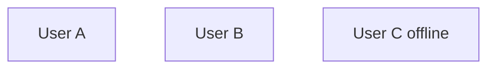

# Design Template

**Companion to:** [implementation-template.md](implementation-template.md "mention") | [mvp-template.md](mvp-template.md "mention")

### Goal

\[One sentence. What are we building?]

### Non-goals

* \[What we're NOT doing]

### Numbers

* QPS: \_\_\_\_\_
* Storage: \_\_\_\_\_ / year
* Latency target: \_\_\_\_\_

### Critical invariant

\[One sentence. The thing that must never be violated.]

### Failure modes

| What fails | How it manifests | How we recover |
| ---------- | ---------------- | -------------- |
|            |                  |                |

## Diagram&#x20;

mermaidjs flowchart

### Core flow

\[Paragraphs. Use bullet lists when needed.]

### Storage choice & why

\[What + reasoning.]

### The hard part & how we solve it

* **Bottleneck:** \_\_\_\_\_
* **Fix:** \_\_\_\_\_

### What we sacrifice

\[One paragraph. What we lose. Who pays the cost. When this will hurt us.]
