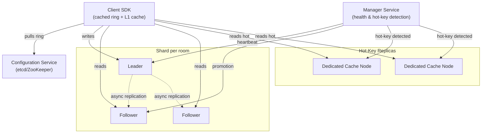
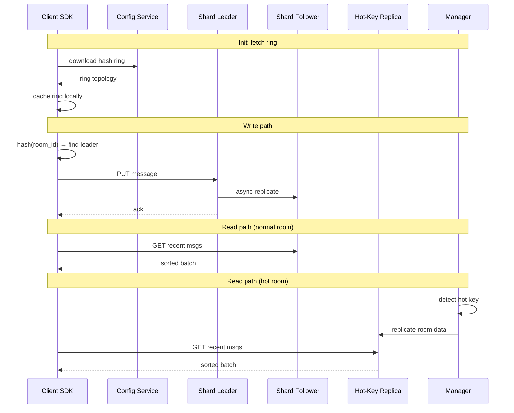

# Distributed Cache for Live‑Streaming Chat

### Goal

A distributed in‑memory cache cluster that serves a large‑scale live‑streaming chat platform with **2 million concurrent viewers**. It provides **sub‑millisecond read latency** for the hot message window, allows messages to be propagated within the streamer’s broadcast delay budget, and gracefully handles “celebrity” rooms where a single streamer may attract hundreds of thousands of viewers.

### Non‑goals

* Persistent storage of full chat history (only a sliding window of recent messages is cached)
* End‑to‑end message ordering across multiple rooms or strong consistency guarantees (this is a cache, not a database)
* Global multi‑region replication (the design focuses on a single logical cluster; cross‑region replication can be added asynchronously later)
* Serving multimedia attachments (only message text and metadata)

### Numbers

| Metric             | Value                                    | Justification                                                                                                    |
| ------------------ | ---------------------------------------- | ---------------------------------------------------------------------------------------------------------------- |
| Concurrent viewers | 2 M (peak)                               | Typical large event (major e‑sports, product launch)                                                             |
| Write rate         | 400 k writes/s                           | Each viewer sends \~0.2 messages/s on average (idle + active)                                                    |
| Read rate          | \~9 M reads/s                            | Viewers poll or receive pushed messages; session‑token lookups add constant read volume. Roughly 10 M RPS total. |
| Hot data size      | 500 GB – 1 TB                            | Sliding window of recent messages (e.g., last 5 minutes) for all active rooms, plus session tokens               |
| Message size       | 200–500 bytes (text) + 50 bytes metadata | Small payloads; average key+value \~500 bytes                                                                    |
| Latency target     | p99 read < 1 ms, write ack < 0.5 ms      | Must stay well within the broadcast delay budget to avoid perceptible lag                                        |
| Staleness window   | < 500 ms for standard streams            | Bound by stream delay (5–15 s) – leaves plenty of room                                                           |
| Shard count        | \~200 shards                             | Balanced for throughput and failover (with replication factor 3, \~600 nodes)                                    |

### Key Design Decisions

<table data-header-hidden><thead><tr><th width="67.08120727539062"></th><th width="164.5999755859375"></th><th></th><th></th></tr></thead><tbody><tr><td></td><td>Decision</td><td>Chosen Approach</td><td>Rejected Alternatives &#x26; Why</td></tr><tr><td>1</td><td>Storage medium</td><td><strong>In‑memory</strong> hash maps &#x26; sorted sets</td><td>Disk: seek time (0.1–1 ms) alone violates sub‑ms read SLO. Database: optimized for durability, not 10 M RPS.</td></tr><tr><td>2</td><td>Routing</td><td><strong>Client‑side consistent hashing</strong></td><td>Proxy: adds a network hop and becomes a bottleneck. Simple modulo: all keys remap when shard count changes, causing a complete cache flush.</td></tr><tr><td>3</td><td>Replication</td><td><strong>Async leader‑follower</strong></td><td>Synchronous: violates write‑ack latency SLO. Multi‑leader: requires conflict resolution (CRDTs), adding complexity and latency for message ordering.</td></tr><tr><td>4</td><td>Shard key</td><td><strong><code>chat_room_id</code></strong></td><td><code>user_id</code>: scatter‑gather across all shards to read a room’s messages would destroy latency and throughput.</td></tr><tr><td>5</td><td>Read‑your‑own‑writes</td><td><strong>Sticky leader</strong> (500 ms pin after write)</td><td>Sync replication: violates write latency. Global sequence numbers: coordination bottleneck. Optimistic UI alone: cache must still return correct data on refresh/rejoin.</td></tr><tr><td>6</td><td>Eviction</td><td><strong>Per‑room time‑based</strong> (trim on write)</td><td>Global LRU: could evict new messages from a slow room while keeping old ones from a busy room. Chat messages decay by time, not access frequency.</td></tr><tr><td>7</td><td>Hot‑key reads</td><td><strong>SDK L1 cache + dynamic replication</strong></td><td>Remote cache only: a celebrity room with 500k viewers overwhelms a single shard’s throughput limit (~50k–100k RPS).</td></tr><tr><td>8</td><td>Cache miss storms</td><td><strong>Singleflight coalescing</strong></td><td>No protection: 10k concurrent misses hit the database simultaneously (thundering herd). Per‑request locking: adds latency to every miss, even when there’s no contention.</td></tr></tbody></table>

### Diagrams

#### Architecture



#### Data flow



### Core flow

#### Client initialisation

* The SDK downloads the consistent hash ring (mapping virtual nodes to physical shards) from the Configuration Service.
* It caches the ring locally and subscribes to push notifications for topology changes.
* The SDK receives a **“sticky leader” policy** per room: after a user writes, reads for that room are pinned to the leader for 500 ms to guarantee read‑your‑own‑writes.

#### Write path (put a chat message)

* The SDK hashes the `chat_room_id` to a point on the ring, resolving to the leader of the responsible shard.
* The leader writes the message into an in‑memory **sorted set** (ZSET) keyed by the room ID, using a monotonically increasing **sequence number** as the score.
* The leader acknowledges the write immediately, then asynchronously replicates the new message (with its sequence number) to its followers.
* For hot rooms (detected by the Manager), the message is also broadcast to a set of **global hot‑key replica nodes** so it can be read from anywhere.

#### Read path (get recent messages)

* For a standard room, the SDK sends the read request to any replica (leader or follower). The follower returns a sorted batch of recent messages, identified by the room’s sequence‑number range.
* Because followers may be up to 500 ms behind, the client SDK **merges and sorts** messages by sequence number; any temporary gaps are acceptable within the staleness budget.
* For a hot room, the read can be directed to a specially replicated hot‑key node, or served from the SDK’s L1 cache (see hot‑key mitigation).

#### Read‑your‑own‑writes (critical for chat UX)

* After a user performs a PUT, the SDK pins that user’s subsequent GETs for the same room to the **leader** for a configurable window (500 ms).
* Once the window expires (replication has caught up), reads fall back to the nearest replica.
* This ensures the sender always sees their own message without requiring synchronous replication.

#### Eviction

* Each shard maintains a **per‑room sorted set** trimmed to a maximum time window (e.g., the last 5 minutes of messages). Older entries are removed at write time, keeping memory usage predictable.

#### Failover

* The Manager Service heartbeats all leaders. If a leader fails, it triggers an election among its followers, promotes a new leader, and updates the Configuration Service.
* Because the sequence‑number generator moves to the new leader, a small gap in sequence numbers may appear. The client SDK treats missing sequence numbers as “not yet replicated” and skips them (they will be filled once replication stabilizes).

#### Hot‑key (hot‑room) mitigation

* The Manager monitors per‑key QPS. When a room’s read rate exceeds a threshold (e.g., 10 k RPS), the entire room’s message set is **dynamically replicated** to a pool of dedicated hot‑key cache nodes spread across the cluster.
* Additionally, the most recent messages for that room are pushed into the SDK’s **L1 cache** (in‑process memory) and refreshed every 2–3 seconds.
* Combined, these two measures absorb the celebrity‑room traffic without overwhelming any single shard.

#### Cache stampede protection

* A **singleflight** mechanism is used for backend fetches: if a message set expires and many clients request the same room simultaneously, only one request fetches from the database (or upstream cache) and the others wait for that result.

### Storage choice & why

* **In‑memory sorted sets** (ZSET) per chat room, holding `(sequence_number → message_payload)`. This is the only way to meet the sub‑millisecond p99 read SLO (disk seek alone is 0.1–1 ms). O(log N) insertion and O(log N + M) range queries are sufficient for a sliding window of thousands of messages.
* **In‑memory hash map** for other key‑value data (e.g., session tokens) with per‑shard LRU eviction.
* **Consistent hashing with virtual nodes** distributes rooms evenly across shards. Chosen over simple modulo because it minimizes key movement (only \~K/N keys remap) when shards are added or removed.

### Data Schema & Protocol

#### In-memory sorted set (per room)

```
Room "stream:123": ZSET
  Score (sequence)  |  Value (message)
  1748764800001     |  {"author":"user_1","content":"hello"}
  1748764800002     |  {"author":"user_2","content":"hi"}
  1748764800003     |  {"author":"user_1","content":"lol"}
```

- Key: `room:{chat_room_id}:messages`
- Score: 64-bit monotonic sequence number (microsecond timestamp + shard-local counter)
- Value: JSON-encoded message payload (~250-550 bytes)
- Trimmed on write: `ZREMRANGEBYSCORE` keeps only the last 5 minutes

#### Session token hash map

- Key: `session:{session_id}`
- Value: `{user_id, room_id, joined_at, last_heartbeat}`
- Eviction: per-shard LRU with max capacity

#### Protocol (SDK ↔ Cache Node)

Request/response over TCP within datacenter:

```
Request:
  opcode:  uint8     // 0x01=PUT, 0x02=GET, 0x03=GET_RANGE
  key:     string    // room_id or session_id
  payload: bytes     // JSON-encoded message or query params

Response:
  status:  uint8     // 0x00=OK, 0x01=NOT_FOUND, 0x02=REDIRECT
  payload: bytes     // JSON-encoded result
```

#### Hash ring entry (SDK local cache)

```
struct VNode {
    hash:    uint32    // position on the ring (0 to 2^32-1)
    shard:   uint16    // shard ID
    address: string    // "10.0.1.5:9000"
}
```

Sorted array of VNodes, binary-searched on each request. Updated on config change notification.

```go
type VNode struct {
    Hash    uint32
    ShardID uint16
    Address string
}

type Ring struct {
    vnodes []VNode // sorted by Hash, rebuilt on config change
    mu     sync.RWMutex
}

func (r *Ring) Resolve(key string) (string, error) {
    h := crc32.ChecksumIEEE([]byte(key))

    r.mu.RLock()
    defer r.mu.RUnlock()

    idx := sort.Search(len(r.vnodes), func(i int) bool {
        return r.vnodes[i].Hash >= h
    })

    if idx == len(r.vnodes) {
        idx = 0 // wrap around
    }

    return r.vnodes[idx].Address, nil
}
```

### The hard part & how we solve it

_Bottleneck:_ Sustaining 10 M RPS with sub‑millisecond latency while serving a 2‑million‑viewer live stream, ensuring that messages appear in order, and preventing a single hot room from melting a shard.

_Fix:_

* **Client‑side routing** with a cached hash ring eliminates any extra network hop.
* **Asynchronous replication with sequence numbers** gives writes instant acknowledgment and allows followers to serve sorted reads within the staleness window.
* **Sticky leader for 500 ms** guarantees read‑your‑own‑writes without expensive synchronous replication.
* **Dynamic hot‑room replication** offloads the whole room to dedicated nodes, and the **SDK L1 cache** serves the very hottest message sets from memory.
* **Singleflight coalescing** prevents thundering herds when a room’s cache expires.
* **Per‑room sorted sets with time‑based eviction** keep memory bound and avoid LRU thrashing for streaming workloads.

### Failure Modes

| Failure | Effect | Mitigation |
|---|---|---|
| Shard leader crash | Writes to that shard fail; followers stop receiving replication | Manager detects missing heartbeat (1s) → promotes follower to leader → updates config service → SDK ring refreshes. During promotion (1-3s), SDK queues writes and retries with backoff. |
| Follower replication lag | Reads return stale data beyond 500ms window | SDK sticky leader pins reads after write. Monitor follower lag via replication offset. If lag > threshold, remove follower from read pool until it catches up. |
| Config service down | SDK can't refresh ring on topology changes | SDK caches ring locally and continues routing with stale topology. Promotions and hot-key events are queued until recovery. |
| Network partition | SDK can't reach a shard; writes time out | SDK retries with backoff (100ms, 200ms, 400ms, max 5s). If permanent, treat as node failure → trigger promotion. Reads fall back to L1 cache or stale local data. |
| Hot-key replica flooded | Celebrity room saturates even dedicated nodes | SDK L1 cache absorbs ~99% of reads. If L1 + hot replicas saturated, serve stale L1 data without retrying remote. |
| Memory exhaustion | OOM kill, all rooms on that shard lost | Per-shard memory limit with per-room TTL (5min sliding window). Evict oldest room when limit reached. Alert at 80%, aggressive eviction at 90%. |

### Infrastructure & Deployment

#### Network topology

```
Viewer → CDN (static assets)
       → Client SDK → [consistent hash ring] → Cache shards (in-memory)
                                              → Config service (ring topology)
       Manager Service monitors all shards via heartbeat
```

#### Compute

- **Cache nodes**: Dedicated high-memory instances (e.g., 64-core, 512GB RAM). In-memory data set is 500GB–1TB across ~200 shards, each shard on a separate node. Replication factor 3 → ~600 nodes total.
- **Config service**: 3–5 etcd or ZooKeeper nodes (small, 2–4 cores, 8GB RAM) for ring topology and leader election.
- **Manager service**: Stateless, 2–4 cores, runs as a K8s deployment with leader election for hot-key detection and failover orchestration.

#### Networking

- All nodes in the same datacenter for sub-ms latency.
- 10GbE or 25GbE NICs between cache nodes.
- Client SDK communicates directly with cache nodes — no proxy hop.

#### Observability

| Signal | Tool | What to watch |
|---|---|---|
| Shard health | Manager heartbeats | Per-shard leader status, follower lag, memory usage |
| Latency | SDK metrics (histogram) | p50/p99 read/write latency per shard, hot vs cold rooms |
| Hot-key detection | Manager QPS monitor | Per-room read rate, L1 cache hit rate, hot replica load |
| Memory | Node exporter + Prometheus | Per-node RSS, eviction rate, room count |
| Failover events | Manager logs + alert | Leader promotion count, duration, data gaps |

### Tradeoffs

#### Primary Tradeoff: Eventual Consistency with Bounded Staleness

We choose **eventual consistency** over strong consistency. Writes are acknowledged instantly, and followers may return slightly stale data (up to 500 ms). This is acceptable because:

1. The streamer’s broadcast delay (5–15 seconds) dwarfs the cache staleness; viewers cannot perceive a 500 ms lag in chat relative to the video.
2. Read‑your‑own‑writes is preserved by the sticky leader, so a user always sees their own messages.
3. The read‑heavy workload (> 90 % reads) benefits massively from load‑balanced follower reads, and synchronous replication would violate the latency SLO.

#### Secondary Tradeoff: Staleness vs. Load for Read‑Your‑Own‑Writes

The sticky leader pins reads to the leader for 500 ms after a write. This guarantees the writer sees their own message but adds a small amount of extra leader read load. Mitigations if leader capacity is tight:

* **Shorten the sticky window** to 50–100 ms (replication within a datacenter is typically 1–10 ms).
* **Probabilistic fallback:** read from a follower first; fall back to leader only if the follower lacks the expected sequence number.
* **Client‑side optimistic rendering:** show the user’s message in the UI immediately, reducing the criticality of the cache read.

#### Tertiary Tradeoff: L1 Cache Staleness for Hot Rooms

The SDK L1 cache holds hot‑room messages for 2–3 seconds. Viewers may miss the very latest messages in that room, but:

* The streamer’s video is 5–15 seconds behind, so the chat remains ahead of the video.
* The reduction in remote cache load (99%+ for hot rooms) justifies the minor staleness.
* For rooms requiring fresher data, L1 caching can be disabled or the TTL shortened.

#### Tunable Consistency for Special Cases

For operations that genuinely need stronger guarantees (moderator commands, payment events), the SDK supports **tunable consistency** on a per‑request basis. The SDK can be instructed to use **quorum writes** (write to leader + at least one follower before acknowledging), trading a small latency increase for stronger durability without redesigning the cache.

<br>

<br>
