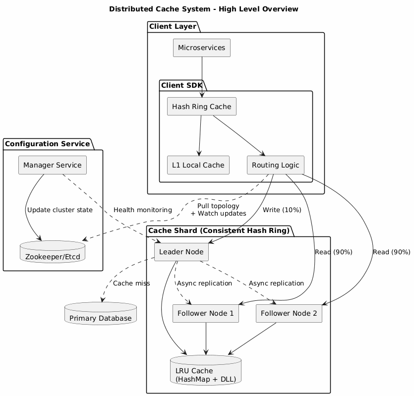

# Distributed Cache

The goal was to design a distributed cache system for a large-scale organization, similar to Redis or Memcached, capable of handling extreme traffic.

**Functional Requirements**

* APIs: Support `get(key)` and `put(key, value)`.
* Scale: Support 10 million Requests Per Second (RPS).
* Capacity: Handle 10 TB of total data.
* Value Size: Average value of 10 KB.
* Eviction: Support LRU (Least Recently Used) policy when memory is full.

**Non-Functional Requirements**

* Latency: Ultra-low, sub-millisecond response times for reads.
* Availability: 99.99% (High Availability); no single point of failure.
* Consistency: Eventual consistency preferred for performance; data must not be lost during partitions.
* Read/Write Ratio: High read-to-write ratio (90:10).

### High-Level Architecture

<figure><figcaption></figcaption></figure>

The system is designed as a distributed cluster of nodes. Because 10 TB cannot fit on a single machine, the data is partitioned (sharded) and replicated.

1. Client SDK: Integrated into microservices; handles routing logic.
2. Configuration Service (The Brain): (e.g., Zookeeper/Etcd) Stores the "Map" of the system.
3. Cache Shards: Individual clusters of nodes (Leader + Followers) storing subsets of the data.

***

### Data Partitioning (Sharding Strategy)

Proposed Solution: Consistent Hashing.

* **Thought Process**: Simple hashing ($$key \pmod n$$) is brittle. If a node is added or removed, almost all keys map to new locations, causing a massive "cache miss storm."
* **Implementation**: Keys and Nodes are mapped onto a logical "Hash Ring." A key is stored on the first node encountered moving clockwise on the ring.
* **Virtual Nodes**: To prevent "hot spots" where one server gets more traffic than others, each physical server is assigned multiple "virtual nodes" across the ring, ensuring a more uniform distribution of the 10 TB data.
* **Trade-off**: Slightly more complex client-side logic in exchange for high elasticity (re-sharding only affects $$1/n$$ of the data).

***

### Replication & Availability

Proposed Solution: Leader-Follower (Parent-Child) Model.

* Thought Process: Given the 90% read load, we separate concerns. One node (Leader) handles writes, while multiple nodes (Followers) handle reads.
* Replication Mode: Asynchronous.
  * **Reasoning**: To meet the sub-millisecond latency requirement, the Leader cannot wait for all Followers to acknowledge a write. It confirms the write to the client immediately and broadcasts the update in the background.
  * **Trade-off**: We sacrifice Strong Consistency for Low Latency. A client might briefly read an old value if they query a Follower before the update arrives.
* **Failover**: A Manager Service monitors node health via heartbeats. If a Leader fails, the Manager triggers an election among Followers to promote a new Leader.

***

### System Coordination & Client Routing

Proposed Solution: Decoupled Configuration Mapping.

* Problem: If clients query a "Manager" for every request to find the right shard, latency doubles.
* The Strategy:&#x20;
  * The client pulls the Hash Ring map from the Configuration Service (Zookeeper) at startup.
  * The client caches this map locally to perform $$O(1)$$ routing lookups.
  * Push Mechanism: Zookeeper uses "Watchers" to push updates to the client only when the cluster topology changes (e.g., a node dies).
* Thought Process: This keeps the "control plane" (management) separate from the "data plane" (traffic), ensuring maximum throughput.

***

### Optimization for Specific Problems

#### The "Hot Key" Problem

* Scenario: A single key (e.g., a celebrity post) gets millions of hits, overwhelming one shard.
* Proposed Solution: Internal L1 Caching & Dynamic Replication.
  * **L1 Cache**: The client-side SDK can store extremely hot keys in its own local memory for a few seconds.
  * **Dynamic Replication**: The system detects high traffic for a specific key and temporarily replicates that specific key-value pair across all shards in the cluster.

#### Cache Stampede (Dogpiling)

* Scenario: A hot key expires, and 10,000 requests simultaneously miss the cache and hit the database.
* Proposed Solution: Request Coalescing (Singleflight).
  * The first request to miss the cache acquires a lock.
  * Subsequent requests for the same key "wait" for the first request to return from the DB and populate the cache.
  * This prevents the database from crashing under a sudden surge.

#### Eviction Policy (LRU)

* Scenario: 10 TB limit reached; which data do we delete?
* Proposed Solution: Hash Map + Doubly Linked List.
  * Hash Map: Allows $$O(1)$$ lookup of the data.
  * Doubly Linked List: Tracks usage. Every time a key is accessed, it moves to the "Head." The "Tail" represents the least recently used item.
  * Action: When memory is full, the system evicts the item at the Tail

