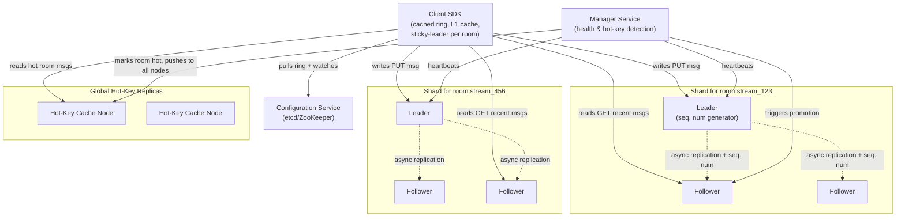

# Distributed Cache for Live‑Streaming Chat

### Goal

A distributed in‑memory cache cluster that serves a large‑scale live‑streaming chat platform with **2 million concurrent viewers**. It provides **sub‑millisecond read latency** for the hot message window, allows messages to be propagated within the streamer’s broadcast delay budget, and gracefully handles “celebrity” rooms where a single streamer may attract hundreds of thousands of viewers.

### Non‑goals

* Persistent storage of full chat history (only a sliding window of recent messages is cached)
* End‑to‑end message ordering across multiple rooms or strong consistency guarantees (this is a cache, not a database)
* Global multi‑region replication (the design focuses on a single logical cluster; cross‑region replication can be added asynchronously later)
* Serving multimedia attachments (only message text and metadata)

### Numbers

| Metric             | Value                                    | Justification                                                                                                    |
| ------------------ | ---------------------------------------- | ---------------------------------------------------------------------------------------------------------------- |
| Concurrent viewers | 2 M (peak)                               | Typical large event (major e‑sports, product launch)                                                             |
| Write rate         | 400 k writes/s                           | Each viewer sends \~0.2 messages/s on average (idle + active)                                                    |
| Read rate          | \~9 M reads/s                            | Viewers poll or receive pushed messages; session‑token lookups add constant read volume. Roughly 10 M RPS total. |
| Hot data size      | 500 GB – 1 TB                            | Sliding window of recent messages (e.g., last 5 minutes) for all active rooms, plus session tokens               |
| Message size       | 200–500 bytes (text) + 50 bytes metadata | Small payloads; average key+value \~500 bytes                                                                    |
| Latency target     | p99 read < 1 ms, write ack < 0.5 ms      | Must stay well within the broadcast delay budget to avoid perceptible lag                                        |
| Staleness window   | < 500 ms for standard streams            | Bound by stream delay (5–15 s) – leaves plenty of room                                                           |
| Shard count        | \~200 shards                             | Balanced for throughput and failover (with replication factor 3, \~600 nodes)                                    |

### Diagram

```mermaid
flowchart TB
    Client["Client SDK<br/>(cached ring, L1 cache,<br/>sticky-leader per room)"]
    Config["Configuration Service<br/>(etcd/ZooKeeper)"]
    Manager["Manager Service<br/>(health & hot-key detection)"]

    subgraph Shard_A ["Shard for room:stream_123"]
        Leader_A["Leader<br/>(seq. num generator)"]
        Follower_A1["Follower"]
        Follower_A2["Follower"]
    end

    subgraph Shard_B ["Shard for room:stream_456"]
        Leader_B["Leader"]
        Follower_B1["Follower"]
        Follower_B2["Follower"]
    end

    subgraph Replicated_Hot_Key ["Global Hot-Key Replicas"]
        HotReplica1["Hot-Key Cache Node"]
        HotReplica2["Hot-Key Cache Node"]
    end

    Client -->|pulls ring + watches| Config
    Client -->|writes PUT msg| Leader_A
    Client -->|writes PUT msg| Leader_B
    Client -->|reads GET recent msgs| Follower_A1
    Client -->|reads GET recent msgs| Follower_B2
    Client -->|reads hot room msgs| HotReplica1

    Leader_A -.->|async replication + seq. num| Follower_A1
    Leader_A -.->|async replication + seq. num| Follower_A2
    Leader_B -.->|async replication| Follower_B1
    Leader_B -.->|async replication| Follower_B2

    Manager -->|heartbeats| Leader_A
    Manager -->|heartbeats| Leader_B
    Manager -->|triggers promotion| Follower_A1
    Manager -->|marks room hot, pushes to all nodes| HotReplica1
```

### Core flow

#### Client initialisation

* The SDK downloads the consistent hash ring (mapping virtual nodes to physical shards) from the Configuration Service.
* It caches the ring locally and subscribes to push notifications for topology changes.
* The SDK receives a **“sticky leader” policy** per room: after a user writes, reads for that room are pinned to the leader for 500 ms to guarantee read‑your‑own‑writes.

#### Write path (put a chat message)

* The SDK hashes the `chat_room_id` to a point on the ring, resolving to the leader of the responsible shard.
* The leader writes the message into an in‑memory **sorted set** (ZSET) keyed by the room ID, using a monotonically increasing **sequence number** as the score.
* The leader acknowledges the write immediately, then asynchronously replicates the new message (with its sequence number) to its followers.
* For hot rooms (detected by the Manager), the message is also broadcast to a set of **global hot‑key replica nodes** so it can be read from anywhere.

#### Read path (get recent messages)

* For a standard room, the SDK sends the read request to any replica (leader or follower). The follower returns a sorted batch of recent messages, identified by the room’s sequence‑number range.
* Because followers may be up to 500 ms behind, the client SDK **merges and sorts** messages by sequence number; any temporary gaps are acceptable within the staleness budget.
* For a hot room, the read can be directed to a specially replicated hot‑key node, or served from the SDK’s L1 cache (see hot‑key mitigation).

#### Read‑your‑own‑writes (critical for chat UX)

* After a user performs a PUT, the SDK pins that user’s subsequent GETs for the same room to the **leader** for a configurable window (500 ms).
* Once the window expires (replication has caught up), reads fall back to the nearest replica.
* This ensures the sender always sees their own message without requiring synchronous replication.

#### Eviction

* Each shard maintains a **per‑room sorted set** trimmed to a maximum time window (e.g., the last 5 minutes of messages). Older entries are removed at write time, keeping memory usage predictable.

#### Failover

* The Manager Service heartbeats all leaders. If a leader fails, it triggers an election among its followers, promotes a new leader, and updates the Configuration Service.
* Because the sequence‑number generator moves to the new leader, a small gap in sequence numbers may appear. The client SDK treats missing sequence numbers as “not yet replicated” and skips them (they will be filled once replication stabilizes).

#### Hot‑key (hot‑room) mitigation

* The Manager monitors per‑key QPS. When a room’s read rate exceeds a threshold (e.g., 10 k RPS), the entire room’s message set is **dynamically replicated** to a pool of dedicated hot‑key cache nodes spread across the cluster.
* Additionally, the most recent messages for that room are pushed into the SDK’s **L1 cache** (in‑process memory) and refreshed every 2–3 seconds.
* Combined, these two measures absorb the celebrity‑room traffic without overwhelming any single shard.

#### Cache stampede protection

* A **singleflight** mechanism is used for backend fetches: if a message set expires and many clients request the same room simultaneously, only one request fetches from the database (or upstream cache) and the others wait for that result.

### Storage choice & why

* **In‑memory sorted sets** (ZSET) per chat room, holding `(sequence_number → message_payload)`. This gives O(log N) insertion and O(log N + M) range queries, which is sufficient for a sliding window of thousands of messages.
* Shards still use a hash map for other key‑value data (e.g., session tokens) with a doubly linked LRU for eviction.
* Consistent hashing with virtual nodes distributes rooms evenly across shards.

### The hard part & how we solve it

_Bottleneck:_ Sustaining 10 M RPS with sub‑millisecond latency while serving a 2‑million‑viewer live stream, ensuring that messages appear in order, and preventing a single hot room from melting a shard.

_Fix:_

* **Client‑side routing** with a cached hash ring eliminates any extra network hop.
* **Asynchronous replication with sequence numbers** gives writes instant acknowledgment and allows followers to serve sorted reads within the staleness window.
* **Sticky leader for 500 ms** guarantees read‑your‑own‑writes without expensive synchronous replication.
* **Dynamic hot‑room replication** offloads the whole room to dedicated nodes, and the **SDK L1 cache** serves the very hottest message sets from memory.
* **Singleflight coalescing** prevents thundering herds when a room’s cache expires.
* **Per‑room sorted sets with time‑based eviction** keep memory bound and avoid LRU thrashing for streaming workloads.

### Tradeoff I’m making

We choose **eventual consistency with a bounded staleness window** over strong consistency. Writes are acknowledged instantly, and followers may return slightly stale data (up to 500 ms). This is acceptable because:

1. The streamer’s own broadcast delay (5–15 seconds) dwarfs the cache staleness; viewers cannot perceive a 500 ms lag in chat relative to the video.
2. Read‑your‑own‑writes is preserved by the sticky leader, so a user always sees their own messages.
3. The read‑heavy workload (over 90 % reads) benefits massively from load‑balanced follower reads, and synchronous replication would violate the latency SLO.

For rooms that genuinely need stronger guarantees (e.g., moderator commands, payment events), the SDK can be instructed to use **quorum writes** on a per‑request basis, trading a small latency increase for higher consistency. This _tunable consistency_ allows the same cache to serve a spectrum of needs without redesign.

 
