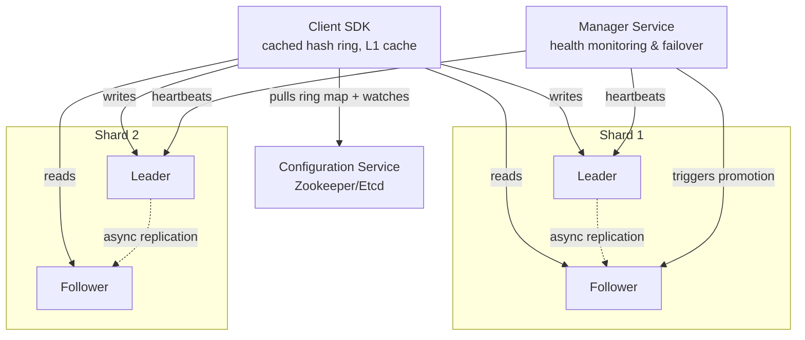

# Distributed Cache

### **Goal**

A distributed in-memory cache cluster serving 10 M RPS with sub‑millisecond latency, storing 10 TB of hot data using consistent hashing, leader‑follower replication, and LRU eviction.

### **Non‑goals**

* Durable, persistent storage (cache only, data may be lost on full outage)
* Strong consistency or ACID transactions
* Cross‑shard transactions or complex query capabilities
* Support for keys larger than typical 10 KB values

### **Numbers**

* QPS: 10 million requests per second (90 % reads, 10 % writes)
* Storage: 10 TB total, average value size 10 KB
* Latency target: sub‑millisecond (p99 read latency < 1 ms)

### **Diagram**

```mermaid
flowchart TB
    Client[Client SDK<br/>cached hash ring, L1 cache]
    Config[Configuration Service<br/>Zookeeper/Etcd]
    Manager[Manager Service<br/>health monitoring & failover]

    subgraph Shard1 ["Shard 1"]
        direction LR
        Leader1[Leader]
        Follower1[Follower]
    end

    subgraph Shard2 ["Shard 2"]
        direction LR
        Leader2[Leader]
        Follower2[Follower]
    end

    Client -->|pulls ring map + watches| Config
    Client -->|writes| Leader1
    Client -->|writes| Leader2
    Client -->|reads| Follower1
    Client -->|reads| Follower2
    
    Leader1 -.->|async replication| Follower1
    Leader2 -.->|async replication| Follower2
    
    Manager -->|heartbeats| Leader1
    Manager -->|heartbeats| Leader2
    Manager -->|triggers promotion| Follower1
```

### **Core flow**

_Client initialisation_

* On startup the SDK downloads the consistent hash ring (mapping virtual nodes → physical shards) from the Configuration Service.
* It caches the ring locally and subscribes to push notifications (Zookeeper Watchers) for any topology changes, avoiding a per‑request lookup.

_Write path (put)_

* SDK hashes the key to a point on the ring and resolves it to the leader of the responsible shard.
* The leader writes the key‑value into its in‑memory store, updates the LRU list, and immediately replies “success” to the client.
* In the background, the leader asynchronously replicates the new value to its followers.

_Read path (get)_

* The SDK uses the same hash ring to locate the shard, but can distribute reads across the leader and any follower for load balancing.
* A local L1 cache in the SDK serves extraordinarily hot keys for a few seconds without any network hop.
* If the key is flagged as a “hot key” globally, it may have been dynamically replicated to all shards; the SDK can read it from any shard.

_Eviction_

* Each shard maintains a hash‑map (O(1) lookup) and a doubly linked list tracking access order.
* On every access the key moves to the head; the tail is the LRU entry.
* When memory is full, the tail entry is evicted.

_Failover_

* A separate Manager Service heartbeats all leaders.
* If a leader fails, the Manager triggers an election among its followers, promotes a new leader, and updates the Configuration Service.
* The new map is pushed to all clients, redirecting traffic with minimal disruption.

_Hot key mitigation_

* Dynamic replication: once a key’s request rate passes a threshold, the system replicates that key‑value pair to every shard temporarily.
* SDK L1 caching: the client library holds extremely hot keys in process memory, refreshing them every few seconds.

_Cache stampede (dogpiling)_

* A singleflight (request coalescing) mechanism: the first miss acquires a lock and fetches from the backend; concurrent requests for the same key wait for that single fetch, then share the result.

### **Storage choice & why**

In‑memory hash map with a doubly linked LRU list per shard. This gives O(1) get/put operations, zero disk I/O, and deterministic sub‑millisecond latency — essential for the performance target. Consistent hashing with virtual nodes spreads the 10 TB uniformly across shards, and each node only needs RAM proportional to its share.

### **The hard part & how we solve it**

_Bottleneck:_ sustaining 10 M RPS with sub‑ms latency while maintaining high availability during node failures and re‑sharding, and preventing hot‑key meltdowns.

_Fix:_

* **Client‑side routing** — the cached hash ring removes any external lookup on the data path, so every request is a single network hop.
* **Asynchronous replication** — writes are acknowledged instantly, avoiding synchronous follower latency.
* **Virtual nodes** — prevent uneven load distribution when shards are added or removed.
* **Push‑based topology updates** — only send ring changes to clients, saving constant polling overhead.
* **Singleflight coalescing** — protects backend from thundering herds on cache misses.
* **Hot‑key dynamic replication + SDK L1 cache** — absorbs celebrity‑key traffic without overwhelming a single shard.

### **Tradeoff I’m making**

Choosing **eventual consistency (asynchronous replication)** over strong consistency because sub‑millisecond write latency and 10 M RPS throughput are paramount. A read‑heavy (90 %) workload tolerates brief windows where a follower returns a stale value; the alternative (synchronous replication) would violate the latency SLO.

 
