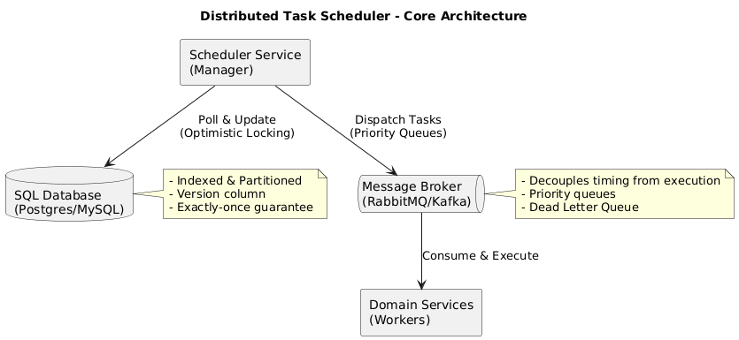

# Distributed Task Scheduler

<figure><figcaption></figcaption></figure>

#### Requirements & Scope

* Scale: Support billions of tasks (Reminders, Financial Retries, Cron jobs).
* Accuracy: High precision (low drift) and Exactly-once execution (critical for financial tasks).
* Flexibility: Support varying types of tasks (Email, DB fetching, API calls) across different domain services.
* Durability: No task should be lost even if a node crashes.

#### High-Level Architecture

We chose a Manager-Worker (Decoupled) Pattern:

* Scheduler Service: The "Manager" that handles the timing and orchestration.
* Message Broker: The "Buffer" that handles task distribution and backpressure.
* Domain Services: The "Workers" that execute the actual business logic.

#### Data Storage & Management

* Database: SQL (Postgres/MySQL) for strong consistency and structured data.
* Efficiency:&#x20;
  * Indexing: Composite index on `(status, scheduled_time)` to avoid scanning the whole table.
  * Partitioning: Table partitioning by date (e.g., daily partitions) to keep the "active" search space small.
* Concurrency (The "Double Execution" Problem):&#x20;
  * Optimistic Locking: We use a `version` column. A worker only picks up a task if the version matches what it read. This ensures that even if 10 nodes try to grab the same task at the same millisecond, only one succeeds.

#### The Execution Flow

1. Polling/Fetching: The Scheduler service uses Batch Fetching and Pagination to pull "Due" tasks from SQL.
2. Status Update: The Scheduler updates task status from `PENDING` to `IN_PROGRESS` using the versioning logic.
3. Dispatching: Instead of a direct call (Webhook), the Scheduler pushes the task into a Message Broker (RabbitMQ/Kafka).
   * This decouples the "Timing" from the "Execution." If a domain service is down, the task stays safe in the queue.
4. Priority Handling: We use Priority Queues within the broker. "Paylater Overdue" tasks get a higher priority than "Marketing Emails."

***

#### Reliability & Traffic Strategies

**Handling Spikes**

* Jitter (Random Delay): We apply a small random delay (1–5 seconds) to spread out the execution of millions of simultaneous tasks, preventing a system meltdown.
* Horizontal Scaling: We scale the Scheduler nodes horizontally. Since they use Optimistic Locking, they can work on the same DB table safely.

**Error Handling**

* Exponential Backoff: If a task fails, we retry it with increasing intervals.
* Dead Letter Queue (DLQ): After $$X$$ failed retries, the task is moved to a special queue for manual inspection.
* Safety Net (Visibility Timeout):
  * If a task is marked `IN_PROGRESS` but never finishes (node crash), a **cleanup job** eventually resets it to `PENDING` so it can be retried.
