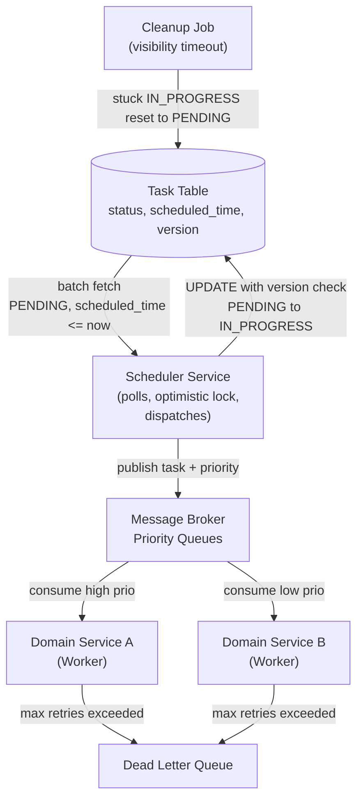

# Distributed Task Scheduler

#### Goal

A scalable, durable, exactly-once task scheduler that decouples timing from execution for billions of heterogeneous background jobs.

#### Non-goals

* Not a workflow orchestration engine (no DAGs, dependencies, or chaining of tasks)
* Not an execution environment—business logic lives in separate domain services, not in the scheduler
* Not targeting sub-second scheduling precision; low drift (seconds) is acceptable
* No single-tenant, in-process, or embedded scheduling; designed as a shared service

#### Numbers

* **QPS**: Up to 10,000 tasks dispatched per second at peak
* **Storage**: \~1 TB/year for billions of tasks (≈1 KB per task metadata record)
* **Latency target**: 99.9% of tasks enqueued within 5 seconds of `scheduled_time`; exactly-once execution guarantee

#### Diagram

```mermaid
flowchart TB
    Tasks[("Task Table\nstatus, scheduled_time, version")]
    Scheduler["Scheduler Service\n(polls, optimistic lock,\ndispatches)"]
    Broker["Message Broker\nPriority Queues"]
    WorkerA["Domain Service A\n(Worker)"]
    WorkerB["Domain Service B\n(Worker)"]
    DLQ["Dead Letter Queue"]
    Cleanup["Cleanup Job\n(visibility timeout)"]

    Tasks -- "batch fetch\nPENDING, scheduled_time <= now" --> Scheduler
    Scheduler -- "UPDATE with version check\nPENDING to IN_PROGRESS" --> Tasks
    Scheduler -- "publish task + priority" --> Broker
    Broker -- "consume high prio" --> WorkerA
    Broker -- "consume low prio" --> WorkerB
    WorkerA -- "max retries exceeded" --> DLQ
    WorkerB -- "max retries exceeded" --> DLQ
    Cleanup -- "stuck IN_PROGRESS reset to PENDING" --> Tasks
```

#### Core flow

1. The Scheduler polls the task table for `PENDING` tasks where `scheduled_time <= now`, using a composite index on `(status, scheduled_time)` and batch/pagination to limit load.
2. For each fetched task, it attempts an atomic status update `PENDING → IN_PROGRESS` with a version field — `WHERE version = last_read_version`. Only one scheduler node wins per task (optimistic locking).
3. Successfully claimed tasks are published to a message broker. Priority is attached (e.g., financial retries → high priority, marketing emails → low) and the broker routes them to the correct priority queue.
4. Domain workers consume from the queues, execute the actual business logic (API call, email, DB operation), and acknowledge on success. The broker applies exponential backoff and retries on failure/nack.
5. After the final retry failure, the task is moved to a Dead Letter Queue for manual inspection.
6. A separate periodic clean‑up job scans for tasks stuck in `IN_PROGRESS` beyond a visibility timeout (e.g., due to worker crash) and resets them to `PENDING` so they can be retried safely.

#### Storage choice & why

**PostgreSQL / MySQL** — ACID transactions, strong consistency, and deterministic queries are essential for exactly‑once task claiming. Optimistic locking via a version column gives us safe concurrent dispatching across horizontally scaled scheduler nodes. Composite indexing and date‑based table partitioning keep the working set small and scans efficient even with billions of rows.

#### The hard part & how we solve it

**Bottleneck:** Safely handing out tasks to competing schedulers without double execution, while keeping latency low at massive scale.\
**Fix:**

* **Optimistic locking** with version column ensures exactly‑one claim per task, no coordination needed.
* **Polling + partitioning** keeps the active scan set tiny (only today’s partition).
* **Message broker + backpressure** decouples timing from execution, absorbs spikes, and retries failures without scheduler involvement.
* **Jitter** (1–5 s random delay on dispatch) smoothes out thundering herds of simultaneous tasks.
* **Visibility timeout clean‑up** protects against node crashes and stranded `IN_PROGRESS` tasks.

#### Tradeoff I’m making

**Choosing a decoupled architecture with a persistent message broker over synchronous, direct worker invocations (webhooks)**.\
This adds one network hop and a small latency increase, but gives us far superior durability (tasks survive worker outages), natural backpressure, priority queuing, and independent retry/dead‑letter handling — all critical for financial retries and high‑scale reliability.
