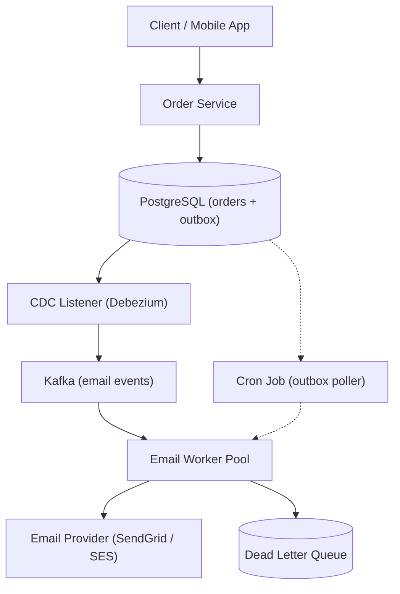
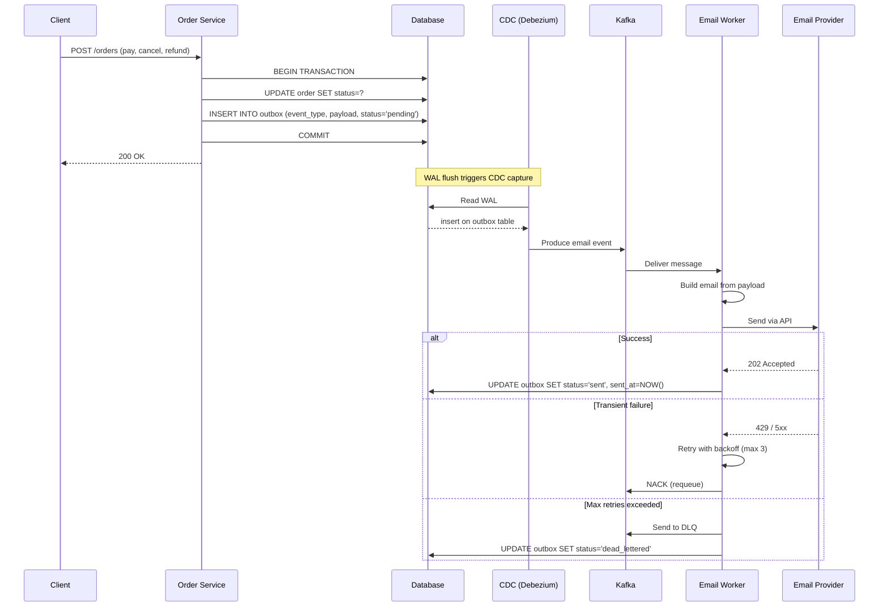
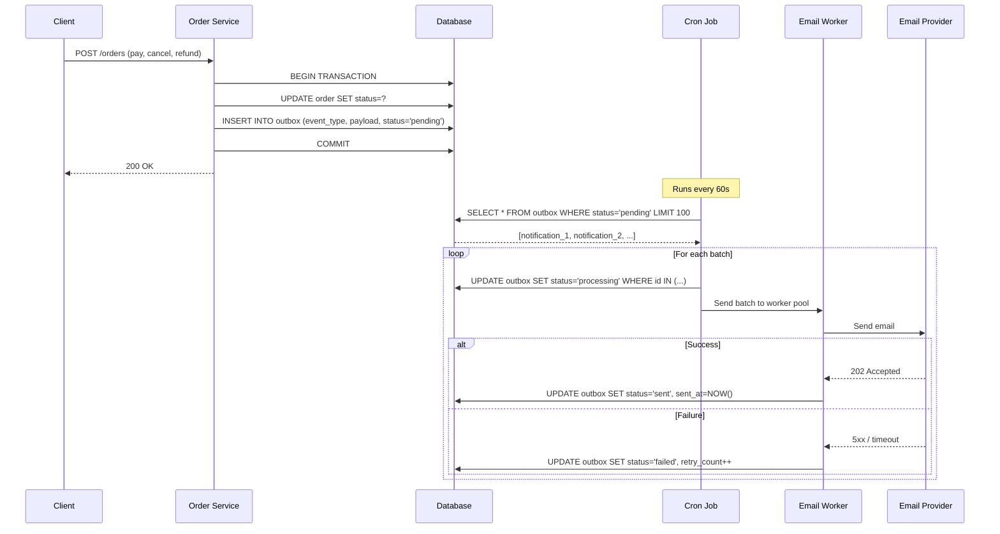

# Event Processing for Order Notifications

### Goal

Reliably process order status change events (paid, cancelled, refunded) to update the order status and deliver notification emails. The system must decouple the critical order-status write (sub-millisecond, strongly consistent) from the latency-sensitive email delivery (seconds-minutes, at-least-once) while surviving publisher delays, queue backlogs, and email provider outages.

### Non-goals

* Not a general-purpose event bus or streaming platform; only order → notification events
* Not an analytics pipeline; no event enrichment, aggregation, or sink to data warehouse
* Not a replacement for synchronous notifications (websocket push for dashboard); email is the only async channel
* Not a workflow engine; no multi-step sagas or compensation logic beyond "send email or fail after N retries"

### Numbers

* **Order throughput:** 10,000 orders/min peak (~167/s); 5M orders/month
* **Email volume:** 500,000 emails/day peak (1–3 per order); ~15M/month
* **Order status write latency:** p99 < 50ms (in-app DB write, no external I/O)
* **Email delivery notification latency:** p99 < 5s for CDC approach; p99 < 90s for outbox polling (60s poll + send)
* **Outbox retention:** 30 days; ~250 MB/month at 500 bytes/row
* **Email provider SLA:** 99.5% uptime; provider-side queueing can delay delivery by minutes during degradation
* **Idempotency window:** 7 days (duplicate detection for retries within this window)

### Key Design Decisions

| Decision | Rationale | Rejected Alternative |
|---|---|---|
| Transactional outbox for email intent | Atomicity: order status update and email intent commit in one DB transaction; no dual-write inconsistency | Dual-write to DB + message queue (partial failure: email lost if queue write fails after DB commit) |
| CDC (Debezium + Kafka) as primary path; outbox as fallback | CDC provides sub-second email dispatch without polling load on DB; outbox is the simpler backup when Kafka isn't justified | CDC-only (operational complexity if you don't already run Kafka); outbox-only (polling latency too high for real-time UX) |
| Separate outbox/notification table (not a column on orders) | Clean schema separation; notification records carry retry metadata, status, timestamps; easily archived and purged | `email_sent` boolean on orders (no retry state, no per-channel tracking, couples status to delivery) |
| Idempotency key on each notification | At-least-once delivery guarantees that retries don't send duplicate emails | Pure at-most-once (emails silently lost on transient failure); exactly-once across email provider (infeasible — SMTP has no idempotency) |
| Exponential backoff + dead-letter for failed sends | Respects email provider rate limits; prevents thundering herd on recovery; DLQ preserves failed payloads for manual inspection | Fixed retry interval (thundering herd risk); permanent discard on first failure (data loss) |
| Outbox poll interval of 60s | Acceptable latency for email (users don't expect sub-second email); minimizes DB read IOPS | 5s polling (most cycles return zero rows, wasted IOPS); 300s polling (users wait 5 min for "your order is confirmed" email) |
| Batch poll + send (up to 100 records/cycle) | Reduces DB round-trips and email provider connection overhead | Single-record poll (N+1 queries, poor throughput under backlog) |
| Partitioned outbox table by `created_at` | Easy archival of sent records; roll-off old partitions instead of DELETE | Unpartitioned table with DELETE (bloat, vacuum overhead, slow index maintenance at 500K rows/day) |

### Architecture Diagram



### Data Flow

**CDC path (primary, near-real-time):**



**Outbox path (fallback, polling-based):**



### Database Schema

```sql
-- Orders table (core entity)
CREATE TABLE orders (
    id                UUID PRIMARY KEY DEFAULT gen_random_uuid(),
    user_id           UUID NOT NULL,
    status            VARCHAR(20) NOT NULL DEFAULT 'pending',
    -- pending, paid, cancelled, refunded, part_refunded
    total_amount      BIGINT NOT NULL,                -- cents
    currency          CHAR(3) NOT NULL DEFAULT 'USD',
    idempotency_key   VARCHAR(255) UNIQUE,            -- prevent duplicate order submission
    created_at        TIMESTAMP NOT NULL DEFAULT NOW(),
    updated_at        TIMESTAMP NOT NULL DEFAULT NOW()
);

CREATE INDEX idx_orders_user ON orders (user_id, created_at DESC);
CREATE INDEX idx_orders_status ON orders (status, created_at DESC);

-- Outbox / notification table
CREATE TABLE email_notifications (
    id                UUID PRIMARY KEY DEFAULT gen_random_uuid(),
    order_id          UUID NOT NULL REFERENCES orders(id),
    event_type        VARCHAR(50) NOT NULL,            -- order.paid, order.cancelled, order.refunded
    recipient_email   VARCHAR(255) NOT NULL,
    subject           VARCHAR(255) NOT NULL,
    body              TEXT NOT NULL,                   -- rendered HTML or template reference
    status            VARCHAR(20) NOT NULL DEFAULT 'pending',
    -- pending, processing, sent, failed, dead_lettered
    retry_count       INT NOT NULL DEFAULT 0,
    max_retries       INT NOT NULL DEFAULT 3,
    last_error        TEXT,
    idempotency_key   VARCHAR(255) UNIQUE,            -- prevent duplicate sends on retry
    created_at        TIMESTAMP NOT NULL DEFAULT NOW(),
    updated_at        TIMESTAMP NOT NULL DEFAULT NOW(),
    sent_at           TIMESTAMP
) PARTITION BY RANGE (created_at);

-- Monthly partitions
CREATE TABLE email_notifications_2026_01 PARTITION OF email_notifications
    FOR VALUES FROM ('2026-01-01') TO ('2026-02-01');
CREATE TABLE email_notifications_2026_02 PARTITION OF email_notifications
    FOR VALUES FROM ('2026-02-01') TO ('2026-03-01');

-- Polling index: find pending records efficiently
CREATE INDEX idx_email_notifications_poll ON email_notifications (status, created_at ASC)
    WHERE status = 'pending';

-- Index for CDC processing (marking as sent)
CREATE INDEX idx_email_notifications_cdc ON email_notifications (id, status)
    WHERE status IN ('pending', 'processing');

-- Dead letter store (optional: separate table for DLQ-destined records)
CREATE TABLE email_notifications_dlq (
    id                UUID PRIMARY KEY DEFAULT gen_random_uuid(),
    notification_id   UUID NOT NULL,
    order_id          UUID NOT NULL,
    event_type        VARCHAR(50) NOT NULL,
    recipient_email   VARCHAR(255) NOT NULL,
    body              TEXT NOT NULL,
    failure_reason    TEXT,
    failed_at         TIMESTAMP NOT NULL DEFAULT NOW()
);
```

#### CDC Event Format (Kafka message value)

```json
{
  "schema": {
    "type": "struct",
    "fields": [
      { "field": "id", "type": "string" },
      { "field": "order_id", "type": "string" },
      { "field": "event_type", "type": "string" },
      { "field": "recipient_email", "type": "string" },
      { "field": "subject", "type": "string" },
      { "field": "body", "type": "string" },
      { "field": "idempotency_key", "type": "string" },
      { "field": "created_at", "type": "timestamp" }
    ]
  },
  "payload": {
    "id": "a1b2c3d4-...",
    "order_id": "e5f6g7h8-...",
    "event_type": "order.paid",
    "recipient_email": "user@example.com",
    "subject": "Order #12345 confirmed",
    "body": "<html>...</html>",
    "idempotency_key": "notif_a1b2c3d4_retry_0",
    "created_at": "2026-01-15T10:30:00Z"
  }
}
```

---

### Go Code

#### Order Service: Transactional Outbox Write

```go
type OrderService struct {
    db *sql.DB
}

type CreateOrderInput struct {
    UserID         string
    TotalAmount    int64
    Currency       string
    IDempotencyKey string
}

func (s *OrderService) CreateOrder(ctx context.Context, input CreateOrderInput) (*Order, error) {
    tx, err := s.db.BeginTx(ctx, nil)
    if err != nil {
        return nil, fmt.Errorf("begin tx: %w", err)
    }
    defer tx.Rollback()

    order := &Order{
        ID:             uuid.New().String(),
        UserID:         input.UserID,
        Status:         "paid",
        TotalAmount:    input.TotalAmount,
        Currency:       input.Currency,
        IDempotencyKey: input.IDempotencyKey,
        CreatedAt:      time.Now(),
    }

    _, err = tx.ExecContext(ctx, `
        INSERT INTO orders (id, user_id, status, total_amount, currency, idempotency_key, created_at)
        VALUES ($1, $2, $3, $4, $5, $6, $7)
        ON CONFLICT (idempotency_key) DO NOTHING
    `, order.ID, order.UserID, order.Status, order.TotalAmount, order.Currency, order.IDempotencyKey, order.CreatedAt)
    if err != nil {
        return nil, fmt.Errorf("insert order: %w", err)
    }

    // Write email intent in the same transaction
    notif := &EmailNotification{
        ID:             uuid.New().String(),
        OrderID:        order.ID,
        EventType:      "order.paid",
        RecipientEmail: lookupUserEmail(ctx, s.db, input.UserID),
        Subject:        fmt.Sprintf("Order #%s confirmed", order.ID[:8]),
        Body:           renderEmailTemplate("order_confirmation", order),
        IDempotencyKey: fmt.Sprintf("notif_%s_retry_%d", order.ID, 0),
    }

    _, err = tx.ExecContext(ctx, `
        INSERT INTO email_notifications (id, order_id, event_type, recipient_email, subject, body, idempotency_key, status, created_at)
        VALUES ($1, $2, $3, $4, $5, $6, $7, 'pending', $8)
    `, notif.ID, notif.OrderID, notif.EventType, notif.RecipientEmail, notif.Subject, notif.Body, notif.IDempotencyKey, notif.CreatedAt)
    if err != nil {
        return nil, fmt.Errorf("insert notification: %w", err)
    }

    if err := tx.Commit(); err != nil {
        return nil, fmt.Errorf("commit: %w", err)
    }

    return order, nil
}
```

#### Outbox Poller (Cron Job)

```go
type OutboxPoller struct {
    db         *sql.DB
    emailSvc   *EmailService
    batchSize  int
    maxRetries int
}

func (p *OutboxPoller) ProcessBatch(ctx context.Context) error {
    tx, err := p.db.BeginTx(ctx, &sql.TxOptions{Isolation: sql.LevelReadCommitted})
    if err != nil {
        return fmt.Errorf("begin tx: %w", err)
    }
    defer tx.Rollback()

    rows, err := tx.QueryContext(ctx, `
        SELECT id, order_id, event_type, recipient_email, subject, body, idempotency_key
        FROM email_notifications
        WHERE status = 'pending'
          AND retry_count < $1
        ORDER BY created_at ASC
        LIMIT $2
        FOR UPDATE SKIP LOCKED
    `, p.maxRetries, p.batchSize)
    if err != nil {
        return fmt.Errorf("poll: %w", err)
    }
    defer rows.Close()

    var batch []*EmailNotification
    var ids []string
    for rows.Next() {
        n := &EmailNotification{}
        if err := rows.Scan(&n.ID, &n.OrderID, &n.EventType, &n.RecipientEmail, &n.Subject, &n.Body, &n.IDempotencyKey); err != nil {
            continue
        }
        batch = append(batch, n)
        ids = append(ids, n.ID)
    }

    if len(batch) == 0 {
        return nil
    }

    // Mark as processing
    _, err = tx.ExecContext(ctx, `
        UPDATE email_notifications SET status = 'processing', updated_at = NOW()
        WHERE id = ANY($1)
    `, pq.Array(ids))
    if err != nil {
        return fmt.Errorf("mark processing: %w", err)
    }

    if err := tx.Commit(); err != nil {
        return fmt.Errorf("commit claim: %w", err)
    }

    // Send emails (outside the transaction)
    for _, n := range batch {
        if err := p.emailSvc.Send(ctx, n); err != nil {
            p.handleFailure(ctx, n, err)
        } else {
            p.handleSuccess(ctx, n)
        }
    }

    return nil
}

func (p *OutboxPoller) handleSuccess(ctx context.Context, n *EmailNotification) {
    _, _ = p.db.ExecContext(ctx, `
        UPDATE email_notifications SET status = 'sent', sent_at = NOW(), updated_at = NOW()
        WHERE id = $1 AND status = 'processing'
    `, n.ID)
}

func (p *OutboxPoller) handleFailure(ctx context.Context, n *EmailNotification, err error) {
    _, _ = p.db.ExecContext(ctx, `
        UPDATE email_notifications
        SET retry_count = retry_count + 1,
            status = CASE WHEN retry_count >= $1 THEN 'dead_lettered' ELSE 'pending' END,
            last_error = $2,
            updated_at = NOW()
        WHERE id = $3
    `, p.maxRetries, err.Error(), n.ID)
}
```

#### CDC Consumer (Kafka → Email Worker)

```go
type CDCConsumer struct {
    db         *sql.DB
    emailSvc   *EmailService
    maxRetries int
}

func (c *CDCConsumer) HandleEmailEvent(ctx context.Context, msg kafka.Message) error {
    var event EmailNotification
    if err := json.Unmarshal(msg.Value, &event); err != nil {
        return fmt.Errorf("unmarshal: %w", err) // send to DLQ
    }

    // Check idempotency before sending
    var existing string
    err := c.db.QueryRowContext(ctx, `
        SELECT status FROM email_notifications WHERE id = $1
    `, event.ID).Scan(&existing)
    if err == nil && existing == "sent" {
        return nil // already sent, skip
    }

    if err := c.emailSvc.Send(ctx, &event); err != nil {
        // NACK with requeue for transient failures
        if isTransient(err) {
            return fmt.Errorf("transient send failure: %w", err)
        }
        // Permanent failure → dead letter
        c.deadLetter(ctx, &event, err)
        return nil
    }

    _, err = c.db.ExecContext(ctx, `
        UPDATE email_notifications SET status = 'sent', sent_at = NOW() WHERE id = $1
    `, event.ID)
    return err
}

func (c *CDCConsumer) deadLetter(ctx context.Context, event *EmailNotification, err error) {
    _, _ = c.db.ExecContext(ctx, `
        INSERT INTO email_notifications_dlq (id, notification_id, order_id, event_type, recipient_email, body, failure_reason)
        VALUES ($1, $2, $3, $4, $5, $6, $7)
    `, uuid.New().String(), event.ID, event.OrderID, event.EventType, event.RecipientEmail, event.Body, err.Error())

    _, _ = c.db.ExecContext(ctx, `
        UPDATE email_notifications SET status = 'dead_lettered', last_error = $1, updated_at = NOW()
        WHERE id = $2
    `, err.Error(), event.ID)
}
```

---

### Failure Modes

| Failure | Probability | Impact | Mitigation |
|---|---|---|---|
| Order service crashes after DB commit but before response | Low | Low: order persisted, but client sees timeout and may retry | Idempotency key on order creation (duplicate submission is a no-op); client retries safely |
| Email provider is down (5xx or timeout) | Medium | Medium: email delivery delayed; no data loss | Retry with exponential backoff (3 attempts); after max retries, route to DLQ for manual reprocessing |
| Outbox poller crashes mid-batch | Low | Medium: claimed records stay "processing" until visibility timeout | Add a `claimed_at` timestamp and a recovery job that resets records stuck in "processing" past 5 minutes |
| CDC relay (Debezium) falls behind | Low | Medium: email delivery lag grows until relay catches up | Monitor Kafka consumer lag; set alert when lag exceeds 60s; CDC catch-up can be supplemented by outbox poller as fallback |
| Database connection pool exhaustion | Low | High: order writes and outbox poll both stall | Connection pooling (pgbouncer); separate connection pools for writes and batch reads; circuit breaker on poll loop |
| Schema migration breaks CDC parser | Low | High: CDC stops capturing outbox inserts; email delivery ceases entirely | Test schema changes against Debezium connector in staging; keep a 1-minute tolerance window and rely on outbox poller as fallback during migration |
| Kafka broker failure | Low | Medium: CDC email events not delivered until broker recovers | Replicated Kafka cluster (3+ brokers); outbox poller continues to process emails during Kafka outage (degraded but not silent) |

---

### Infrastructure & Deployment

#### Topology

| Component | Count | Role |
|---|---|---|
| Order service instances | 3–10 (horizontally scaled) | Order CRUD + outbox write |
| PostgreSQL cluster | 1 primary + 2 read replicas | Orders + outbox storage; replicas serve poll queries |
| Kafka cluster | 3 brokers | CDC event transport |
| Debezium connector | 1 per database instance | WAL streaming → Kafka |
| Email worker pool | Auto-scaled (5–20) | Pull from Kafka or receive from outbox poller |
| Cron job (outbox poller) | 1 instance (singleton) | Fallback email delivery via polling |

#### Compute

Order service: 2 vCPU, 4 GB RAM. CPU-bound (JSON serialization, DB writes) and moderately memory-bound (template rendering for email bodies).

Email workers: Variable (1–4 vCPU). The email send is I/O-bound (HTTP call to email provider); workers are sized for concurrent connections, not CPU.

#### Networking

* Order service → PostgreSQL: private VPC, no public endpoint
* Order service → external: API Gateway with TLS termination; tenant-level rate limiting
* Kafka: inter-broker traffic within the same AZ; producers/consumers connect via VPC endpoints
* Email workers → email provider: outbound HTTPS to SendGrid / SES API; static IPs for provider allowlisting

#### Observability

* **Metrics:** Prometheus (order write latency, outbox poll duration, email send latency, Kafka consumer lag, per-event-type throughput, dead-letter count)
* **Dashboards:** Grafana — "Order Events" panel (write rate, latency), "Email Delivery" panel (send rate, success rate, latency, dead letters)
* **Logging:** Structured JSON to ELK; every outbox state transition logged with `notification_id`, `order_id`, `event_type`, `correlation_id`
* **Tracing:** OpenTelemetry across order service → outbox write → CDC → Kafka → email worker → email provider; `correlation_id` propagated through Kafka headers
* **Alerts:**
  * P1: Email send success rate < 90% for 5 minutes
  * P2: Kafka consumer lag > 60 seconds
  * P2: Outbox "processing" records stuck > 5 minutes (recovery may be stalled)
  * P3: Dead letter queue non-empty for 10+ minutes (manual triage needed)

---

### The Hard Part & How We Solve It

| Bottleneck | Fix |
|---|---|
| Dual-write inconsistency (order updates but email doesn't send) | Transactional outbox: email intent is written in the same DB transaction as the order status update |
| Email provider rate limits during backlog recovery | Exponential backoff with jitter; batch sends are throttled to stay within provider rate limit |
| CDC relay failure causes silent email loss | Outbox poller runs as fallback on a 60s schedule; if CDC catches up, outbox records are skipped (already marked sent by CDC worker) |
| Schema migration breaks CDC parsing | Backward-compatible schema changes only; Debezium `schema.history.internal` stores schema evolution; verify connector in staging before production deploy |
| Duplicate email delivery on retry | Idempotency key on each notification; check `email_notifications.status` before sending; email provider-side dedup where available (SendGrid `unique_args`) |
| Outbox table grows indefinitely | Partition by `created_at`; monthly partitions detached and archived after 30 days retention |
| Kafka backlog from burst of orders | Auto-scaling email workers based on consumer lag; outbox poller backs up CDC path during bursts |

---

### Tradeoffs

**1. CDC + outbox fallback over either alone.**\
Cost: Must operate both Kafka/Debezium and a cron poller. Two code paths that must agree on state.\
Benefit: No single point of failure for email delivery. If CDC lags or fails, the outbox poller catches up. If the outbox poller is slow, CDC delivers in real-time.

**2. Separate outbox table over status flag on orders.**\
Cost: Additional table, join for cross-referencing. Slightly more storage.\
Benefit: Clean separation of concerns. Outbox records are ephemeral (partitioned, archived, deleted). The orders table stays lean. Per-email retry metadata doesn't clutter the order row.

**3. `FOR UPDATE SKIP LOCKED` for outbox polling over simple `LIMIT`.**\
Cost: Takes row locks during poll. Requires PostgreSQL 9.5+.\
Benefit: Multiple poller instances can run concurrently without duplicating work. Each instance claims its own batch of records.

**4. At-least-once delivery over at-most-once.**\
Cost: Workers must implement idempotency to avoid duplicate emails. Idempotency keys add storage and a uniqueness constraint.\
Benefit: No silent email loss. If the email provider is degraded, the system retries. Manual DLQ recovery is possible without data loss.

**5. Rendered email body in outbox over template reference.**\
Cost: More storage per row (templates with order-specific data can be several KB). Changes to email template require re-rendering old records.\
Benefit: The email worker is stateless — it doesn't need access to a template engine or the order data at send time. Archived records are self-contained for auditing.

---

### Where It's Used

* **Transactional outbox pattern:** Described by Chris Richardson in "Microservices Patterns" ([pattern docs](https://microservices.io/patterns/data/transactional-outbox.html)). Also documented in AWS Prescriptive Guidance ([guide](https://docs.aws.amazon.com/prescriptive-guidance/latest/patterns/implement-the-transactional-outbox-pattern.html)). Used broadly across e-commerce, fintech, and SaaS to reliably emit events without distributed transactions.
* **Debezium + Kafka CDC:** Red Hat's Debezium is the de facto open-source CDC connector. Used in production by Reddit, Shopify, Okta, Flipkart, Zalando, Bolt, Tokopedia, and many others for change data capture from MySQL/PostgreSQL to Kafka ([adopters list](https://debezium.io/community/users/)).
* **Amazon SQS + outbox:** Many AWS-based systems write to SQS after a DB commit by using the outbox pattern with a lightweight poller; the queue then triggers Lambda for email delivery. Follows the same transactional outbox pattern referenced above.
* **SendGrid event webhooks:** SendGrid (Twilio) provides delivery event callbacks that workers can consume to mark outbox records as delivered or bounced ([docs](https://docs.sendgrid.com/for-developers/tracking-events/event)). This closes the loop on email lifecycle tracking — `sent` in the outbox means the provider accepted it, but `delivered` (from the webhook) means the recipient's inbox received it.
* **Resend / AWS SES:** Modern email APIs with built-in retry, delivery tracking, and idempotency key support (Resend [docs](https://resend.com/docs/api-reference/emails/send-email)); the system should integrate via these APIs rather than implementing SMTP directly.
