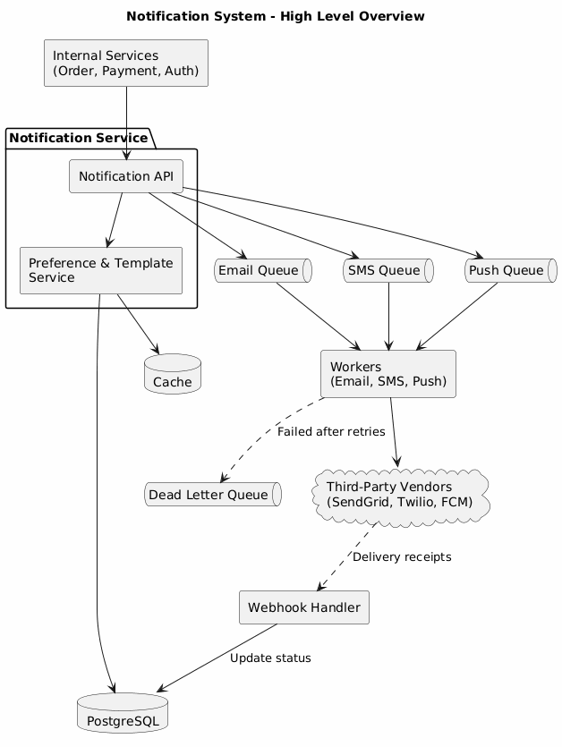

# Notification System

## Requirement

#### Functional Requirement

* Multi-Channel: Support for Email, SMS, and Mobile Push.
* Dynamic Templates: Support for placeholders (e.g., `Hello {name}`).
* User Preferences: Opt-in/out logic per channel and category.
* Tracking: End-to-end delivery status (Pending $$\rightarrow$$ Sent $$\rightarrow$$ Delivered).
* Priority: High-priority lane for OTPs and transaction alerts.

#### Non-Functional Requirements

* Reliability: "At-least-once" delivery guarantee.
* Availability: Fault tolerance against third-party vendor outages.
* Scalability: Ability to handle traffic bursts (e.g., millions of marketing messages).
* Idempotency: Prevent duplicate notifications for a single event.

### High-Level Architecture

The system uses an Asynchronous Event-Driven approach. By decoupling the trigger from the delivery, we ensure the main application remains responsive.

<figure><figcaption></figcaption></figure>

**Notification API**

* Receives requests from internal services (Order, Payment, Auth).
* Checks for valid `user_id`, message types, and required payload data.
* Checks the Database/Cache for an `idempotency_key` to avoid duplicate processing.

**Preference & Template Service**

* Queries the User DB to see if the user has disabled a specific channel (e.g., "Don't send me SMS").
* Injects data into pre-defined templates (e.g., converting a raw JSON payload into a formatted HTML email).

**Message Queues (The Buffer)**

* Separate queues for Email, SMS, and Push. This prevents a slow email vendor from delaying an urgent SMS.
* Within each channel, use a Priority Queue to move OTPs to the front of the line.

**Workers (The Consumers)**

* Pulls messages from the queue, selects the appropriate vendor (Twilio, SendGrid), and executes the API call.
* Implements Exponential Backoff. If a vendor returns a 5xx error, the worker puts the message back in the queue for a later attempt.

**Webhook Handler**

* Listens for "Delivery Receipts" from vendors.
* Updates the `notification_status` in the DB from `SENT` to `DELIVERED` or `FAILED` (e.g., if an email bounces).

***

### Failure Handling & Reliability

#### Dead Letter Queues (DLQ)

If a message fails after 3–5 retries, it is moved to a DLQ. This prevents "poison messages" from looping forever and allows engineers to inspect and "replay" them later.

#### Circuit Breaker Pattern

If a vendor like SendGrid is consistently failing (100% error rate), the system trips a circuit breaker to stop sending requests, preventing resource exhaustion and allowing the system to fail gracefully or switch to a backup vendor.

#### Rate Limiting

We implement rate limiting before calling vendors to ensure we don't exceed our paid tiers or get blocked for spamming.

***

### Trade-offs Summary

1. Consistency vs. Availability: We prioritize Availability. We send notifications even if our logging database is slow, ensuring the user gets their info.
2. Database Choice: We use RDBMS (Postgres) over NoSQL because transactional integrity is vital for status tracking and idempotency.
