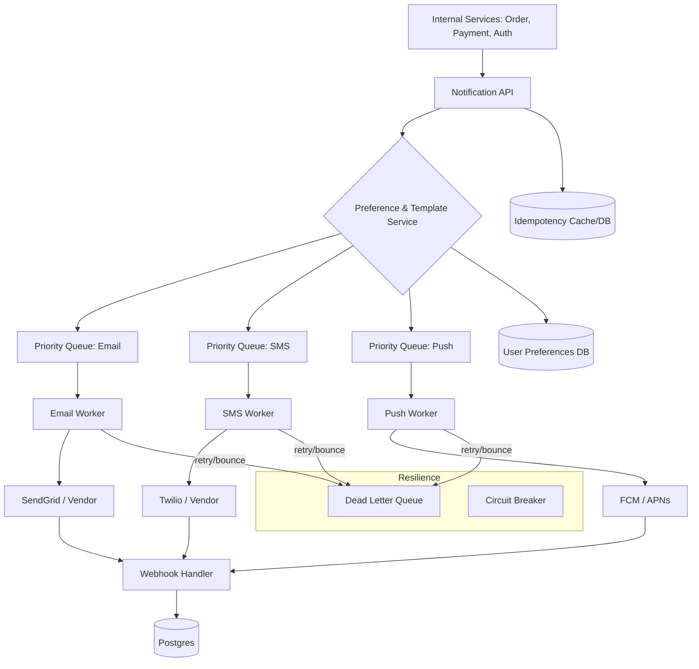

# Notification System

### Goal

Build a reliable, multi-channel notification system that delivers transactional and marketing messages via Email, SMS, and Push with idempotent processing, user preferences, priority routing, and end-to-end tracking.

### Non-goals

* Building the underlying vendor APIs (Twilio, SendGrid, FCM, APNs); we integrate with existing providers.
* Managing user contact details (phone number/email verification, address book); that’s owned by the user service.
* Real-time chat or interactive messaging workflows.
* Full-featured marketing campaign orchestration or A/B testing engine.

### Numbers

* QPS: Up to 10,000 requests/second during marketing bursts (peak).
* Storage: \~1 TB/year for notification logs, delivery statuses, DLQ snapshots, and idempotency keys.
* Latency target: p95 < 2 seconds from API acceptance to vendor handoff for high-priority messages (OTP, transaction alerts); p99 < 10 seconds for normal priority.

### Diagram

```mermaid
flowchart TB
    A[Internal Services: Order, Payment, Auth] --> B[Notification API]
    B --> C{Preference & Template Service}
    
    C --> D1[Priority Queue: Email]
    C --> D2[Priority Queue: SMS]
    C --> D3[Priority Queue: Push]
    
    D1 --> E1[Email Worker]
    D2 --> E2[SMS Worker]
    D3 --> E3[Push Worker]
    
    E1 --> F1[SendGrid / Vendor]
    E2 --> F2[Twilio / Vendor]
    E3 --> F3[FCM / APNs]
    
    F1 --> G[Webhook Handler]
    F2 --> G
    F3 --> G
    
    G --> H[(Postgres)]
    
    E1 -- "retry/bounce" --> DLQ
    E2 -- "retry/bounce" --> DLQ
    E3 -- "retry/bounce" --> DLQ
    
    B --> I[(Idempotency Cache/DB)]
    C --> J[(User Preferences DB)]
    
    subgraph Resilience
        DLQ[Dead Letter Queue]
        CB[Circuit Breaker]
    end
```

### Core flow

* Notification API receives a request containing `user_id`, `event_type`, `payload`, and `idempotency_key`.
* Idempotency check: lookup `idempotency_key` in cache (Redis) / Postgres; if already processed, return existing status immediately to avoid duplicates.
* Preference & Template Service:
  * Queries user preferences per channel and category (e.g., marketing, transactional) to decide opt-in/out.
  * If opted out for this channel, drop the notification (or log) and bail.
  * Renders the message by injecting payload data into the appropriate dynamic template (e.g., “Hello {name}, your order #{order\_id} is confirmed”).
* Message routing:
  * Place the rendered message into one of the per-channel priority queues (Email, SMS, Push).
  * High-priority messages (OTP, payment alerts) go to the front of the queue; regular marketing to the back.
* Workers (consumers):
  * Pull messages from their assigned channel/priority queue.
  * Apply a per-vendor rate limiter (token bucket) to stay within provider limits.
  * Call the external vendor API (e.g., Twilio for SMS). On 5xx errors or temporary failures, apply exponential backoff with jitter and re-queue.
  * After a configurable retry limit (3–5 attempts), move the message to the Dead Letter Queue (DLQ) for manual inspection.
* Status tracking:
  * Worker updates status to `SENT` once the vendor accepts the request.
  * A separate Webhook Handler ingests delivery receipts, bounce events, and click/open events from vendors, then updates the notification status in Postgres to `DELIVERED`, `FAILED`, or `BOUNCED`.
* The circuit breaker monitors vendor error rate (configurable threshold). If tripped, workers stop calling the failing vendor for a cool-down period, and optionally fall back to a backup provider.

### Storage choice & why

**Postgres (RDBMS)** because we need strict ACID transactions for critical idempotency checks and consistent status updates. Each new notification’s idempotency key and initial status are written in a single transaction, preventing duplicate processing even under concurrent requests. For high-speed duplicate detection under load, a write‑through cache (Redis) sits in front of Postgres to handle the hot lookups without sacrificing consistency.

### The hard part & how we solve it

* **Bottleneck:** Third‑party vendor outages or rate limit throttling can stall the entire pipeline, especially when low‑priority bulk messages block critical alerts.
* **Fix:**
  * **Priority Queues** isolate critical paths – OTP and transaction messages bypass the slower marketing queue.
  * **Circuit Breaker** stops hammering a degraded vendor, preserving system resources and allowing graceful fallback (e.g., secondary SMS provider).
  * **Dead Letter Queue** prevents poison messages from retrying infinitely; operations can replay after manual fixes.
  * **Rate Limiting** before each vendor call prevents exceeding paid tiers and reduces the risk of being blacklisted.

### Tradeoff I’m making

* **Availability over strict consistency:** If the logging database is slow, we still dispatch the notification. Delivery status may be eventually consistent (updated asynchronously via webhooks), but the user receives the critical message.
* **Asynchronous queue‑based processing** over synchronous API calls avoids blocking the upstream service and absorbs traffic spikes, at the cost of eventual consistency for the caller (the API responds with “accepted” before actual delivery).
