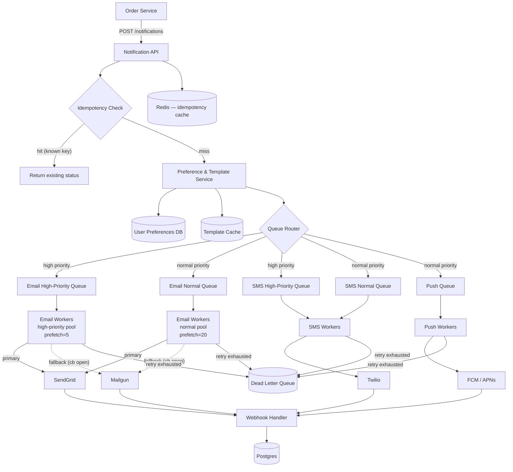

# Order Notification System (E-Commerce)

### Goal

Build a reliable, multi-channel notification system for e-commerce **order lifecycle events** — order confirmations, shipping updates, payment receipts, and refund/cancellation alerts — with idempotent exactly-once send semantics, per-channel user preferences, priority routing, and end-to-end delivery tracking.

### Non-Goals

* Building the underlying vendor APIs (SendGrid, Twilio, FCM, APNs); we integrate with existing providers.
* Managing user contact details (phone/email verification, address book); owned by the user service.
* OTP/password-reset delivery — separate system with stricter latency (<500ms) and consistency requirements.
* Real-time chat or interactive messaging.
* Full-featured marketing campaign orchestration or A/B testing engine.

### Functional Requirements

* **Multi-channel delivery:** Email (SendGrid), SMS (Twilio), Push (FCM/APNs) per user preference.
* **Order lifecycle events:** `order.confirmed`, `payment.received`, `order.shipped`, `payment.failed`, `order.refunded`.
* **Idempotent send:** Duplicate events for the same order action must not result in duplicate notifications.
* **User preferences:** Users can opt out per channel per event type (explicit opt-out model — default is opted in).
* **Priority routing:** Payment failures and refunds (high priority) bypass normal order confirmations and shipping updates.
* **Template-based rendering:** Dynamic templates with payload injection (order number, amount, tracking URL).
* **Delivery tracking:** Track notification through SENT → DELIVERED / FAILED / BOUNCED via vendor webhooks.
* **Retry with backoff:** Transient vendor errors retry up to 3–5 times with exponential backoff + jitter.
* **Circuit breaker:** Stop calling a degraded vendor; fall back to secondary provider for that channel.
* **Dead letter queue:** Malformed payloads or permanently-failing deliveries go to DLQ for manual inspection and replay.

### Non-Functional Requirements

* **Availability:** 99.9% uptime for the notification API. Notification dispatch degrades gracefully (queue absorbs spikes).
* **Durability:** At-least-once delivery. Notifications accepted by the API must eventually reach a vendor or the DLQ.
* **Latency:** p95 < 2s from API acceptance to vendor handoff for high priority; p99 < 10s for normal priority.
* **Throughput:** 10,000 requests/second during flash sale / Black Friday peak.
* **Consistency:** Exactly-once send via idempotency key. Delivery status is eventually consistent (async webhooks).
* **Data retention:** Notification records retained 90 days. Idempotency keys expire after 24h.

### Capacity Planning

| Metric | Value |
|---|---|
| Peak QPS | 10,000 req/s (flash sale / Black Friday) |
| Avg QPS | ~500 req/s (normal day) |
| Storage | ~1 TB/year (notification logs, webhook receipts, DLQ snapshots, idempotency keys) |
| Notification volume | ~15B/year (10K peak × seconds daily, avg 500 × rest of day) |
| High-priority latency | p95 < 2s (API → vendor handoff) |
| Normal-priority latency | p99 < 10s |

### API Design

**POST /api/v1/notifications**

```json
{
    "user_id": "a1b2c3d4-...",
    "event_type": "order.confirmed",
    "idempotency_key": "order-1234-confirmed-v1",
    "payload": {
        "order_id": "1234",
        "amount": 99.99,
        "currency": "USD",
        "items": [{"name": "Widget", "qty": 2}],
        "customer_name": "Alice",
        "tracking_url": "https://track.carrier.com/XYZ789"
    }
}
```

**Response 202 (first time):**

```json
{
    "notification_id": "n_abc123",
    "status": "ACCEPTED"
}
```

**Response 200 (idempotent replay):**

```json
{
    "notification_id": "n_abc123",
    "status": "SENT",
    "duplicate": true
}
```

**GET /api/v1/notifications/{notification_id}**

```json
{
    "notification_id": "n_abc123",
    "event_type": "order.confirmed",
    "channel": "email",
    "priority": "normal",
    "status": "DELIVERED",
    "vendor": "sendgrid",
    "sent_at": "2026-06-01T10:00:02Z",
    "delivered_at": "2026-06-01T10:00:05Z"
}
```

### Data Model

```sql
-- Core notification record
CREATE TABLE notifications (
    id                UUID PRIMARY KEY DEFAULT gen_random_uuid(),
    user_id           UUID NOT NULL,
    idempotency_key   VARCHAR(255) NOT NULL,
    event_type        VARCHAR(100) NOT NULL,
    channel           VARCHAR(10) NOT NULL,    -- 'email', 'sms', 'push'
    priority          VARCHAR(10) NOT NULL DEFAULT 'normal',
    payload           JSONB NOT NULL,
    rendered_body     TEXT,                    -- populated after template rendering
    status            VARCHAR(20) NOT NULL DEFAULT 'PENDING',
    -- PENDING → RENDERED → QUEUED → SENT → DELIVERED / FAILED / BOUNCED
    vendor            VARCHAR(50),
    vendor_message_id VARCHAR(255),
    retry_count       INT NOT NULL DEFAULT 0,
    max_retries       INT NOT NULL DEFAULT 3,
    error_message     TEXT,
    sent_at           TIMESTAMP,
    delivered_at      TIMESTAMP,
    failed_at         TIMESTAMP,
    created_at        TIMESTAMP NOT NULL DEFAULT NOW(),
    updated_at        TIMESTAMP NOT NULL DEFAULT NOW()
);

CREATE INDEX idx_notifications_user ON notifications (user_id, created_at DESC);
CREATE INDEX idx_notifications_status ON notifications (status) WHERE status IN ('QUEUED', 'SENT');
CREATE UNIQUE INDEX idx_notifications_idempotency ON notifications (idempotency_key);

-- Templates with versioning — only one active per (event_type, channel)
CREATE TABLE notification_templates (
    id          SERIAL PRIMARY KEY,
    event_type  VARCHAR(100) NOT NULL,
    channel     VARCHAR(10) NOT NULL,
    subject     TEXT,                    -- for email only; NULL for sms/push
    body        TEXT NOT NULL,           -- "Your order #{order_id} has shipped! Track: {tracking_url}"
    version     INT NOT NULL DEFAULT 1,
    is_active   BOOLEAN NOT NULL DEFAULT FALSE,
    created_at  TIMESTAMP NOT NULL DEFAULT NOW(),
    UNIQUE (event_type, channel, version)
);

CREATE UNIQUE INDEX idx_templates_active ON notification_templates (event_type, channel)
    WHERE is_active = TRUE;

-- Per-user opt-in/out per event type per channel
CREATE TABLE user_notification_preferences (
    user_id     UUID NOT NULL,
    event_type  VARCHAR(100) NOT NULL,
    channel     VARCHAR(10) NOT NULL,
    opted_in    BOOLEAN NOT NULL DEFAULT TRUE,
    updated_at  TIMESTAMP NOT NULL DEFAULT NOW(),
    PRIMARY KEY (user_id, event_type, channel)
);

-- Deduplicate vendor webhooks (vendors may send the same event twice)
CREATE TABLE vendor_webhooks (
    id                  UUID PRIMARY KEY DEFAULT gen_random_uuid(),
    vendor              VARCHAR(50) NOT NULL,
    vendor_message_id   VARCHAR(255) NOT NULL,
    event_type          VARCHAR(50) NOT NULL,  -- 'delivered', 'bounced', 'opened', 'clicked'
    notification_id     UUID REFERENCES notifications(id),
    raw_payload         JSONB NOT NULL,
    processed_at        TIMESTAMP NOT NULL DEFAULT NOW(),
    UNIQUE (vendor, vendor_message_id, event_type)
);
```

### Architecture Diagram



### Core Flow

1. **Accept.** Order Service emits an event (`order.confirmed`, `payment.received`, `order.shipped`, `payment.failed`, `order.refunded`). It POSTs to `/notifications` with `user_id`, `event_type`, `idempotency_key`, and `payload`.

2. **Idempotency check** (fast path):
   * Check Redis for `idempotency_key`. If found → return existing status immediately.
   * On cache miss → attempt `INSERT INTO notifications`. The UNIQUE constraint on `idempotency_key` is the source of truth.
   * If INSERT succeeds → this is the first processing. Proceed.
   * If UNIQUE violation → someone else is processing (or already did). Query the existing record and return its status.

3. **Preference check:**
   * Query `user_notification_preferences` for `(user_id, event_type, channel)`.
   * Opted out → log and return 200 (no notification sent).
   * No preference record → default to opted in (explicit opt-out model).

4. **Template rendering:**
   * Look up active template for `(event_type, channel)` from in-memory LRU cache.
   * On cache miss → query `notification_templates WHERE event_type = ? AND channel = ? AND is_active = TRUE`.
   * Render body by interpolating `payload` fields (e.g., `{order_id}` → `1234`).
   * Update `notifications.rendered_body`, set status to `RENDERED`.

5. **Queue routing:**
   * High-priority events (`payment.failed`, `order.refunded`) → `{channel}.high` queue.
   * Normal events (`order.confirmed`, `payment.received`, `order.shipped`) → `{channel}.normal` queue.
   * Push-only events → `push.normal` queue.
   * Update notification status to `QUEUED`.

6. **Worker dispatch:**
   * Workers consume from their assigned queue in a consumer group.
   * Apply per-vendor token bucket (Redis-backed, replenished per-second) before calling the vendor API.
   * On vendor success → update status to `SENT`, ACK the message.
   * On transient failure (5xx, timeout) → exponential backoff + jitter, NACK with requeue.
   * After `max_retries` (3) exhausted → publish to DLQ, ACK (don't requeue).

7. **Webhook handling:**
   * Vendors POST events (`delivered`, `bounced`, `opened`, `clicked`) to `/webhooks/{vendor}`.
   * Deduplicate via `UNIQUE (vendor, vendor_message_id, event_type)` in `vendor_webhooks`.
   * Update `notifications` status: `DELIVERED` on first `delivered` event; `FAILED`/`BOUNCED` on `bounced`.
   * Terminal states (`DELIVERED`, `BOUNCED`) are never overwritten — first terminal state wins.

8. **Circuit breaker:**
   * Per-vendor error rate monitor (>50% in 1-min window → trip).
   * **Closed** → normal operation. **Open** → stop calling this vendor, route to fallback. **Half-open** → after cooldown (30s), allow one test call.

---

### Deep Dive: Idempotency

**Problem:** The Order Service may retry a POST with the same `idempotency_key` due to network timeouts or client-side retries. Without deduplication, the user gets two "order confirmed" emails.

**How it works:**

| Layer | Mechanism |
|---|---|
| **Hot path** | Redis SET NX with TTL (24h). Key: `idempotency:{key}` → value: `notification_id`. If SET NX fails → already processed, return cached status. |
| **Cold path (source of truth)** | Postgres UNIQUE constraint on `idempotency_key`. On INSERT conflict → query existing record, return status. |
| **Race condition** | Two concurrent POSTs with the same key both miss Redis and both attempt INSERT. One wins (UNIQUE constraint succeeds); the other catches the violation and returns the first one's status. No double send. |

**Why both Redis and Postgres?** Redis gives sub-millisecond lookups at 10K QPS. Postgres guarantees correctness when Redis is down, evicted, or restarted. Redis is a cache, not a consistency layer — Postgres is the authority.

### Deep Dive: Priority Queues

**Problem:** "Push message to front of queue" is not a real primitive in most message brokers (SQS, Redis lists, RabbitMQ).

**Actual implementation:** Separate queues per priority tier per channel.

| Queue | Channels | Workers | Prefetch | Purpose |
|---|---|---|---|---|
| `email.high` | Email | 30% of email worker pool | 5 | Payment failure, refund alerts |
| `email.normal` | Email | Remaining 70% | 20 | Order confirmations, shipping updates |
| `sms.high` | SMS | 30% of SMS worker pool | 5 | Payment failure, refund |
| `sms.normal` | SMS | Remaining 70% | 20 | Shipping updates |
| `push.normal` | Push | All push workers | 50 | Order confirmed, shipped |

* High-priority workers use **smaller prefetch** (5) for faster turnaround — a payment failure is picked up within milliseconds.
* Normal workers use larger prefetch for throughput.
* Workers are stateless and horizontally scalable. Adding more workers to `email.high` increases high-priority throughput without touching normal.

### Deep Dive: Worker Scaling

Workers are stateless processes deployed as a Kubernetes Deployment with HPA:

* **Scale metric:** Queue depth (messages ready in the queue).
* **Target:** Keep queue depth < 1,000 messages. If `email.high` depth > 1,000 → HPA adds workers.
* **Token bucket coordination:** Each worker maintains a local token bucket (e.g., 100 emails/sec/worker). Total system rate = `N workers × rate_per_worker`. A Redis-coordinated global counter ensures the sum never exceeds the vendor tier limit.

### Deep Dive: Circuit Breaker & Vendor Fallback

```
State machine:
  [CLOSED] ──(error rate > 50% over 1 min)──▶ [OPEN]
  [OPEN]   ──(30s cooldown elapsed)────────▶ [HALF-OPEN]
  [HALF-OPEN] ──(test call succeeds)───────▶ [CLOSED]
  [HALF-OPEN] ──(test call fails)───────────▶ [OPEN]
```

* Circuit state stored in Redis with TTL. All email workers read the same state.
* **Fallback:** When SendGrid circuit is OPEN, workers publish to `email.{priority}.fallback` queues feeding Mailgun workers. SMS and Push are unaffected.
* **No double send:** The router decides primary vs fallback at publish time. A message is never in both queues.
* **Recovery:** When circuit re-closes, new messages flow back to primary. Messages already in fallback stay until consumed.

### Deep Dive: Webhook Deduplication

Vendors may deliver the same webhook twice (network retries, vendor bugs).

**Solution:**

1. On webhook receipt, INSERT into `vendor_webhooks`. The `UNIQUE (vendor, vendor_message_id, event_type)` constraint blocks duplicates.
2. If INSERT succeeds → update `notifications` status to `DELIVERED` (or `BOUNCED`).
3. If INSERT violates UNIQUE → event already processed, skip the status update.
4. Terminal states (`DELIVERED`, `BOUNCED`) are never overwritten — first terminal state wins permanently.

### Deep Dive: Template Rendering & Caching

* Templates stored in `notification_templates` with versioning. Only one row per `(event_type, channel)` has `is_active = TRUE`.
* **Deploy flow:** Insert new version, then in a single transaction atomically deactivate old and activate new.
* **Rendering cache:** In-memory LRU cache keyed by `event_type:channel`. 60s TTL or explicit invalidation via pub/sub on template deploy.
* **Rendering itself:** Fast string interpolation (`strings.Replace`), no template engine at runtime. Templates are pre-compiled strings with `{placeholder}` syntax.
* **Performance:** Template lookup + rendering < 1ms. The preference DB query is the larger cost, mitigated by preference caching in the same LRU layer.

---

### Storage Choice & Why

**Postgres** — chosen over NoSQL alternatives:

| Requirement | Why Postgres |
|---|---|
| Exactly-once idempotency | UNIQUE constraint on `idempotency_key` is the simplest correct implementation. No distributed coordination. |
| ACID status transitions | PENDING → RENDERED → QUEUED → SENT → DELIVERED. Atomic transitions prevent corrupt states. |
| Webhook dedup | `UNIQUE (vendor, vendor_message_id, event_type)` prevents duplicate vendor callbacks. |
| Template versioning | Partial unique index enforces exactly one active template per `(event_type, channel)`. |
| User-facing queries | "Show Alice's last 50 notifications" — trivial with indexed `user_id`. |

**Redis** — hot cache only, never the source of truth:
* Idempotency fast path (99.9% hit rate, sub-ms lookup)
* Circuit breaker state (shared across workers, TTL-based)
* Per-vendor rate limit token buckets

**RabbitMQ** — chosen over SQS/Kafka:
* Separate priority queues (SQS lacks true priority; Kafka ordering is partition-level)
* NACK with requeue for exponential backoff (SQS uses fixed visibility timeout)
* DLX for dead-letter routing
* Quorum queues (3-node cluster) for durability

---

### Failure Modes

| Failure | Probability | Impact | Mitigation |
|---|---|---|---|
| **Redis cache down** | Low | Higher latency (DB fallback), no data loss | Idempotency falls through to Postgres UNIQUE constraint. Circuit breaker uses local memory fallback. |
| **Postgres primary fails** | Low | Cannot accept new notifications | Streaming replicas + Patroni auto-failover (≤30s). API returns 503 during failover. |
| **RabbitMQ node fails** | Low | Queued messages lost on that node | Quorum queues across 3 nodes. Messages replicated to survivors. Workers reconnect. |
| **SendGrid outage** | Medium | Email delivery stalls | Circuit breaker opens → fallback to Mailgun. SMS/Push unaffected. |
| **Worker crashes mid-send** | Medium | Message redelivered to another worker | RabbitMQ requeues unacknowledged message. Idempotency prevents double send. |
| **Duplicate vendor webhooks** | Medium | Potential incorrect status update | `UNIQUE (vendor, vendor_message_id, event_type)` blocks duplicate processing. |
| **Flash sale 10× QPS spike** | Planned | Queue backlog, higher p99 latency | Priority isolation prevents critical blocking. Normal delay is acceptable. HPA scales workers up. |
| **Vendor rate limit exceeded** | Low | Messages rejected by vendor | Per-worker token bucket + Redis-coordinated global limiter. Workers back off before hitting vendor cap. |
| **Template rendering fails** | Low | One event/channel stuck | DLQ catches malformed payloads. Ops fixes template or payload, replays from DLQ. |

---

### Monitoring & Alerting

| Alert | Severity | Condition |
|---|---|---|
| High-priority queue depth > 0 for > 2 min | P1 (Critical) | Payment failure/refund notifications delayed |
| Circuit breaker OPEN > 5 min | P1 | Vendor outage; verify fallback is active |
| Notification API error rate > 5% for 2 min | P1 | Upstream issue or DB down |
| DLQ depth growing > 10 msg/min for 10 min | P2 (High) | Template bugs or bad payloads in production |
| Vendor error rate > 30% for 5 min | P2 | Vendor degradation (pre-circuit-breaker) |
| Any queue depth > 10,000 | P2 | Workers can't keep up; scale out |
| Webhook handler error rate > 10% for 5 min | P2 | Vendor sending malformed webhooks |
| Notification p99 latency > 15s for 10 min | P3 (Medium) | Queue backlog building |
| Zero webhooks received for > 30 min | P3 | Webhook URL misconfiguration or vendor issue |

**Dashboards:**
* Per-queue depth graph (email.high, email.normal, sms.high, sms.normal, push.normal, DLQ)
* Notification status distribution (SENT / DELIVERED / FAILED / BOUNCED) — stacked bar
* Vendor latency p50/p95/p99 per channel
* Circuit breaker state per vendor (0/1 indicator)
* Per-event-type notification volume (bar chart)

---

### Tradeoffs

**1. Async queue delivery over synchronous send.**
Cost: Caller gets `202 Accepted` — doesn't know if the notification was sent. Delivery status is eventually consistent.
Benefit: Order Service stays fast. Checkout flow isn't blocked by email rendering or vendor latency. Queue absorbs flash sale spikes.

**2. Redis cache + Postgres source of truth (vs Redis-only or Postgres-only).**
Cost: Two systems to operate. Idempotency logic has two code paths (hot cache and cold DB fallback).
Benefit: Redis gives sub-ms hot path at 10K QPS. Postgres guarantees correctness when Redis crashes. Redis-only loses idempotency on restart; Postgres-only is too slow for 10K QPS hot lookups.

**3. Separate priority queues (vs single queue with priority header).**
Cost: 2× the queues, 2× the worker pools, more operational surface area.
Benefit: Guaranteed isolation. A million "order confirmed" messages cannot delay a single "payment failed" alert. Single-queue priority is not reliably supported by most brokers.

**4. Circuit breaker + fallback provider (vs single provider with aggressive retry).**
Cost: Pay for and maintain two email providers. Additional fallback worker pool.
Benefit: During a SendGrid outage, payment failure alerts still reach users. Retrying a dead vendor endlessly just delays critical messages.

**5. At-least-once delivery (vs exactly-once end-to-end).**
Cost: Edge case — worker sends to vendor, vendor accepts, worker crashes before ACKing → message redelivered. If the vendor API is not idempotent, a true duplicate may reach the user.
Benefit: True exactly-once requires vendor API support (most don't guarantee it) or 2PC (impractical at this latency). At-least-once + idempotency key at the notification level is the pragmatic, honest choice.

---

### References & Prior Art

**Stripe — Webhook Delivery & Idempotency**

Stripe's approach to exactly-once webhook delivery is the closest analogue. They attach an `idempotency_key` to each outgoing webhook request, and the receiving service uses it to deduplicate. If Stripe doesn't receive a timely response, it retries with exponential backoff. Their key insight: don't try to achieve exactly-once in the sender; make the receiver idempotent and guarantee at-least-once delivery.

> *Takeaway for this design:* The `idempotency_key` on notifications follows the same pattern. The notification system guarantees at-least-once send; the vendor or receiver handles deduplication.

**Netflix — Multi-Channel Notification Gateway**

Netflix operates a notification gateway that routes messages across Email, Push, and In-App channels with per-provider circuit breakers. Their architecture uses a priority gating system: critical alerts (billing, security) bypass the standard pipeline and go to a dedicated high-priority channel. Each provider has an isolated worker pool with a dedicated circuit breaker, so a Push provider outage doesn't affect Email.

> *Takeaway:* Separate priority queues + per-channel circuit breakers are battle-tested at Netflix scale.

**Shopify / Amazon — Order Lifecycle Notifications**

Large e-commerce platforms typically separate transactional notifications (order confirmations, shipping updates) from marketing. Transactional notifications follow a direct API → queue → vendor pipeline identical to this design. Marketing notifications go through a separate campaign orchestration system with scheduling, segmentation, and A/B testing — explicitly out of scope here.

> *Takeaway:* This design's scope carve-out (no marketing) matches real-world separation at multi-billion-dollar e-commerce platforms.

**Transactional Outbox Pattern (Alternative Approach)**

An alternative to the direct API call is the **Transactional Outbox**: the Order Service writes a notification row to an `outbox` table in the same database transaction as the order state change. A separate relay process polls the outbox table and publishes to the message queue. This guarantees that if the order is persisted, the notification is enqueued — no 2PC, no dual writes.

| Approach | Atomicity Guarantee | Complexity | When to Use |
|---|---|---|---|
| Direct API call (this design) | No atomicity; notification may be lost if API call fails after order commit | Low | Acceptable for best-effort notifications (order confirmations aren't critical) |
| Transactional Outbox | Atomic with order state change; notification never lost | Medium | When losing a notification is unacceptable (payment receipts, legal notices) |
| CDC + Debezium | Outbox table changes streamed to queue via CDC; no polling overhead | High | When outbox polling latency is too high and you already run Kafka |

This design uses the direct API call because order notifications are eventually-visible via the Order Service itself (users can check their dashboard). If the notification is lost, the user still sees their order. For the payment failure case specifically, you'd pair this with an alerting system (PagerDuty) that doesn't depend on this pipeline.

> *Tradeoff note:* If the business requires guaranteed notification delivery (e.g., financial receipts for compliance), migrate to the Transactional Outbox pattern. It's an orthogonal change — the rest of the pipeline (queues, workers, vendors, webhooks) stays identical.

**AWS SES / SNS — Bulk vs Transactional**

AWS SES is optimized for bulk marketing email (high throughput, batching, suppression lists). AWS SNS targets push and SMS with fan-out semantics. Both trade latency for throughput. A transactional notification system like this design needs the opposite: low latency per message, not bulk throughput.

> *Takeaway:* Vendor selection matters. SendGrid's transactional API (not their marketing API) is used intentionally. Same for Twilio's Programmable SMS (not their marketing messaging product).

---

### Infrastructure & Deployment

#### Compute Sizing

| Component | Size | Count | Notes |
|---|---|---|---|
| Notification API | 4 vCPU, 8 GB RAM | 3–10 (HPA) | I/O-bound (DB reads, Redis calls). Lightweight. |
| Email workers | 2 vCPU, 4 GB RAM | 5–50 (HPA on queue depth) | CPU-bound (rendering, serialization). |
| SMS workers | 2 vCPU, 2 GB RAM | 3–20 (HPA) | Lightweight (short payloads, fast vendor calls). |
| Push workers | 2 vCPU, 2 GB RAM | 3–20 (HPA) | Lightweight (payload constrained by APNs/FCM limits). |
| Postgres primary | 8 vCPU, 32 GB RAM, 500 GB SSD | 1 + 2 replicas | Write-heavy. Partition by month. |
| Redis cluster | 4 vCPU, 16 GB RAM | 3 nodes (cluster mode) | Cache-only; data loss is acceptable. |
| RabbitMQ | 4 vCPU, 16 GB RAM | 3 nodes (quorum queues) | Persistent queues. Disk I/O matters. |

#### Networking

* All inter-service communication over private VPC. No public endpoints on queues or database.
* mTLS between API → workers → vendors. Worker-to-vendor calls go through a NAT gateway.
* API exposed via API Gateway with tenant-level rate limiting and JWT authentication.
* Webhook Handler is the only public-facing internal component (vendors POST to it). It sits behind a separate API Gateway with vendor IP allowlisting.

#### Template Deployment (Zero-Downtime)

1. Insert new template version row with `is_active = FALSE`.
2. In a single transaction: set old active row to `is_active = FALSE`, set new row to `is_active = TRUE`.
3. Publish cache invalidation event (Redis pub/sub). All API nodes evict the `(event_type, channel)` entry from their template LRU cache.
4. **Backward compatibility:** The new template must accept the same set of `{placeholders}` as the old version. Adding a placeholder is a breaking change — it requires a coordinated deploy with the Order Service to ensure the new `payload` field is always present.
5. **Rollback:** Reverse the transaction (activate old version, deactivate new). No code deploy needed.

#### Graceful Shutdown

When a worker receives SIGTERM (Kubernetes pod eviction, rolling deploy):

1. Stop pulling new messages from the queue (cancel consumer).
2. Finish processing the current in-flight message (vendor call + ACK/NACK).
3. If the deadline (10s) expires before the in-flight message completes → NACK with requeue, let another worker pick it up.
4. Release Redis connections, close DB connection pool.

When the API receives SIGTERM:

1. Stop accepting new connections. Health check returns unhealthy so the load balancer drains traffic.
2. Wait for inflight requests to complete (up to 5s grace period).
3. Shut down.

#### Observability

| Layer | Tool | What |
|---|---|---|
| **Metrics** | Prometheus + Grafana | Per-queue depth, vendor latency p50/p95/p99, error rates, circuit breaker state, idempotency hit/miss ratio, notification status distribution |
| **Logging** | Structured JSON → ELK | Every state transition logged with `notification_id`, `user_id`, `event_type`, `correlation_id`. Error logs include vendor response body (redacted). |
| **Tracing** | OpenTelemetry → Jaeger | `correlation_id` propagated through API → queue → worker → vendor → webhook. Full end-to-end trace for a single notification. |
| **Alerting** | Alertmanager → PagerDuty | Alerts defined in Monitoring section above. P1 = page on-call. P2 = Slack + ticket. P3 = Slack only. |

#### Multi-Region (Active-Passive)

* **Primary region:** All workers are active. Notifications are queued and sent normally.
* **Standby region:** API accepts writes (replicates to standby Postgres via streaming replication). Workers are **quiesced** — they exist but don't consume from queues. This prevents double sends across regions.
* **Failover:** Promote standby Postgres to primary. Activate standby workers. DNS or Global Load Balancer flips traffic. Target RTO: < 5 minutes.
* **Idempotency safety:** If a notification was sent in the primary region and the same event is replayed in the standby region, the `idempotency_key` UNIQUE constraint (replicated to standby) prevents a duplicate send. This is the same mechanism that handles retries within a single region — no additional cross-region coordination needed.
