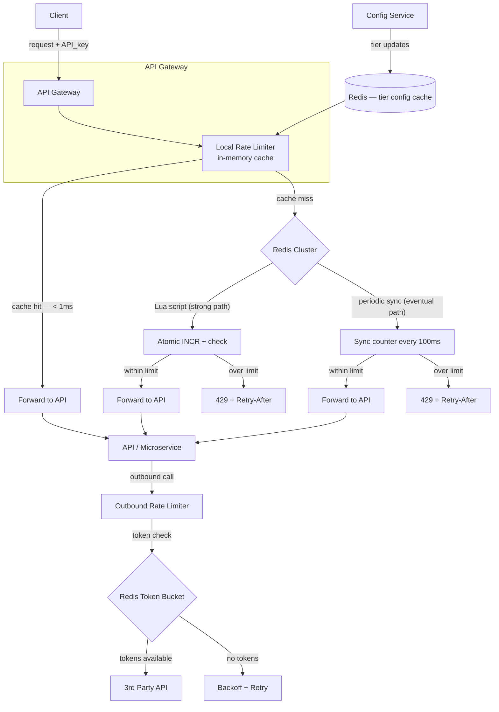

# Public API Rate Limiter

### Goal

Build a distributed rate limiting system that protects public APIs from abuse and throttles outbound calls to third-party APIs, supporting 1,000 to 1,000,000+ concurrent users with tiered limits per user (free vs paid), sub-5ms p99 checks, and strong consistency for critical operations.

### Non-Goals

* Handling authentication/authorization beyond user identification (`user_id`, `API_key`, `IP_address`)
* Storing permanent request history or analytics dashboards
* Implementing global rate limits across independent services (we accept eventual consistency for general cases)
* DDoS protection at the network layer (handled separately by CDN / WAF)
* Quota enforcement across billing periods (e.g., monthly API usage caps — separate metering system)

### Functional Requirements

* **Caller identification:** Rate limit by `user_id`, `API_key`, or `IP_address`. Precedence order: API_key > user_id > IP.
* **Tiered limits:** Free tier (e.g., 100 req/min), paid tier (e.g., 10,000 req/min). Admins get configurable custom limits.
* **Per-operation limits:** Different limits for different API endpoints (e.g., `/search` = 1000/min, `/payment` = 10/min).
* **Dual consistency modes:**
  * **Strong consistency** for critical operations (financial, account mutations) — exact count, zero tolerance for over-limit.
  * **Eventual consistency** for general API throttling — approximate count, < 1% over-limit tolerance in exchange for lower latency.
* **Outbound throttling:** Apply the same rate limiting before calling external third-party APIs (vendor contract compliance).
* **Standard response:** Return `HTTP 429 Too Many Requests` with `Retry-After` header + jitter. Include rate limit headers (`X-RateLimit-Limit`, `X-RateLimit-Remaining`, `X-RateLimit-Reset`).
* **Jitter:** Randomize `Retry-After` (1s + random 0–1000ms) to prevent thundering herd on retry.

### Non-Functional Requirements

* **Latency:** p99 < 5ms for rate check (including Redis round-trip for strong path; < 1ms for local-cache path).
* **Throughput:** 1,000,000 requests/second at peak. Rate limiter must not be the bottleneck.
* **Availability:** 99.99%. Rate limiter is in the critical path — if it's down, no traffic flows.
* **Accuracy:** Strong path = exact count. Eventual path = within 1% of configured limit under normal operation.
* **Memory:** ~10 GB in Redis for 100 million active keys (each key ≈ 100 bytes: user + operation + counter + TTL metadata).

### Capacity Planning

| Metric | Value |
|---|---|
| Peak QPS | 1,000,000 req/s |
| Active users (concurrent) | 100 million |
| Redis keys | ~100 million (one per user:operation:window) |
| Redis memory | ~10 GB |
| Rate check latency (strong path) | p99 < 5ms (includes Redis RTT) |
| Rate check latency (eventual path) | p99 < 1ms (local in-memory) |
| Redis cluster nodes | 10–20 shards (5M–10M keys each) |

### Algorithm Selection

The core algorithm matters more here than in most system design problems. Different algorithms have different memory vs accuracy tradeoffs.

| Algorithm | Redis Memory | Accuracy | Burst Handling | Boundary Problem |
|---|---|---|---|---|
| **Token Bucket** | O(1) per user (2 keys: tokens + last_refill) | Exact | Good — allows bursts up to bucket size, then smooths to refill rate | None (continuous) |
| **Fixed Window Counter** | O(1) per user (1 key: count + TTL) | Good on average | Poor — user can burst 2× limit at window boundary | Yes — e.g., 100 req at 12:00:59 + 100 req at 12:01:01 = 200 in 2s with 100/min limit |
| **Sliding Window Log** | O(N) per user (ZSET, N = requests in window) | Exact | Exact | None (continuous tracking) |
| **Sliding Window Counter** | O(1) per user (2 keys: prev + current count) | Approximate (~< 1% error) | Good — smooths boundary spike | Mitigated — weighted interpolation between windows |

**Choice:** **Sliding Window Counter** for general throttling (memory-efficient, good accuracy, no boundary problem). **Token Bucket** for outbound vendor throttling (maps naturally to vendor rate limits). **Fixed Window with Lua** for critical financial operations (simplest correct implementation when absolute accuracy is required and per-operation volume is low).

### Data Model (Redis)

```
# Fixed Window Counter (critical financial ops)
Key:    ratelimit:fixed:{user_id}:{operation}:{window_ts}
Value:  INT (counter)
TTL:    window_size_seconds

# Sliding Window Counter (general throttling)
Key:    ratelimit:sw:prev:{user_id}:{operation}:{window_ts}
Value:  INT (counter from previous full window)
TTL:    window_size_seconds * 2

Key:    ratelimit:sw:curr:{user_id}:{operation}:{window_ts}
Value:  INT (counter in current window)
TTL:    window_size_seconds

# Token Bucket (outbound vendor throttling)
Key:    ratelimit:tb:tokens:{user_id}:{vendor}
Value:  INT (available tokens)
TTL:    none (managed by Lua script)
Key:    ratelimit:tb:last_refill:{user_id}:{vendor}
Value:  INT (epoch ms of last refill)
TTL:    none

# User tier config (read-heavy, rarely written)
Key:    ratelimit:tier:{user_id}
Value:  JSON {"tier": "paid", "limits": {"search": 10000, "payment": 100}}
TTL:    1 hour (cached from config service)
```

**Key sizing:** Average key ≈ 100 bytes. With 100M active users × ~1 key per user (varies by operation count), total ≈ 10 GB across the cluster. Redis Cluster automatically shards by key hash, distributing load evenly.

### Architecture Diagram



### Core Flow

**Inbound request flow:**

1. API Gateway receives request, extracts caller identity (`API_key` → `user_id` → `IP`).
2. Local rate limiter checks in-memory cache for this `(user_id, operation)`:
   * **Cache hit + below limit** → forward request immediately (< 1ms).
   * **Cache hit + over limit** → return `429` immediately.
   * **Cache miss** → fall through to Redis (strong path or eventual path depending on operation type).
3. **Strong consistency path** (critical operations — payment, account mutations):
   * Execute atomic Lua script in Redis: `INCR counter`, set TTL on first increment, check against limit.
   * Within limit → forward, update local cache. Over limit → return `429`.
4. **Eventual consistency path** (general API calls):
   * Read current counter from Redis. Update local cache.
   * If local cache is stale (> 100ms old), re-sync from Redis.
   * Decision is based on local cached value, which may be up to 100ms behind Redis.
   * Periodically push local increments to Redis (batch every 100ms or N requests).

**Outbound throttling flow:**

1. Before calling a third-party API, check token bucket for `(user_id, vendor)`.
2. Lua script atomically: calculate tokens since last refill, deduct 1 token, update last_refill timestamp.
3. If tokens available → proceed with vendor call. If not → back off (exponential + jitter), retry.
4. Token refill rate is configured per vendor contract (e.g., Twilio: 100 SMS/sec, SendGrid: 1000 emails/sec).

### Response Headers

Every API response includes:

```
X-RateLimit-Limit: 10000          # Max requests per window
X-RateLimit-Remaining: 8543       # Remaining in current window
X-RateLimit-Reset: 1717250000     # Unix timestamp when window resets
Retry-After: 2                    # Seconds to wait before retrying (only on 429)
```

On `429`, the `Retry-After` header includes jitter: `1 + random(0, 1) seconds`.

---

### Deep Dive: Strong Consistency Path (Lua Script)

For critical operations that require exact counting (payment, account deletion), every request hits Redis via an atomic Lua script:

```lua
-- KEYS[1]: ratelimit:fixed:{user_id}:{operation}:{window_ts}
-- ARGV[1]: limit
-- ARGV[2]: window_seconds
-- Returns: 1 if allowed, 0 if rate limited

local current = redis.call('INCR', KEYS[1])
if current == 1 then
    redis.call('EXPIRE', KEYS[1], ARGV[2])
end
if current > tonumber(ARGV[1]) then
    return 0
end
return 1
```

**Why Lua?** Without `INCR` + `EXPIRE` — another client could call `EXPIRE` between the `INCR` and the check — a non-atomic race. Lua scripts execute atomically on the Redis server, guaranteeing the counter never overflows.

**Why Fixed Window?** For low-volume critical ops (10–100 req/min), the boundary problem is negligible. If payments spike unexpectedly, 2× the rate is still only 20–200 req/min — easily handled. The simplicity of a single counter with TTL outweighs the slight boundary imprecision.

**Key TTL management:** The `current == 1` check ensures `EXPIRE` is set only once per window, avoiding RTT overhead on subsequent increments.

### Deep Dive: Eventual Consistency Path (Local Cache + Periodic Sync)

For high-volume general API calls (1000–10000 req/min per user), hitting Redis on every request is wasteful and adds latency. Instead:

```go
type LocalRateLimiter struct {
    mu       sync.Mutex
    counters map[string]*WindowCounter  // key: "user_id:operation"
    syncedAt map[string]time.Time
    syncFreq time.Duration               // 100ms
}

func (l *LocalRateLimiter) Allow(userID, operation string, limit int) bool {
    l.mu.Lock()
    defer l.mu.Unlock()

    key := userID + ":" + operation
    c := l.counters[key]

    // Re-sync from Redis if stale
    if time.Since(l.syncedAt[key]) > l.syncFreq {
        c = l.fetchFromRedis(userID, operation)
        l.counters[key] = c
        l.syncedAt[key] = time.Now()
    }

    // Check against local counter
    if c.Current() >= limit {
        return false
    }

    c.Incr()
    return true
}
```

**Background sync loop** (runs every 100ms per instance):

* Flush all local counter deltas to Redis (pipeline batch `INCRBY` commands).
* Reset local deltas.
* This reduces Redis operations from 10,000/sec (one per request) to ~10/sec (one sync batch), while keeping counters within ~5% of truth at 10,000 QPS.

**Accuracy guarantee:** At worst, a user might send up to `limit × (1 + sync_window_budget)` requests before the sync catches up. With 100ms sync and 10,000 req/min (167 req/s), the worst-case overage is ~17 requests (< 1% at 10K/min).

### Deep Dive: Hot Key / Shard Problem

**Problem:** A single popular user (e.g., a viral API consumer) can generate millions of requests per second. Their Redis key `ratelimit:{user_id}:*` hashes to a single shard, creating a hotspot.

**Mitigations (layered):**

| Layer | Mechanism |
|---|---|
| **1. Client-side pre-filter** | Before hitting Redis, check if the user is sending > 1000 req/s locally (simple counter). If so, rate-limit locally without touching Redis. |
| **2. Tier-based burst allowance** | Paid users get higher local burst thresholds. This reduces lock contention on their Redis shard. |
| **3. Redis Cluster sharding** | Keys are already distributed by `user_id` hash across 10–20 shards. A hot user only affects their shard, not the entire cluster. |
| **4. Shard isolation** | If a shard's p99 latency spikes, the rate limiter can fail open (allow traffic) for non-critical operations on that shard, with an alert to the ops team. |
| **5. Key splitting (last resort)** | For extreme cases, replicate the counter across N keys with a hash suffix (e.g., `ratelimit:{user_id}:shard_{0..N-1}`). Sum all shards for the total count. This distributes writes but adds read amplification. |

### Deep Dive: Thundering Herd Prevention

When a rate-limited client retries, every instance of that client retries simultaneously on the same `Retry-After` timestamp, creating a thundering herd.

**Fix:**

* **Server-side jitter:** `Retry-After = base_delay + random(0, max_jitter)`. Default: `1 + random(0, 1)` seconds. Spreads retries across a 1-second window.
* **Client-side jitter (recommended):** Clients should apply their own jitter on top of the server's `Retry-After` — e.g., use `Retry-After` as a minimum, add up to 1s of random delay.
* **Exponential backoff:** If retried requests continue to get `429`, the client should double the wait time before the next retry (with jitter).

---

### Storage Choice & Why

**Redis Cluster** — chosen over alternatives:

| Requirement | Why Redis |
|---|---|
| Sub-ms operations at 1M QPS | In-memory data store; single-threaded event loop enables atomic Lua scripts. |
| Atomicity | Lua scripts execute atomically on the Redis server — no distributed locking. |
| TTL-based expiry | Counters automatically expire after their window. No manual cleanup. No GC pauses. |
| Horizontal scaling | Redis Cluster hash-slots distribute keys across 10–20 nodes. Each shard handles 50K–100K QPS. |
| Operational simplicity | Mature tooling, widely understood failure modes (vs rolling your own). |

**Why not...**

| Alternative | Reason Rejected |
|---|---|
| **Memcached** | No built-in atomic INCR + compare operation. No Lua scripting. Counters can overflow and wrap. |
| **Postgres** | Disk I/O adds 1–10ms latency per check. At 1M QPS, requires 1000× the hardware. OK for persisting rate limit configs, not for the hot path. |
| **DynamoDB** | Conditional updates possible but p99 latency is ~10ms. Provisioned throughput costs are high at 1M QPS. Good for cross-region rate limiting if multi-region latency matters more than per-check latency. |
| **Envoy / Kong plugin (local-only)** | No shared state across instances. Inaccurate when traffic is distributed across many load-balanced instances. Good as a first layer (pre-filter), not as the sole rate limiter. |

---

### Failure Modes

| Failure | Probability | Impact | Mitigation |
|---|---|---|---|
| **Redis shard unavailable** | Low | Deny all traffic from users assigned to that shard | **Fail open** for general throttling (allow traffic, alert). **Fail closed** for critical financial ops (reject, alert P1). Configurable per operation. |
| **Redis cluster entirely down** | Very Low | All rate limiting lost | Circuit breaker: fail open for all non-critical traffic. Return `503` for critical financial endpoints. |
| **Redis slow (p99 > 100ms)** | Medium | High tail latency for rate checks | Timeout at 10ms. Fall through to local cache decision (stale but available). Alert on elevated Redis latency. |
| **Local cache skew (drifted from Redis)** | Medium | User allowed slightly over limit | Sync frequency of 100ms bounds the skew. At 10K/min, worst overage is ~17 extra requests (< 1%). |
| **Hot shard (one user floods one Redis node)** | Low–Medium | Tail latency spikes for that shard's users | Client-side pre-filter + tier-based burst allowances. Fail open for non-critical ops on hot shard. |
| **Rate limiter service down** | Low | No rate limiting; all traffic flows through | Multiple instances behind load balancer. If all instances down, API Gateway can apply a static rate limit fallback. |
| **Race condition on key creation (INCR + EXPIRE)** | Low | Key created without TTL, memory leak | Lua script sets TTL atomically on first INCR. A separate cleanup job scans for keys without TTL as defense-in-depth. |

---

### Monitoring & Alerting

| Alert | Severity | Condition |
|---|---|---|
| Redis shard unavailable | P1 (Critical) | Any Redis shard unreachable for > 1 min |
| Redis cluster entirely down | P1 | All Redis nodes unreachable |
| Rate limiter error rate > 1% for 2 min | P1 | Lua script errors, Redis timeouts, connection pool exhaustion |
| Rate limit decision latency p99 > 20ms for 5 min | P2 (High) | Redis degradation or network issue |
| Hot shard detected | P2 | Single Redis node > 3× avg QPS of other nodes for 10 min |
| Local cache sync lag > 500ms for 5 min | P2 | Sync goroutine blocked or Redis slow |
| 429 rate spike > 10× baseline | P3 (Medium) | Possible abuse or misconfigured limits |
| Redis memory usage > 80% | P3 | Add shard or increase memory before OOM |

**Dashboards:**
* Rate check QPS (allowed vs rejected) — stacked area chart
* Rate check latency p50/p95/p99 — line chart
* Redis per-shard QPS and latency — heatmap
* 429 response count per user tier — bar chart
* Local cache hit ratio — gauge

---

### Infrastructure & Deployment

#### Placement: Hybrid (Local Cache + Central Redis)

| Placement | Pros | Cons |
|---|---|---|
| **Sidecar (per-service-instance, local only)** | Lowest latency (< 0.1ms), no SPOF | Inaccurate across instances; 10 instances × 10% each = 100% limit easily exceeded |
| **Central service** | Consistent state | Extra network hop (+1ms), SPOF |
| **API Gateway plugin** | Combines auth + rate limiting in one hop | Coupled to gateway vendor; limited algorithm flexibility |
| **Hybrid (this design)** | Sub-ms fast path, accurate slow path, tunable consistency | Two code paths; operational complexity of managing Redis + local cache |

#### Compute Sizing

| Component | Size | Count | Notes |
|---|---|---|---|
| API Gateway + Rate Limiter | 8 vCPU, 16 GB RAM | 10–20 (behind NLB) | Rate limiter is CPU-bound (serialization, Lua script encoding). In-memory cache uses ~500 MB for active user counters. |
| Redis Cluster | 4 vCPU, 16 GB RAM per node | 10–20 nodes | Each node handles ~50K QPS at p99 < 1ms. 5M–10M keys per node. |
| Config Service | 2 vCPU, 4 GB RAM | 2 | Serves user tier configs to the rate limiter cache. Low traffic. |

#### Graceful Shutdown

When a rate limiter instance receives SIGTERM:

1. Stop accepting new requests (health check returns unhealthy).
2. Flush all local counter deltas to Redis (pipeline INCRBY batch).
3. Drain in-flight Redis calls (up to 5s grace period).
4. Shut down.

If step 2 fails (Redis unreachable), log and shut down anyway. The local deltas are lost but represent at most 100ms of traffic — statistically insignificant.

#### Multi-Region

Rate limiting is inherently local to a region. Cross-region rate limiting adds unacceptable latency (100ms+ RTT between regions).

* **Option A (simple):** Independent rate limit per region. Each region gets its own Redis cluster. A user sending requests to us-east and eu-west is counted separately in each region. Fine for most use cases (a user is typically routed to the nearest region anyway).
* **Option B (global accuracy):** Redis replicas across regions with CRDT (conflict-free replicated data type) counters. Merged asynchronously. Adds cross-region replication latency (~50ms). Use only if global accuracy is a hard requirement (rare).

---

### Tradeoffs

**1. Eventual consistency for general throttling (vs strong consistency for all).**
Cost: A user may slightly exceed their limit (~1%) during the 100ms sync window.
Benefit: Reduces Redis calls by 1000× (from 1 per request to ~10 syncs/sec). At 1M QPS, this is the difference between a 10-node Redis cluster and a 500-node one.

**2. Lua scripts for strong path (vs Redis transactions / WATCH).**
Cost: Lua scripts are harder to debug and version. They block the Redis event loop for the duration of the script.
Benefit: True atomicity. Redis transactions (MULTI/EXEC) don't support conditional logic (if-then-else). WATCH loops are optimistic and can retry under contention — unacceptable for rate limiting.

**3. Hybrid placement with local cache (vs pure central service).**
Cost: Two code paths. Inconsistent state between local cache and Redis during the sync window.
Benefit: Sub-ms latency for the common case. Survives Redis degradation (local cache is available even when Redis is slow).

**4. Fail open for non-critical ops (vs fail closed).**
Cost: During a Redis outage, a user may exceed their rate limit temporarily.
Benefit: The API remains available. Blocking all traffic because the rate limiter is slow is a worse outage than letting a few extra requests through. For critical operations, the tradeoff reverses — fail closed.

**5. Fixed Window with Lua for critical ops (vs Sliding Window for everything).**
Cost: Boundary burst: payment endpoint accepting 100 req/sec could momentarily accept 200 req/sec if the burst aligns with the window boundary.
Benefit: O(1) memory, single key, single Lua script. At 10 req/min for payment endpoints, the boundary burst is 20 req/min — not a threat. If it were, we'd use Sliding Window Log (ZSET) at the cost of more memory per user.

---

### References & Prior Art

**Cloudflare Rate Limiting**

Cloudflare implements rate limiting at the edge (CDN layer), before traffic reaches the origin. They use a sliding window counter with configurable burst protection. Their key insight: rate limit as far from the origin as possible to absorb abuse before it consumes backend resources.

> *Takeaway:* The API Gateway placement in this design follows the same principle. Rate limiting at the edge minimizes waste.

**Stripe — Idempotency + Rate Limiting**

Stripe's API uses both rate limiting and idempotency together: rate limits prevent abuse, idempotency keys prevent duplicate side effects. Retrying a rate-limited request (with the same `Idempotency-Key`) is safe — if the original request was processed before the rate limit applied, the retry returns the original result.

> *Takeaway:* Rate limiting and idempotency are complementary. This design assumes upstream services handle idempotency independently, which is the correct separation.

**Google Guava RateLimiter (Local)**

Guava's `RateLimiter` implements a smooth token bucket with no external state. It's local-only, ideal for outbound throttling within a single process. Its `acquire()` method blocks until a token is available, creating natural backpressure.

> *Takeaway:* The outbound throttling path in this design maps directly to Guava's model, but with Redis as the shared state layer for distributed coordination.

**Uber — Distributed Rate Limiting with Redis**

Uber's rate limiter uses a hybrid approach: local in-memory counters with periodic Redis sync, exactly as described in the Eventual Consistency path here. Their sync interval is configurable per service (10ms for latency-sensitive, 500ms for throughput-heavy). At Uber's scale (> 1M QPS per service), pure Redis was cost-prohibitive.

> *Takeaway:* The 100ms sync default in this design is mid-range. Mission-critical services can configure shorter intervals; bulk services can configure longer.

**Kong / Envoy Rate Limiting Plugin**

Kong and Envoy both offer rate limiting plugins that offload decisions to an external Redis. Their model is centralized (no local cache), which simplifies correctness but adds ~1ms per check. They support multiple algorithms (fixed window, sliding window) via plugin configuration.

> *Takeaway:* For teams that want a managed solution, Kong/Envoy + Redis is the off-the-shelf equivalent of this design. Building your own is justified when you need hybrid consistency modes, custom tier logic, or tighter latency SLOs.

---

### What This Design Doesn't Cover

* **Per-IP rate limiting for anonymous traffic:** Requires different key structure and shorter TTLs (bots rotate IPs). Handled by a separate WAF/CDN layer.
* **Billing-period quota enforcement:** "10,000 API calls per month" is a metering problem, not a rate limiting problem. Separate system with persistent counters in Postgres.
* **Distributed tracing of rate limit decisions:** Useful for debugging but orthogonal to the rate limiter's correctness.
* **Custom per-endpoint Lua scripts:** This design uses a single generic Lua script. Per-endpoint custom logic (e.g., different burst allowances per endpoint) is a configuration layer, not an architecture change.
