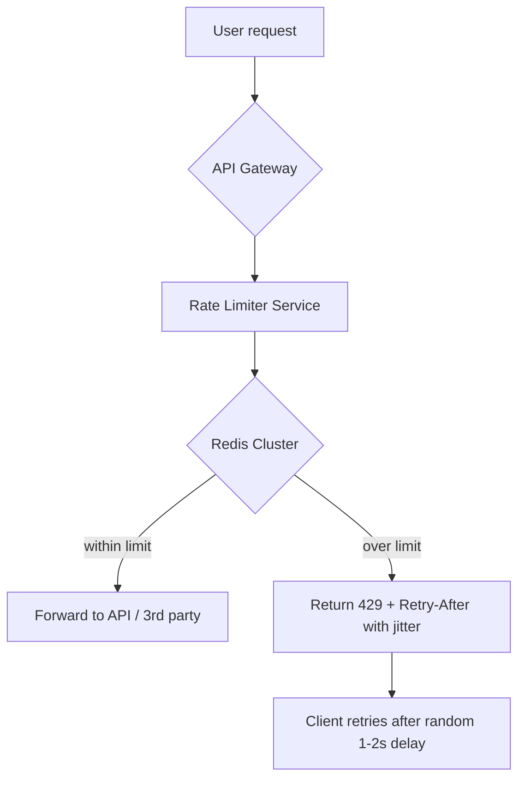

# Rate Limit

### Goal

Build a distributed rate limiting system that protects public APIs from abuse and throttles outbound calls to third-party APIs, supporting 1,000 to 1,000,000+ concurrent users with tiered limits per user (free vs paid).

### Non-goals

* Handling authentication/authorization beyond user identification (user\_id, API\_key, IP\_address)
* Storing permanent request history or analytics dashboards
* Implementing global rate limits across independent services (we accept eventual consistency for general cases)

### Numbers

* **QPS:** Up to 1,000,000 requests per second (peak)
* **Storage:** \~10 GB in Redis for 100 million active keys (each `{user_id}:{operation}` + count + TTL ≈ 100 bytes)
* **Latency target:** <5 ms p99 for rate check (including Redis round-trip)

### Diagram

### Core flow

* Identify the caller using `user_id`, `API_key`, or `IP_address` (order of precedence: API\_key > user\_id > IP).
* Look up the user’s tier (free/paid) to determine the allowed limit per time window (e.g., free: 100 req/min, paid: 10,000 req/min).
* For **critical operations** (e.g., financial withdrawals):\
  Execute an atomic Lua script in Redis that reads, increments, and checks the count against the limit → strong consistency.
* For **general API throttling**:\
  Use eventual consistency with in memory caching + periodic Redis sync to reduce latency.
* If the limit is exceeded, return `HTTP 429 Too Many Requests` with a `Retry-After` header set to `1 + random(0..1000)ms` to prevent thundering herd.
* For **outbound throttling** (calls to external 3rd party APIs): apply the same logic before initiating the external request — protects contract compliance.

### Storage choice & why

**Redis Cluster** because:

* In-memory operations deliver sub‑millisecond latency and millions of QPS
* Atomic Lua scripting provides strong consistency for critical paths
* Built‑in TTL automatically expires keys (no manual cleanup)
* Native sharding scales linearly to 1M+ concurrent users

### The hard part & how we solve it

**Bottleneck:** A single hot user (e.g., a popular API key) sending millions of requests per second can overload one Redis shard, causing tail latency spikes and cluster instability.

**Fix:**

* **Local token bucket** + async sync to Redis for high‑throughput users (the rate limiter service maintains an in‑memory bucket, periodically reconciling with Redis).
* **Client‑side jitter** on retries spreads thundering herds across time.
* **Multi‑tier limits** – paid users can have higher burst allowances, reducing lock contention.
* **Redis Cluster** already shards by key (hash of `user_id`), so different users go to different nodes.

### Tradeoff I'm making

Choosing **eventual consistency for general API throttling** over **strong consistency** because:

* A few extra requests during a race condition (e.g., 101 instead of 100) are acceptable for non‑critical APIs.
* It avoids distributed locks or always‑hitting Redis, cutting p99 latency from \~10ms to <5ms.
* **Strong consistency is still used for critical financial operations** (via Lua scripts), where accuracy matters more than a few extra microseconds.

 
