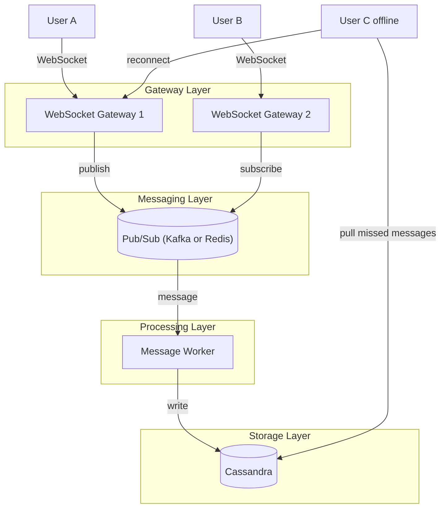

# Real Time Chat (Discord)

### Goal

Build a real-time chat system supporting 10 million concurrent users with message delivery under 500ms (p95) and persistent message history.

### Non-goals

* Voice/video calls (separate system)
* File attachments (CDN design not included)
* End-to-end encryption (deferred to v2)
* Full-text search (requires separate indexing pipeline)

### Numbers

* QPS: 100,000 messages/second peak (e.g., live event)
* Storage: 1 PB per year (1 KB average message, 10M users × 30 msgs/day)
* Latency target: p95 < 500ms end-to-end (client → server → client)

### Diagram

### Core flow

* **Send message**: User A sends message to channel #general. Gateway 1 receives it, assigns a local sequence number, and publishes to Pub/Sub topic `channel:general`.
* **Fan-out**: All gateways subscribed to `channel:general` (including Gateway 2) receive the message and push it to their connected clients (User B). Delivery happens in real time (<500ms).
* **Durability**: Worker consumes the same Pub/Sub stream and writes the message to Cassandra. If a worker crashes, Kafka retains the offset and resumes.
* **Offline recovery**: User C reconnects later. The client sends `last_seen_message_id` for each channel; gateway fetches missed messages from Cassandra (or cache) and sends them in batches.

### Storage choice & why

**Cassandra** because it provides linear write scalability (100K+ writes/sec), fault tolerance with no single master bottleneck, and columnar time-series access patterns perfect for `SELECT * FROM messages WHERE channel_id = X AND message_id > Y LIMIT 50`.

### The hard part & how we solve it

* **Bottleneck**: Broadcasting to a guild with 100,000 online members. Naively looping over 100,000 sockets would block the gateway for seconds.
* **Fix**:
  * Only send to actively connected members (presence state stored in Redis, TTL 30s).
  * Batch writes: Gateway iterates over local sessions for that guild in chunks (e.g., 500 per tick) using a non-blocking scheduler.
  * Offline members don't receive push; they pull on reconnect.
  * For gigantic guilds, @everyone mentions are rate-limited to 1 per 5 minutes.

### Tradeoff I'm making

Choosing **eventual consistency for presence** (online/offline status may lag 2–3 seconds) over strong consistency, because broadcasting accurate real-time presence to all members would cost O(N^2) network messages and kill scalability. Users tolerate slight delays in presence visibility. Message ordering remains strongly consistent per channel using a single Kafka partition per channel.
