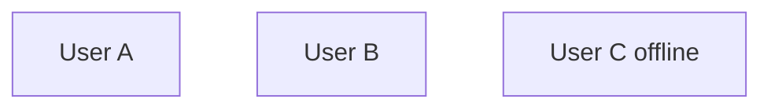

# Template

## Goal

1 sentence. What are we building?

## Non-goals

* What we're NOT doing (saves arguments)

## Numbers

* QPS: \_\_\_\_\_
* Storage: \_\_\_\_\_ / year
* Latency target: \_\_\_\_\_

## Diagram&#x20;

mermaidjs flowchart

## Core flow

paragraphs use bullet list when needed

## Storage choice & why

example: Postgres because we need ACID transactions OR: Cassandra because 100K writes/sec

## The hard part & how we solve it

* Bottleneck: \_\_\_\_\_
* Fix: \_\_\_\_\_

## Tradeoff I'm making

* Choosing \_\_\_\_\_ over \_\_\_\_\_ because \_\_\_\_\_
